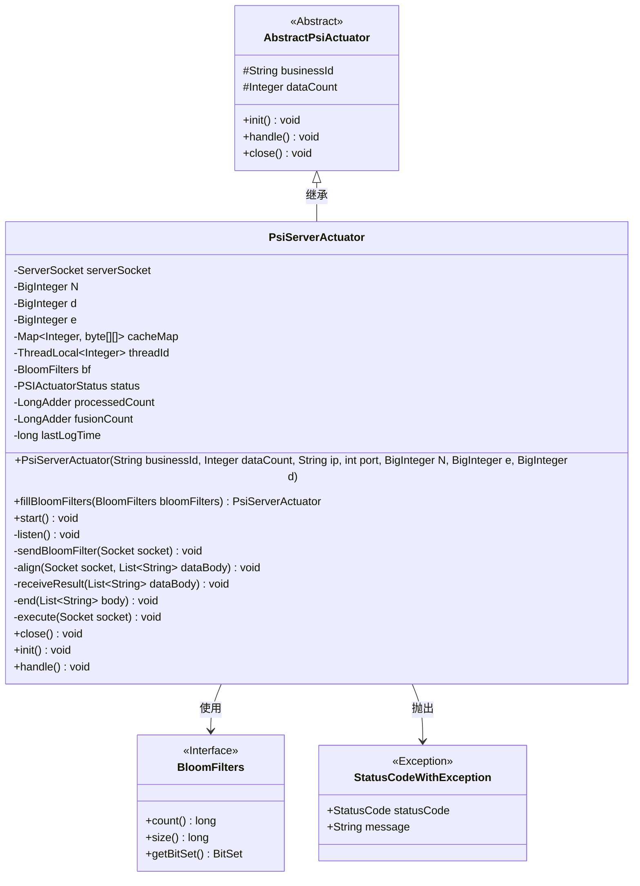
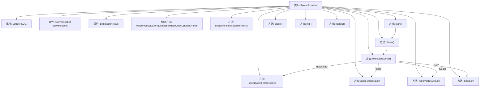

# 基础信息

|      |      |
|------|------|
| 名称 | PsiServerActuator |
| 编码语言 | .java |
| 代码路径 | WeFe/fusion/fusion-service/src/main/java/com/welab/wefe/data/fusion/service/actuator/rsapsi/PsiServerActuator.java |
| 包名 | com.welab.wefe.data.fusion.service.actuator.rsapsi |
| 依赖项 | ['com.alibaba.fastjson.JSONObject', 'com.welab.wefe.common.CommonThreadPool', 'com.welab.wefe.common.StatusCode', 'com.welab.wefe.common.exception.StatusCodeWithException', 'com.welab.wefe.common.util.JObject', 'com.welab.wefe.data.fusion.service.enums.ActionType', 'com.welab.wefe.data.fusion.service.enums.PSIActuatorStatus', 'com.welab.wefe.data.fusion.service.utils.FusionUtils', 'com.welab.wefe.data.fusion.service.utils.bf.BloomFilters', 'com.welab.wefe.fusion.core.utils.CryptoUtils', 'com.welab.wefe.fusion.core.utils.PSIUtils', 'org.apache.commons.collections4.CollectionUtils', 'org.slf4j.Logger', 'org.slf4j.LoggerFactory', 'java.io.DataOutputStream', 'java.io.IOException', 'java.math.BigInteger', 'java.net.InetAddress', 'java.net.ServerSocket', 'java.net.Socket', 'java.util.ArrayList', 'java.util.HashMap', 'java.util.List', 'java.util.Map'] |
| 概述说明 | PsiServerActuator类实现基于Socket的PSI协议服务端，包含密钥参数N/e/d，支持初始化布隆过滤器、监听端口、处理对齐请求及结果接收功能，状态管理完善。 |

# 说明

PsiServerActuator是一个基于Java的服务器端执行器类，用于处理隐私集合求交（PSI）任务。该类继承自AbstractPsiActuator，包含服务器套接字、RSA加密参数（N、d、e）和缓存映射等核心字段。主要功能包括：初始化布隆过滤器、启动服务器监听端口、处理客户端请求（下载布隆过滤器、数据对齐、结果接收和任务结束）、以及加密签名操作。通过多线程处理并发请求，记录详细执行日志，并实现资源关闭接口。该类严格遵循状态机模式管理任务生命周期，支持大数据量下的安全多方计算场景。

# 类列表 Class Summary

| 名称   | 类型  | 说明 |
|-------|------|-------------|
| PsiServerActuator | class | PsiServerActuator是一个基于Java的服务器执行器，用于处理加密数据通信和布隆过滤器操作。它通过ServerSocket监听端口，支持下载、对齐、融合和结束四种操作类型，使用RSA算法进行数据加密签名，并记录处理状态和日志。 |

## 类 PsiServerActuator

|      |      |
|------|------|
| 访问范围 | public |
| 类型 | class |
| 名称 | PsiServerActuator |
| 说明 | PsiServerActuator是一个基于Java的服务器执行器，用于处理加密数据通信和布隆过滤器操作。它通过ServerSocket监听端口，支持下载、对齐、融合和结束四种操作类型，使用RSA算法进行数据加密签名，并记录处理状态和日志。 |

### UML类图

这段代码描述了一个PSI（Private Set Intersection）服务器的实现类PsiServerActuator，它继承自抽象类AbstractPsiActuator。该类主要负责建立服务器Socket连接、处理客户端请求、执行数据对齐操作以及管理布隆过滤器。核心功能包括监听端口、发送加密参数、处理对齐请求和接收结果数据。类中使用了多个BigInteger参数进行加密运算，并通过ThreadLocal管理线程局部变量。异常处理通过StatusCodeWithException实现，状态管理通过PSIActuatorStatus枚举控制。整体设计体现了PSI协议的服务端实现，支持多线程处理和数据加密传输。

### 内部方法调用关系图

这段代码实现了一个PSI（Private Set Intersection）服务端执行器，主要功能包括初始化服务端Socket、监听客户端请求、处理不同类型的操作（下载布隆过滤器、数据对齐、结果融合和结束处理）。通过多线程机制处理并发请求，使用RSA加密算法进行数据保护，并提供了完整的生命周期管理（初始化、启动、关闭）。流程图清晰展示了类结构和核心方法调用链，特别是execute方法根据action类型路由到不同处理逻辑的分支过程。

### 字段列表 Field List

| 名称  | 类型  | 说明 |
|-------|-------|------|
| LOG = LoggerFactory.getLogger(PsiServerActuator.class) | Logger | 定义PsiServerActuator类的静态日志对象LOG，使用protected final修饰确保安全性和不可变性。 |
| N | BigInteger | 声明一个私有的大整数变量N。 |
| serverSocket | ServerSocket | 声明一个ServerSocket类型的私有变量serverSocket。 |
| threadId = new ThreadLocal<>() | ThreadLocal<Integer> | 线程局部变量，存储每个线程独有的整型ID。 |
| cacheMap = new HashMap<>() | Map<Integer, byte[][]> | 定义一个私有HashMap，键为Integer，值为二维字节数组，用于缓存数据。 |
| d | BigInteger | 私有的大整数变量d。 |
| e | BigInteger | 声明一个私有的大整数变量e。 |

### 方法列表

| 名称  | 类型  | 说明 |
|-------|-------|------|
| receiveResult | void | 接收数据并处理：记录数据大小，提取数据转为JObject对象，统计处理数量后存储。 |
| sendBloomFilter | void | 服务器通过socket发送布隆过滤器数据，包括e、N参数、元素个数、位数及位集数据，并记录日志。异常时记录错误。 |
| start | void | 方法start()检查数据初始化，未初始化抛出异常。启动服务器Socket监听指定端口，记录日志。创建线程执行监听任务。 |
| listen | void | 监听端口并处理连接：循环接收socket请求，使用线程池执行任务，捕获异常并记录错误日志。 |
| end | void | 方法end接收字符串列表body，将首个元素转为PSIActuatorStatus枚举类型赋值给status属性，并记录状态日志。 |
| align | void | 方法align处理数据对齐：提取索引和数据，加密后返回结果并记录处理时间和数量，出错时记录错误日志。 |
| fillBloomFilters | PsiServerActuator | 方法fillBloomFilters将传入的布隆过滤器赋值给成员变量bf，并将状态设为running，最后返回当前对象。 |
| execute | void | 方法execute处理socket数据：接收数据体，检查空值后提取动作类型。根据动作类型执行下载、对齐、融合或结束操作，最后更新日志时间。 |
| close | void | 重写close方法，关闭serverSocket并记录日志，捕获异常时记录错误信息。 |
| init | void | 这是一个Java方法重写示例，空实现，可能抛出StatusCodeWithException异常。 |
| handle | void | 方法重写，调用start()，可能抛出StatusCodeWithException异常。 |

