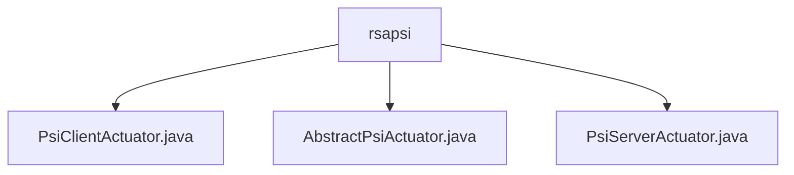

# 基础信息

|      |      |
|------|------|
| 名称 | rsapsi |
| 编码语言 | .java |
| 代码路径 | WeFe/fusion/fusion-service/src/main/java/com/welab/wefe/data/fusion/service/actuator/rsapsi |
| 包名 | docs.fusion.fusion-service.src.main.java.com.welab.wefe.data.fusion.service.actuator.rsapsi |
| 概述说明 | PsiClientActuator是PSI客户端执行器，处理数据加密和比对，含线程池和加密参数。AbstractPsiActuator是抽象基类，管理PSI任务属性和结果处理。PsiServerActuator是服务端执行器，处理请求和加密操作，支持多线程和状态管理。 |

# 说明

## 概述  
PsiClientActuator和PsiServerActuator构成隐私保护集合求交（PSI）的双端执行模块，分别负责客户端数据加密比对和服务端请求处理。采用RSA加密参数（e/N/d）和布隆过滤器实现安全数据对齐，类似安全多方计算网关模式。核心数据结构包括线程池配置、缓存Map、加密参数及状态标识，通过Socket通信实现分阶段交互（初始化/过滤器下载/数据对齐）。外部依赖仅涉及基础Java网络库和加密组件。例如客户端分页加密查询，服务端多线程处理签名请求。

## 主要业务场景  
完整业务流程为：客户端分片获取数据→加密后与服务端布隆过滤器比对→服务端签名返回交集结果。交互模式遵循状态机管理，客户端通过回调通知结果，服务端严格按生命周期处理请求。典型应用包括跨机构数据安全匹配，例如金融风控中的黑名单比对。API类型涵盖过滤器下载（HTTP）、数据对齐（Socket长连接），集成案例展示了大容量数据集的分片处理能力。

### 包内部结构视图

该流程图展示了rsapsi目录下的三个Java文件之间的层级关系。PsiClientActuator.java、AbstractPsiActuator.java和PsiServerActuator.java都直接隶属于rsapsi目录，没有更深层次的嵌套结构。这三个文件在rsapsi目录下是平级关系，共同构成了该目录的内容。

# 文件列表

| 名称   | 类型  | 说明 |
|-------|------|-------------|
| [PsiClientActuator.java](PsiClientActuator.md) | file | PsiClientActuator类实现PSI协议客户端逻辑，包含数据分页获取、加密、对齐及结果解析功能。使用线程池处理数据分片，支持BloomFilter下载与数据融合，通过Socket通信完成协同计算。关键属性包括线程池、加密参数、数据集ID及缓存映射。核心方法为cursor()分页查询、align()数据对齐及fusion()加密融合。 |
| [AbstractPsiActuator.java](AbstractPsiActuator.md) | file | 抽象类AbstractPsiActuator继承AbstractActuator，包含IP、端口、布隆过滤器等属性，状态默认为未初始化。提供dump方法处理JObject列表，格式化后存储结果。 |
| [PsiServerActuator.java](PsiServerActuator.md) | file | PsiServerActuator类实现基于Socket的PSI协议服务端，包含密钥参数N/e/d，支持初始化布隆过滤器、监听端口、处理对齐请求及结果接收功能，状态管理完善。 |

