# 基础信息

|      |      |
|------|------|
| 名称 | api |
| 编码语言 | .java |
| 代码路径 | WeFe/fusion/fusion-service/src/main/java/com/welab/wefe/data/fusion/service/api |
| 包名 | docs.fusion.fusion-service.src.main.java.com.welab.wefe.data.fusion.service.api |
| 概述说明 | 系统管理模块负责初始化、配置和密钥管理；合作伙伴模块提供增删改查功能；布隆过滤器模块支持CRUD和状态查询；第三方服务模块处理回调和状态检测；文件模块管理分片上传与合并；数据集模块实现生命周期管理；日志模块查询操作记录；任务模块管理任务全周期；数据源模块处理数据源CRUD和连接测试。 |

# 说明

## 概述  
该模块是联邦学习平台的核心管理系统，采用分层架构设计，包含系统控制、数据管理、任务调度等子模块。系统控制模块负责初始化状态、全局配置及安全密钥管理，类似控制中枢模式；数据管理模块提供数据集、布隆过滤器等资源的CRUD操作；任务调度模块处理对齐任务生命周期。统一接口规范继承AbstractApi基类，使用@Api注解定义路径，例如"system/is_initialized"检查初始化状态。关键数据结构包括分页结果集、带业务ID的Input类和各类OutputModel。外部依赖包括SystemInitializeService、TaskService等十余个服务组件，例如InitializeApi通过校验memberName完成系统初始化。

## 主要业务场景  
模块支持联邦学习全流程管理：1)系统初始化阶段通过IsInitializedApi检查状态，InitializeApi完成配置；2)数据准备阶段使用DatasetApi管理数据集，BloomfilterApi配置过滤器；3)任务执行阶段通过TaskApi创建对齐任务，ReceiveApi处理协作请求。典型交互模式为RESTful风格，如OptionsApi返回EnumSet<Options>枚举集合。功能完整性体现在各子模块的生命周期管理能力，例如合作伙伴模块支持AddApi到DeleteApi全链条操作。API类型涵盖状态查询（如GetStateApi）、数据处理（如MergeApi）和枚举获取（如TaskStatusApi），集成案例包括分片文件合并和RSA密钥轮换。

### 包内部结构视图

```mermaid
graph TD
    api --> system
    api --> account
    api --> partner
    api --> bloomfilter
    api --> thirdparty
    api --> file
    api --> dataset
    api --> operation
    api --> task
    api --> datasource
    system --> IsInitializedApi.java
    system --> ResetRsaKeyApi.java
    system --> OptionsApi.java
    system --> GlobalConfigUpdateApi.java
    system --> GetGlobalConfigApi.java
    system --> TaskOverviewApi.java
    system --> InitializeApi.java
    system --> ConfigApi.java
    account --> SsoLoginApi.java
    partner --> PagingApi.java
    partner --> UpdateApi.java
    partner --> DeleteApi.java
    partner --> AddApi.java
    partner --> CheckApi.java
    bloomfilter --> QueryApi.java
    bloomfilter --> DetailAndPreviewApi.java
    bloomfilter --> DeleteApi.java
    bloomfilter --> AddApi.java
    bloomfilter --> DetailApi.java
    bloomfilter --> GetBloomFilterStateApi.java
    bloomfilter --> PreviewApi.java
    thirdparty --> CallbackApi.java
    thirdparty --> RemoteCheckApi.java
    file --> MergeApi.java
    file --> UploadApi.java
    dataset --> GetDataSetStateApi.java
    dataset --> QueryApi.java
    dataset --> DetailAndPreviewApi.java
    dataset --> UpdateApi.java
    dataset --> DeleteApi.java
    dataset --> AddApi.java
    dataset --> DetailApi.java
    dataset --> GetHeadersApi.java
    dataset --> PreviewApi.java
    operation --> LogQueryApi.java
    task --> ReceiveApi.java
    task --> InfoApi.java
    task --> PagingApi.java
    task --> UpdateApi.java
    task --> DeleteApi.java
    task --> AddApi.java
    task --> DetailApi.java
    task --> TaskStatusApi.java
    task --> StopTaskApi.java
    task --> HandleApi.java
    datasource --> OverviewApi.java
    datasource --> QueryApi.java
    datasource --> UpdateApi.java
    datasource --> DeleteApi.java
    datasource --> AddApi.java
    datasource --> TestDBConnectApi.java
```

该流程图展示了WeFe数据融合服务API的完整目录结构，从根目录api分支出9个子模块，包括系统配置、账户管理、合作伙伴等核心功能模块。每个子模块下包含多个具体的API实现类，如系统模块包含初始化、密钥重置等8个API，数据集模块提供查询、更新等9种操作接口，共呈现了47个API节点，完整覆盖了数据融合服务的功能体系。

# 文件列表

| 名称   | 类型  | 说明 |
|-------|------|-------------|
| [thirdparty](thirdparty/_module.md) | package | CallbackApi是第三方回调接口类，路径thirdparty/callback，继承AbstractNoneOutputApi，处理输入含必填businessId和CallbackType及可选字段。RemoteCheckApi用于测试服务状态，路径third_party/remote/check，继承AbstractNoneOutputApi，输入无额外字段。 |
| [system](system/_module.md) | package | IsInitializedApi检查系统初始化状态。ResetRsaKeyApi重置RSA密钥。OptionsApi获取操作类型选项。GlobalConfigUpdateApi更新全局配置。GetGlobalConfigApi获取全局配置。TaskOverviewApi获取任务概览。InitializeApi处理系统初始化。ConfigApi为空配置类。 |
| [datasource](datasource/_module.md) | package | OverviewApi处理数据源概览请求，路径data_source/overview。QueryApi查询数据源，路径data_source/query，支持分页。UpdateApi更新数据源，路径data_source/update。DeleteApi删除数据源，路径data_source/delete。AddApi新增数据源。TestDBConnectApi测试数据库连接，路径data_source/test_db_connect。均继承AbstractApi，通过DataSourceService实现功能。 |
| [task](task/_module.md) | package | ReceiveApi接收对齐请求，路径task/receive，需签名。InfoApi获取任务信息，路径task/info。PagingApi处理分页列表，路径task/paging。UpdateApi修改任务，路径task/update。DeleteApi删除任务，路径task/delete。AddApi添加任务，路径task/add。DetailApi查询详情，路径task/detail。TaskStatusApi获取状态枚举，路径task/status。StopTaskApi暂停任务，路径task/stop。HandleApi处理任务，路径task/handle。 |
| [account](account/_module.md) | package | SSO登录API类，无需登录，调用AccountService的ssoLogin方法，返回包含ID、token、手机号和昵称的输出结果。 |
| [operation](operation/_module.md) | package | 日志查询API类，继承抽象API，输入含接口名、调用者、时间范围，输出分页操作日志，调用OperationLogService处理查询。 |
| [dataset](dataset/_module.md) | package | 获取数据集状态、查询列表、详情预览、更新、删除、添加、获取详情、特征字段和预览文件的API接口集合，均需登录访问，包含输入输出定义和服务调用逻辑。 |
| [file](file/_module.md) | package | MergeApi类处理文件分片合并，验证文件类型后合并分片并删除临时文件。UploadApi类处理文件上传，支持分片保存和检查，限制文件类型为csv/xls/xlsx。 |
| [bloomfilter](bloomfilter/_module.md) | package | QueryApi查询过滤器列表，继承AbstractApi，输入含id和name，输出分页结果。DetailAndPreviewApi获取过滤器详情和预览，输入需id。DeleteApi删除过滤器，需id和登录。AddApi添加过滤器，含多字段校验。DetailApi获取详情，需id和登录。GetBloomFilterStateApi获取状态，含进度信息。PreviewApi预览文件，输入含数据ID等。 |
| [partner](partner/_module.md) | package | PagingApi处理合作伙伴分页查询，输入含memberId和memberName，返回分页结果。UpdateApi更新合作伙伴，输入含五个必填字段。DeleteApi删除合作方，输入需id。AddApi添加合作伙伴，输入含四个必填字段。CheckApi测试服务状态，输入需memberId。 |

