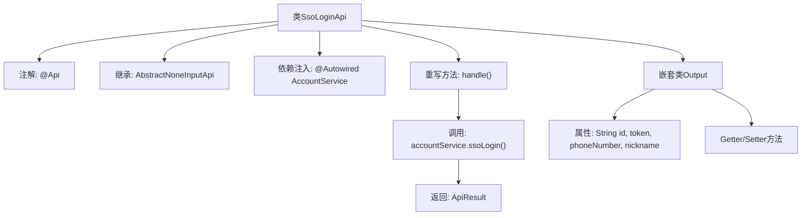

# 基础信息

|      |      |
|------|------|
| 名称 | SsoLoginApi |
| 编码语言 | .java |
| 代码路径 | WeFe/fusion/fusion-service/src/main/java/com/welab/wefe/data/fusion/service/api/account/SsoLoginApi.java |
| 包名 | com.welab.wefe.data.fusion.service.api.account |
| 依赖项 | ['com.welab.wefe.common.exception.StatusCodeWithException', 'com.welab.wefe.common.web.api.base.AbstractNoneInputApi', 'com.welab.wefe.common.web.api.base.Api', 'com.welab.wefe.common.web.dto.AbstractApiOutput', 'com.welab.wefe.common.web.dto.ApiResult', 'com.welab.wefe.data.fusion.service.service.AccountService', 'org.springframework.beans.factory.annotation.Autowired'] |
| 概述说明 | SSO登录API类，无需登录，调用AccountService的ssoLogin方法，返回包含ID、token、手机号和昵称的输出结果。 |

# 说明

这是一个名为SsoLoginApi的Java类，用于处理单点登录（SSO）请求。该类继承自AbstractNoneInputApi，路径为account/sso_login，无需登录即可访问。通过注入的AccountService调用ssoLogin方法处理请求，返回包含用户ID、令牌、电话号码和昵称的输出结果。输出类Output继承自AbstractApiOutput，提供四个字符串字段的getter和setter方法。

# 类列表 Class Summary

| 名称   | 类型  | 说明 |
|-------|------|-------------|
| SsoLoginApi | class | SSO登录API类，调用accountService.ssoLogin返回用户ID、token、手机号和昵称。无需登录。 |


## 类 SsoLoginApi

|      |      |
|------|------|
| 访问范围 | @Api(path = "account/sso_login", name = "sso_login", login = false);public |
| 类型 | class |
| 名称 | SsoLoginApi |
| 说明 | SSO登录API类，调用accountService.ssoLogin返回用户ID、token、手机号和昵称。无需登录。 |


### UML类图

```mermaid
classDiagram
    class AbstractNoneInputApi~T~ {
        <<Abstract>>
        +handle() ApiResult~T~
    }

    class SsoLoginApi {
        -AccountService accountService
        +handle() ApiResult~Output~
    }

    class AccountService {
        <<Interface>>
        +ssoLogin() SsoLoginApi$Output
    }

    class AbstractApiOutput {
        <<Abstract>>
    }

    class SsoLoginApi$Output {
        -String id
        -String token
        -String phoneNumber
        -String nickname
        +get/set methods...
    }

    SsoLoginApi --|> AbstractNoneInputApi : 继承
    SsoLoginApi --> AccountService : 依赖
    SsoLoginApi$Output --|> AbstractApiOutput : 继承
```

类图描述：该图展示了SSO登录API的类结构，核心是SsoLoginApi继承自泛型抽象类AbstractNoneInputApi，并依赖AccountService接口实现登录功能。输出类Output继承自AbstractApiOutput，包含id、token等用户信息字段。整体结构体现了控制层与服务的分离，通过泛型和抽象类实现类型安全的API响应处理。


### 内部方法调用关系图



这段代码流程图展示了SSO登录API的核心结构。SsoLoginApi类通过@Api注解定义接口路径，继承抽象基类并注入AccountService。主要逻辑在handle()方法中，调用accountService.ssoLogin()服务并返回包含Output对象的ApiResult。嵌套类Output定义了登录返回的用户ID、令牌、手机号和昵称等字段，并提供了标准的Getter/Setter方法。整个流程清晰地呈现了从API入口到业务逻辑处理的调用链。

### 字段列表 Field List

| 名称  | 类型  | 说明 |
|-------|-------|------|
| accountService | AccountService | 使用@Autowired自动注入AccountService实例。 |

### 方法列表

| 名称  | 类型  | 说明 |
|-------|-------|------|
| handle | ApiResult<Output> | Java方法重写，调用accountService的ssoLogin方法并返回成功结果。 |


