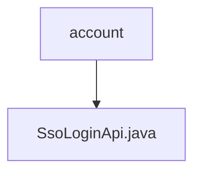

# 基础信息

|      |      |
|------|------|
| 名称 | account |
| 编码语言 | .java |
| 代码路径 | WeFe/fusion/fusion-service/src/main/java/com/welab/wefe/data/fusion/service/api/account |
| 包名 | docs.fusion.fusion-service.src.main.java.com.welab.wefe.data.fusion.service.api.account |
| 概述说明 | SSO登录API类，无需登录，调用AccountService的ssoLogin方法，返回包含ID、token、手机号和昵称的输出结果。 |

# 说明

这是一个名为SsoLoginApi的Java类，用于处理单点登录（SSO）请求。该类继承自AbstractNoneInputApi，路径为account/sso_login，无需登录即可访问。通过注入的AccountService调用ssoLogin方法处理请求，返回包含用户ID、令牌、电话号码和昵称的输出结果。输出类Output继承自AbstractApiOutput，提供四个字符串字段的getter和setter方法。

### 包内部结构视图

该流程图展示了account文件夹与SsoLoginApi.java文件之间的层级关系。account作为父级目录，包含一个子文件SsoLoginApi.java。这是一个简单的单层结构，清晰地呈现了Java项目中API接口文件与其所在包目录的从属关系。

# 文件列表

| 名称   | 类型  | 说明 |
|-------|------|-------------|
| [SsoLoginApi.java](SsoLoginApi.md) | file | SSO登录API类，无需登录，调用AccountService的ssoLogin方法，返回包含ID、token、手机号和昵称的输出结果。 |

