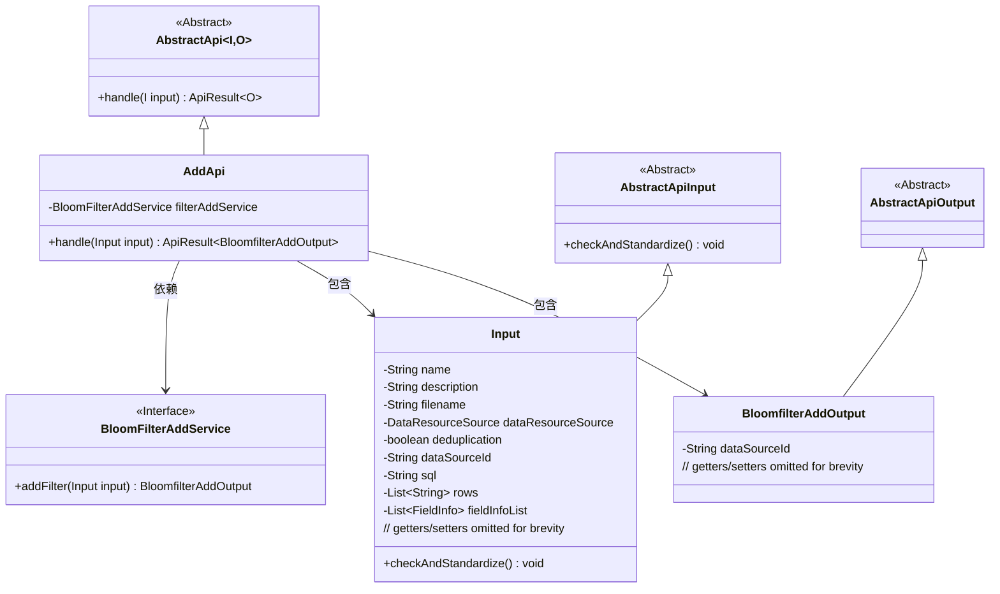
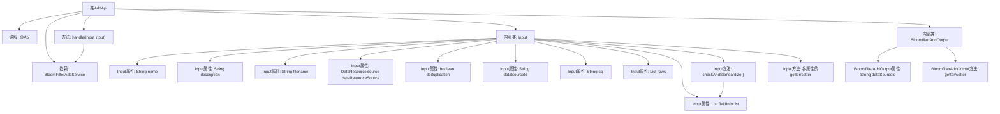

# 基础信息

|      |      |
|------|------|
| 名称 | AddApi |
| 编码语言 | .java |
| 代码路径 | WeFe/fusion/fusion-service/src/main/java/com/welab/wefe/data/fusion/service/api/bloomfilter/AddApi.java |
| 包名 | com.welab.wefe.data.fusion.service.api.bloomfilter |
| 依赖项 | ['com.welab.wefe.common.StatusCode', 'com.welab.wefe.common.exception.StatusCodeWithException', 'com.welab.wefe.common.fieldvalidate.annotation.Check', 'com.welab.wefe.common.web.api.base.AbstractApi', 'com.welab.wefe.common.web.api.base.Api', 'com.welab.wefe.common.web.dto.AbstractApiInput', 'com.welab.wefe.common.web.dto.AbstractApiOutput', 'com.welab.wefe.common.web.dto.ApiResult', 'com.welab.wefe.data.fusion.service.enums.DataResourceSource', 'com.welab.wefe.data.fusion.service.service.bloomfilter.BloomFilterAddService', 'com.welab.wefe.data.fusion.service.utils.primarykey.FieldInfo', 'org.apache.commons.collections4.CollectionUtils', 'org.springframework.beans.factory.annotation.Autowired', 'java.util.List'] |
| 概述说明 | 添加过滤器的API接口，需登录，输入包括数据集名称、描述、文件等，输出为数据源ID。名称长度4-30，描述不超过3072字符，主键必填。 |

# 说明

该代码定义了一个名为AddApi的API类，用于添加过滤器。API路径为filter/add，需要登录访问。输入参数Input类包含多个字段，如数据集名称、描述、文件名、数据源类型、去重标志、数据源ID、SQL脚本、特征列和主键处理信息，其中数据集名称和去重标志为必填项。输入参数有严格的校验规则，如名称长度限制和描述长度限制。处理逻辑通过BloomFilterAddService完成，输出为BloomfilterAddOutput，包含数据源ID。输入类还包含自定义校验逻辑，确保主键处理信息不为空。

# 类列表 Class Summary

| 名称   | 类型  | 说明 |
|-------|------|-------------|
| AddApi | class | 添加过滤器的API接口，包含数据集名称、描述、文件等输入参数，需登录使用，返回数据源ID。 |

## 类 AddApi

|      |      |
|------|------|
| 访问范围 | @Api(path = "filter/add", name = "添加过滤器", desc = "添加过滤器", login = true);public |
| 类型 | class |
| 名称 | AddApi |
| 说明 | 添加过滤器的API接口，包含数据集名称、描述、文件等输入参数，需登录使用，返回数据源ID。 |

### UML类图

这段代码展示了一个添加过滤器的API实现，采用分层架构设计。核心类AddApi继承自泛型抽象类AbstractApi，处理输入(Input)和输出(BloomfilterAddOutput)类型。Input类继承AbstractApiInput并包含多个带校验注解的字段，BloomfilterAddOutput继承AbstractApiOutput。AddApi通过依赖注入的BloomFilterAddService接口实现业务逻辑，体现了清晰的职责分离和依赖倒置原则。

### 内部方法调用关系图

这段代码描述了一个添加过滤器的API类AddApi，它继承自AbstractApi并包含输入参数处理类Input和输出结果类BloomfilterAddOutput。Input类包含多个带校验注解的属性和参数标准化方法，BloomfilterAddOutput则封装返回的数据源ID。核心流程是通过handle方法调用BloomFilterAddService服务完成过滤器添加操作，期间会进行严格的参数校验和标准化处理。

### 字段列表 Field List

| 名称  | 类型  | 说明 |
|-------|-------|------|
| filterAddService | BloomFilterAddService | 自动注入布隆过滤器添加服务实例。 |

### 方法列表

| 名称  | 类型  | 说明 |
|-------|-------|------|
| handle | ApiResult<BloomfilterAddOutput> | Java方法重写，调用filterAddService.addFilter处理输入并返回ApiResult结果。 |

