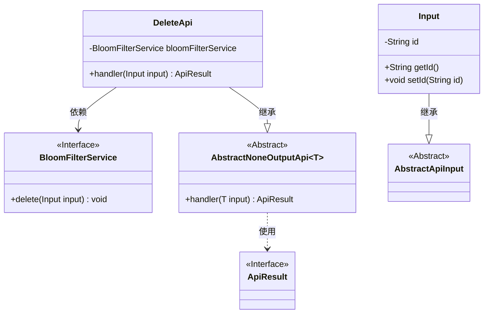
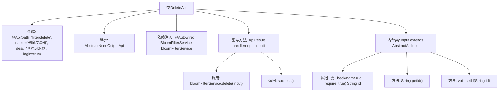

# 基础信息

|      |      |
|------|------|
| 名称 | DeleteApi |
| 编码语言 | .java |
| 代码路径 | WeFe/fusion/fusion-service/src/main/java/com/welab/wefe/data/fusion/service/api/bloomfilter/DeleteApi.java |
| 包名 | com.welab.wefe.data.fusion.service.api.bloomfilter |
| 依赖项 | ['com.welab.wefe.common.fieldvalidate.annotation.Check', 'com.welab.wefe.common.web.api.base.AbstractNoneOutputApi', 'com.welab.wefe.common.web.api.base.Api', 'com.welab.wefe.common.web.dto.AbstractApiInput', 'com.welab.wefe.common.web.dto.ApiResult', 'com.welab.wefe.data.fusion.service.service.bloomfilter.BloomFilterService', 'org.springframework.beans.factory.annotation.Autowired'] |
| 概述说明 | 删除过滤器的API类，需登录，调用BloomFilterService删除指定ID的过滤器。输入参数为必填的ID字段。 |

# 说明

这是一个用于删除过滤器的API类，路径为"filter/delete"，需要登录验证。类继承自AbstractNoneOutputApi，泛型参数为内部类Input。通过BloomFilterService执行删除操作，输入参数Input包含必填字段id及其getter/setter方法。处理逻辑简单，调用服务删除后返回成功结果。

# 类列表 Class Summary

| 名称   | 类型  | 说明 |
|-------|------|-------------|
| DeleteApi | class | 删除过滤器API，需登录，接收ID参数调用BloomFilterService删除操作，返回成功结果。 |

## 类 DeleteApi

|      |      |
|------|------|
| 访问范围 | @Api(path = "filter/delete", name = "删除过滤器", desc = "删除过滤器", login = true);public |
| 类型 | class |
| 名称 | DeleteApi |
| 说明 | 删除过滤器API，需登录，接收ID参数调用BloomFilterService删除操作，返回成功结果。 |

### UML类图

这段代码展示了一个删除过滤器的API实现，核心是DeleteApi类继承自泛型抽象类AbstractNoneOutputApi，并依赖BloomFilterService接口完成删除操作。输入参数通过嵌套类Input定义，继承自AbstractApiInput基类，包含必填字段id。类图清晰地呈现了继承关系（DeleteApi→AbstractNoneOutputApi、Input→AbstractApiInput）和依赖关系（DeleteApi→BloomFilterService），同时通过泛型和抽象类实现了良好的扩展性。

### 内部方法调用关系图

这段代码展示了一个基于Spring框架的API类DeleteApi，主要用于处理删除过滤器的请求。类通过@Api注解定义接口路径和元信息，继承抽象类并注入BloomFilterService服务。核心逻辑在handler方法中，调用服务层删除操作后返回成功结果。内部类Input定义了必需的id字段及其getter/setter，通过@Check注解进行参数校验。流程图清晰呈现了类结构、方法调用关系和参数校验流程。

### 字段列表 Field List

| 名称  | 类型  | 说明 |
|-------|-------|------|
| bloomFilterService | BloomFilterService | 自动注入布隆过滤器服务实例。 |

### 方法列表

| 名称  | 类型  | 说明 |
|-------|-------|------|
| handler | ApiResult | 代码重写父类handler方法，调用布隆过滤器服务删除输入数据，返回成功结果。 |

