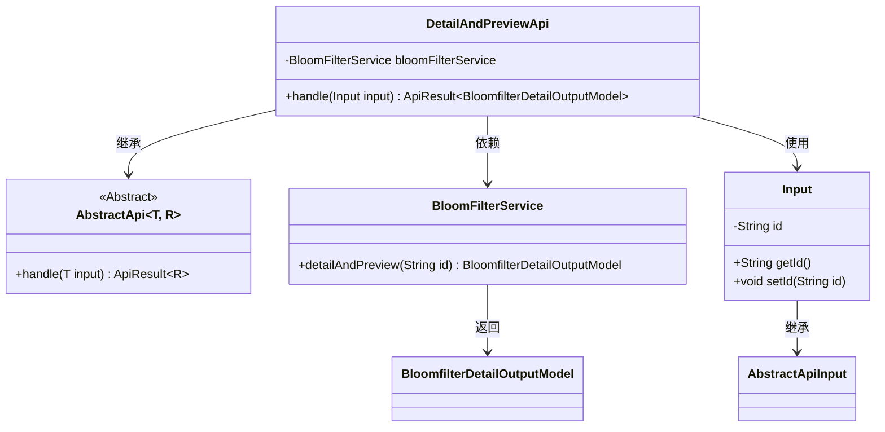

# 基础信息

|      |      |
|------|------|
| 名称 | DetailAndPreviewApi |
| 编码语言 | .java |
| 代码路径 | WeFe/fusion/fusion-service/src/main/java/com/welab/wefe/data/fusion/service/api/bloomfilter/DetailAndPreviewApi.java |
| 包名 | com.welab.wefe.data.fusion.service.api.bloomfilter |
| 依赖项 | ['com.welab.wefe.common.fieldvalidate.annotation.Check', 'com.welab.wefe.common.web.api.base.AbstractApi', 'com.welab.wefe.common.web.api.base.Api', 'com.welab.wefe.common.web.dto.AbstractApiInput', 'com.welab.wefe.common.web.dto.ApiResult', 'com.welab.wefe.data.fusion.service.dto.entity.bloomfilter.BloomfilterDetailOutputModel', 'com.welab.wefe.data.fusion.service.dto.entity.dataset.DataSetDetailOutputModel', 'com.welab.wefe.data.fusion.service.service.bloomfilter.BloomFilterService', 'com.welab.wefe.data.fusion.service.service.dataset.DataSetService', 'org.springframework.beans.factory.annotation.Autowired'] |
| 概述说明 | 这是一个过滤器详情预览API类，通过ID获取布隆过滤器详情，返回详情和预览数据。输入参数为数据ID，调用BloomFilterService处理请求。 |

# 说明

这是一个名为"过滤器详情预览"的API类，路径为"filter/detail_and_preview"。它继承自AbstractApi基类，使用泛型指定输入类型为内部类Input，输出类型为BloomfilterDetailOutputModel。类中注入了BloomFilterService服务，核心处理逻辑是通过bloomFilterService的detailAndPreview方法获取详情数据。输入参数Input继承自AbstractApiInput，包含一个必填的字符串类型id字段，用于标识要查询的数据。该API的主要功能是根据传入的id返回对应的过滤器详情和预览信息。

# 类列表 Class Summary

| 名称   | 类型  | 说明 |
|-------|------|-------------|
| DetailAndPreviewApi | class | 这是一个名为"过滤器详情预览"的API类，通过ID获取布隆过滤器详情和预览数据，输入参数为数据ID，输出为布隆过滤器详情模型。 |

## 类 DetailAndPreviewApi

|      |      |
|------|------|
| 访问范围 | @Api(path = "filter/detail_and_preview", name = "过滤器详情预览", desc = "过滤器详情预览");public |
| 类型 | class |
| 名称 | DetailAndPreviewApi |
| 说明 | 这是一个名为"过滤器详情预览"的API类，通过ID获取布隆过滤器详情和预览数据，输入参数为数据ID，输出为布隆过滤器详情模型。 |

### UML类图

该代码展示了一个过滤器详情预览API的实现结构。DetailAndPreviewApi继承自泛型抽象类AbstractApi，处理Input输入并返回BloomfilterDetailOutputModel结果。通过依赖注入的BloomFilterService获取数据，Input类继承AbstractApiInput并包含id字段及访问方法。整体设计遵循了依赖注入和分层架构原则，实现了API请求处理逻辑的封装。

### 内部方法调用关系图

```mermaid
graph TD
    A["类DetailAndPreviewApi"]
    B["注解: @Api"]
    C["继承: AbstractApi<Input, BloomfilterDetailOutputModel>"]
    D["依赖注入: @Autowired BloomFilterService"]
    E["重写方法: handle(Input input)"]
    F["内部类: Input"]
    G["属性: @Check String id"]
    H["方法: getId()"]
    I["方法: setId(String id)"]
    J["调用: bloomFilterService.detailAndPreview(input.getId())"]
    K["返回: ApiResult.success()"]

    A --> B
    A --> C
    A --> D
    A --> E
    E --> J
    J --> K
    A --> F
    F --> G
    F --> H
    F --> I
```

这段代码展示了一个名为DetailAndPreviewApi的API类，它继承自AbstractApi并处理过滤器详情预览功能。类结构包含@Api注解定义接口元信息，通过@Autowired注入BloomFilterService服务，重写handle方法调用服务层获取数据。内部类Input继承AbstractApiInput，包含带@Check注解的id属性和getter/setter方法。流程图清晰呈现了类继承关系、依赖注入、方法调用链和内部类结构，体现了API请求处理的核心流程。

### 字段列表 Field List

| 名称  | 类型  | 说明 |
|-------|-------|------|
| bloomFilterService | BloomFilterService | 使用@Autowired自动注入BloomFilterService实例。 |

### 方法列表

| 名称  | 类型  | 说明 |
|-------|-------|------|
| handle | ApiResult<BloomfilterDetailOutputModel> | 该代码重写handle方法，调用bloomFilterService的detailAndPreview方法，传入input的ID，返回包含结果的ApiResult对象。 |

