# 基础信息

|      |      |
|------|------|
| 名称 | DetailApi |
| 编码语言 | .java |
| 代码路径 | WeFe/fusion/fusion-service/src/main/java/com/welab/wefe/data/fusion/service/api/bloomfilter/DetailApi.java |
| 包名 | com.welab.wefe.data.fusion.service.api.bloomfilter |
| 依赖项 | ['com.welab.wefe.common.fieldvalidate.annotation.Check', 'com.welab.wefe.common.web.api.base.AbstractApi', 'com.welab.wefe.common.web.api.base.Api', 'com.welab.wefe.common.web.dto.AbstractApiInput', 'com.welab.wefe.common.web.dto.ApiResult', 'com.welab.wefe.data.fusion.service.dto.entity.bloomfilter.BloomfilterOutputModel', 'com.welab.wefe.data.fusion.service.service.bloomfilter.BloomFilterService', 'org.springframework.beans.factory.annotation.Autowired'] |
| 概述说明 | 这是一个过滤器详情API类，路径为"filter/detail"，需要登录。它继承自AbstractApi，处理输入ID并返回BloomfilterOutputModel结果。使用BloomFilterService获取详情。输入类Input包含必填字段id。 |

# 说明

该代码定义了一个名为DetailApi的API类，用于获取过滤器详情。API路径为filter/detail，需要登录访问。类继承自AbstractApi，泛型参数指定输入类型为内部类Input，输出类型为BloomfilterOutputModel。内部类Input继承AbstractApiInput，包含一个必填的id字段，并通过getter和setter方法访问。API处理逻辑通过注入的BloomFilterService调用detail方法，传入id参数并返回结果。整个API封装了获取布隆过滤器详情的功能。

# 类列表 Class Summary

| 名称   | 类型  | 说明 |
|-------|------|-------------|
| DetailApi | class | 这是一个名为"过滤器详情"的API类，路径为"filter/detail"，需要登录。它继承自AbstractApi，处理输入参数id并返回BloomfilterOutputModel结果，通过BloomFilterService获取详情。 |


## 类 DetailApi

|      |      |
|------|------|
| 访问范围 | @Api(path = "filter/detail", name = "过滤器详情", desc = "过滤器详情", login = true);public |
| 类型 | class |
| 名称 | DetailApi |
| 说明 | 这是一个名为"过滤器详情"的API类，路径为"filter/detail"，需要登录。它继承自AbstractApi，处理输入参数id并返回BloomfilterOutputModel结果，通过BloomFilterService获取详情。 |


### UML类图

```mermaid
classDiagram
    class DetailApi {
        -BloomFilterService bloomFilterService
        +handle(Input input) ApiResult~BloomfilterOutputModel~
    }
    <<Interface>> DetailApi {
        <<AbstractApi>>
    }
    class AbstractApi~Input, BloomfilterOutputModel~ {
        <<abstract>>
    }
    class Input {
        -String id
        +String getId()
        +void setId(String id)
    }
    class AbstractApiInput {
        <<abstract>>
    }
    class BloomfilterOutputModel
    class BloomFilterService {
        +detail(String id) BloomfilterOutputModel
    }
    class ApiResult~T~ {
        <<generic>>
    }

    DetailApi --> AbstractApi : 继承
    DetailApi --> BloomFilterService : 依赖
    Input --> AbstractApiInput : 继承
    AbstractApi --> ApiResult : 使用泛型
    AbstractApi --> Input : 泛型参数
    AbstractApi --> BloomfilterOutputModel : 泛型参数
    BloomFilterService --> BloomfilterOutputModel : 返回
```

类图描述：该图展示了DetailApi类继承自泛型类AbstractApi<Input, BloomfilterOutputModel>，并依赖BloomFilterService服务。Input作为内部类继承AbstractApiInput，包含id字段及其访问方法。BloomFilterService提供detail方法返回BloomfilterOutputModel。AbstractApi使用ApiResult泛型类处理结果，体现了典型的API控制器结构。


### 内部方法调用关系图

```mermaid
graph TD
    A["类DetailApi"]
    B["注解: @Api"]
    C["继承: AbstractApi<Input, BloomfilterOutputModel>"]
    D["依赖注入: @Autowired BloomFilterService"]
    E["重写方法: handle(Input input)"]
    F["内部类: Input"]
    G["属性: @Check String id"]
    H["方法: String getId()"]
    I["方法: void setId(String id)"]
    J["调用: bloomFilterService.detail(input.getId())"]
    K["返回: ApiResult<BloomfilterOutputModel>"]

    A --> B
    A --> C
    A --> D
    A --> E
    E --> J
    J --> K
    A --> F
    F --> G
    F --> H
    F --> I
```



该流程图展示了DetailApi类的结构及其关键组件。DetailApi是一个带有@Api注解的类，继承自AbstractApi并泛型化处理Input和BloomfilterOutputModel。它通过@Autowired注入BloomFilterService，并重写handle方法处理输入参数。内部类Input包含一个带@Check注解的id属性及其getter/setter方法。handle方法调用bloomFilterService.detail()并返回封装后的ApiResult结果。整个流程清晰展示了从请求处理到结果返回的数据流转路径。

### 字段列表 Field List

| 名称  | 类型  | 说明 |
|-------|-------|------|
| bloomFilterService | BloomFilterService | 使用@Autowired自动注入BloomFilterService实例。 |

### 方法列表

| 名称  | 类型  | 说明 |
|-------|-------|------|
| handle | ApiResult<BloomfilterOutputModel> | Java方法重写，调用bloomFilterService.detail处理输入ID并返回结果。 |


