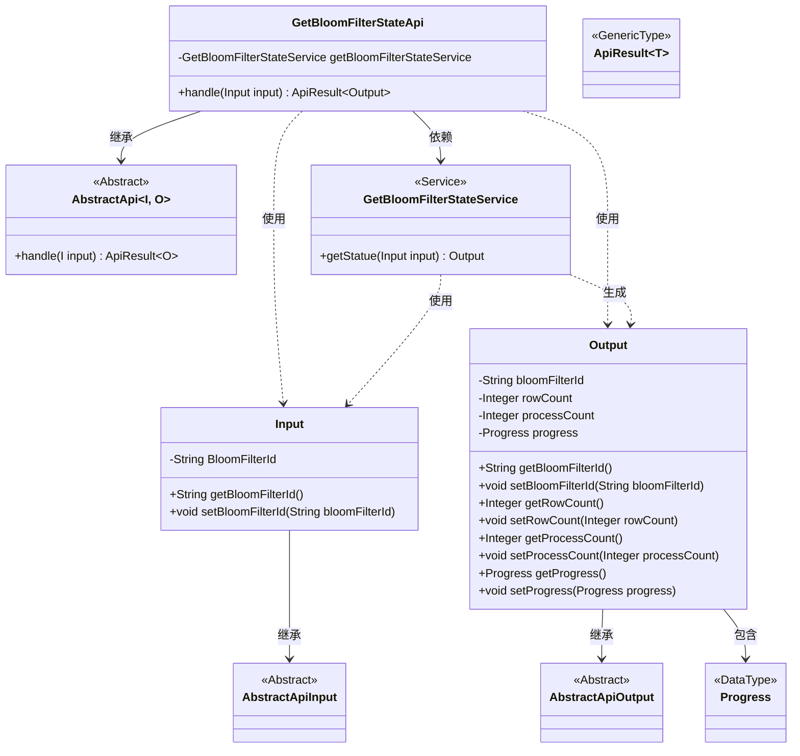
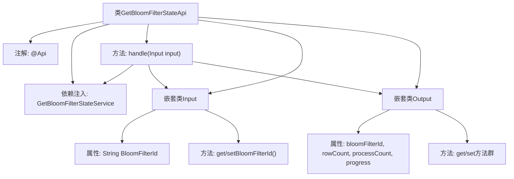

# 基础信息

|      |      |
|------|------|
| 名称 | GetBloomFilterStateApi |
| 编码语言 | .java |
| 代码路径 | WeFe/fusion/fusion-service/src/main/java/com/welab/wefe/data/fusion/service/api/bloomfilter/GetBloomFilterStateApi.java |
| 包名 | com.welab.wefe.data.fusion.service.api.bloomfilter |
| 依赖项 | ['com.welab.wefe.common.exception.StatusCodeWithException', 'com.welab.wefe.common.fieldvalidate.annotation.Check', 'com.welab.wefe.common.web.api.base.AbstractApi', 'com.welab.wefe.common.web.api.base.Api', 'com.welab.wefe.common.web.dto.AbstractApiInput', 'com.welab.wefe.common.web.dto.AbstractApiOutput', 'com.welab.wefe.common.web.dto.ApiResult', 'com.welab.wefe.data.fusion.service.enums.Progress', 'com.welab.wefe.data.fusion.service.service.bloomfilter.GetBloomFilterStateService', 'org.springframework.beans.factory.annotation.Autowired', 'java.io.IOException'] |
| 概述说明 | 获取布隆过滤器状态的API，需登录，输入为过滤器ID，输出包含ID、行数、处理数和进度。 |

# 说明

该代码定义了一个名为GetBloomFilterStateApi的API类，用于获取布隆过滤器的当前状态。API路径为filter/get_state，需要登录访问。输入参数包括布隆过滤器ID，输出包含过滤器ID、行数、处理数和进度信息。通过GetBloomFilterStateService处理请求并返回结果。

# 类列表 Class Summary

| 名称   | 类型  | 说明 |
|-------|------|-------------|
| GetBloomFilterStateApi | class | 获取布隆过滤器状态的API，需登录，输入过滤器ID，返回ID、行数、处理数和进度。 |

## 类 GetBloomFilterStateApi

|      |      |
|------|------|
| 访问范围 | @Api(path = "filter/get_state", name = "获取过滤器当前状态", desc = "获取过滤器当前状态", login = true);public |
| 类型 | class |
| 名称 | GetBloomFilterStateApi |
| 说明 | 获取布隆过滤器状态的API，需登录，输入过滤器ID，返回ID、行数、处理数和进度。 |

### UML类图

这段代码描述了一个获取布隆过滤器状态的API实现，包含输入参数处理、业务逻辑调用和结果封装。GetBloomFilterStateApi继承自泛型抽象类AbstractApi，通过GetBloomFilterStateService服务获取状态数据。输入类Input继承AbstractApiInput包含布隆过滤器ID，输出类Output继承AbstractApiOutput包含状态信息和进度对象。整个结构展示了典型的API分层设计模式，包含控制器、服务层和数据传输对象。

### 内部方法调用关系图

该流程图展示了GetBloomFilterStateApi类的完整结构，包含API注解标记、核心服务依赖和输入输出数据结构。主类通过handle方法协调处理流程，调用GetBloomFilterStateService获取状态，Input类负责参数校验，Output类封装返回的布隆过滤器状态信息（包括ID、行数、处理数和进度），形成完整的API请求响应链路。

### 字段列表 Field List

| 名称  | 类型  | 说明 |
|-------|-------|------|
| getBloomFilterStateService | GetBloomFilterStateService | 自动注入布隆过滤器状态服务实例。 |

### 方法列表

| 名称  | 类型  | 说明 |
|-------|-------|------|
| handle | ApiResult<Output> | Java方法重写，调用服务获取布隆过滤器状态并返回成功结果。 |

