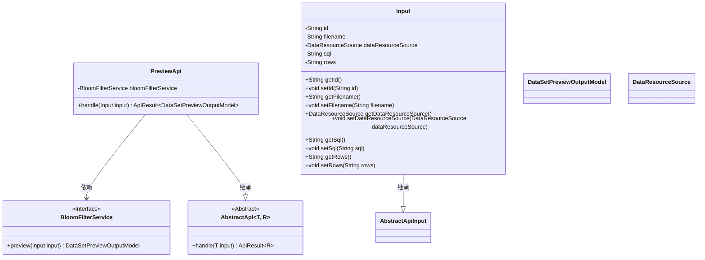

# 基础信息

|      |      |
|------|------|
| 名称 | PreviewApi |
| 编码语言 | .java |
| 代码路径 | WeFe/fusion/fusion-service/src/main/java/com/welab/wefe/data/fusion/service/api/bloomfilter/PreviewApi.java |
| 包名 | com.welab.wefe.data.fusion.service.api.bloomfilter |
| 依赖项 | ['com.welab.wefe.common.fieldvalidate.annotation.Check', 'com.welab.wefe.common.web.api.base.AbstractApi', 'com.welab.wefe.common.web.api.base.Api', 'com.welab.wefe.common.web.dto.AbstractApiInput', 'com.welab.wefe.common.web.dto.ApiResult', 'com.welab.wefe.data.fusion.service.dto.entity.dataset.DataSetPreviewOutputModel', 'com.welab.wefe.data.fusion.service.enums.DataResourceSource', 'com.welab.wefe.data.fusion.service.service.bloomfilter.BloomFilterService', 'org.springframework.beans.factory.annotation.Autowired'] |
| 概述说明 | 预览上传的过滤器源文件API，接收数据ID、文件名、数据源、SQL和行数输入，通过BloomFilterService处理并返回预览结果。 |

# 说明

该代码定义了一个名为PreviewApi的API类，用于预览上传的过滤器源文件。它继承自AbstractApi，接受Input类作为输入参数，返回DataSetPreviewOutputModel类型结果。Input类包含数据ID、文件名、数据资源来源、SQL语句和行数等字段，并提供了相应的getter和setter方法。API通过BloomFilterService的preview方法处理输入数据，并返回成功结果。

# 类列表 Class Summary

| 名称   | 类型  | 说明 |
|-------|------|-------------|
| PreviewApi | class | 预览上传的过滤器源文件API，接收数据ID、文件名、数据源等输入，调用BloomFilterService返回预览结果。 |

## 类 PreviewApi

|      |      |
|------|------|
| 访问范围 | @Api(path = "filter/preview", name = "Preview the uploaded filter source file");public |
| 类型 | class |
| 名称 | PreviewApi |
| 说明 | 预览上传的过滤器源文件API，接收数据ID、文件名、数据源等输入，调用BloomFilterService返回预览结果。 |

### UML类图

这段代码展示了一个预览API的实现结构，其中PreviewApi继承自泛型抽象类AbstractApi，处理Input类型参数并返回DataSetPreviewOutputModel结果。核心依赖BloomFilterService接口完成数据预览功能，Input作为嵌套类封装了数据ID、文件名、资源来源等参数。类图清晰地呈现了继承关系和跨类依赖，体现了通过抽象基类实现API统一处理的设计模式。

### 内部方法调用关系图

```mermaid
graph TD
    A["类PreviewApi"]
    B["继承: AbstractApi<Input, DataSetPreviewOutputModel>"]
    C["注解: @Api(path='filter/preview', name='Preview the uploaded filter source file')"]
    D["依赖注入: @Autowired BloomFilterService"]
    E["重写方法: handle(Input input)"]
    F["内部类: Input"]
    G["属性: String id"]
    H["属性: String filename"]
    I["属性: DataResourceSource dataResourceSource"]
    J["属性: String sql"]
    K["属性: String rows"]
    L["getter/setter方法组"]
    M["调用: bloomFilterService.preview(input)"]
    N["返回: ApiResult<DataSetPreviewOutputModel>"]

    A --> B
    A --> C
    A --> D
    A --> E
    E --> M --> N
    A --> F
    F --> G
    F --> H
    F --> I
    F --> J
    F --> K
    F --> L
```

这段代码流程图展示了PreviewApi类的完整结构，它是一个继承自AbstractApi的REST API端点类，带有特定路径的API注解。核心是通过bloomFilterService处理输入参数Input并返回预览结果，其中Input作为内部类包含多个数据字段和对应的访问方法。流程图清晰呈现了类继承关系、依赖注入、方法重写以及内部类结构，特别突出了从请求处理到服务调用的数据流转路径。

### 字段列表 Field List

| 名称  | 类型  | 说明 |
|-------|-------|------|
| bloomFilterService | BloomFilterService | 使用@Autowired自动注入BloomFilterService实例。 |

### 方法列表

| 名称  | 类型  | 说明 |
|-------|-------|------|
| handle | ApiResult<DataSetPreviewOutputModel> | 处理输入并返回布隆过滤器服务的预览结果。 |

