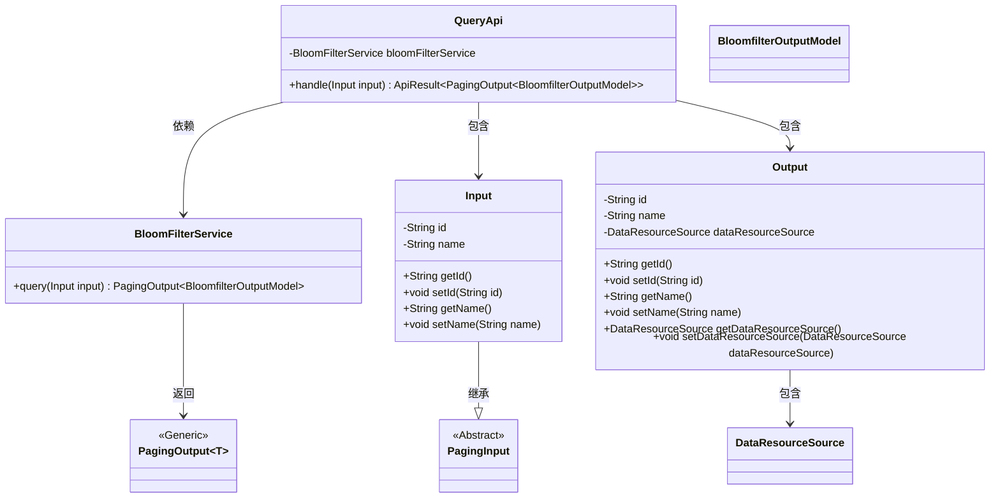

# 基础信息

|      |      |
|------|------|
| 名称 | QueryApi |
| 编码语言 | .java |
| 代码路径 | WeFe/fusion/fusion-service/src/main/java/com/welab/wefe/data/fusion/service/api/bloomfilter/QueryApi.java |
| 包名 | com.welab.wefe.data.fusion.service.api.bloomfilter |
| 依赖项 | ['com.welab.wefe.common.fieldvalidate.annotation.Check', 'com.welab.wefe.common.web.api.base.AbstractApi', 'com.welab.wefe.common.web.api.base.Api', 'com.welab.wefe.common.web.dto.ApiResult', 'com.welab.wefe.data.fusion.service.dto.base.PagingInput', 'com.welab.wefe.data.fusion.service.dto.base.PagingOutput', 'com.welab.wefe.data.fusion.service.dto.entity.bloomfilter.BloomfilterOutputModel', 'com.welab.wefe.data.fusion.service.enums.DataResourceSource', 'com.welab.wefe.data.fusion.service.service.bloomfilter.BloomFilterService', 'org.springframework.beans.factory.annotation.Autowired'] |
| 概述说明 | QueryApi类用于查询过滤器列表，接收分页参数和过滤器名称，返回分页结果和过滤器信息。 |

# 说明

这是一个名为QueryApi的Java类，用于查询过滤器列表。它继承自AbstractApi，接受Input参数并返回分页的BloomfilterOutputModel结果。Input类包含id和name字段，其中name字段有校验注解。Output类包含id、name和dataResourceSource字段。该类通过BloomFilterService处理查询请求，并返回成功结果。

# 类列表 Class Summary

| 名称   | 类型  | 说明 |
|-------|------|-------------|
| QueryApi | class | 查询过滤器列表API，输入包含ID和名称，输出分页结果，调用BloomFilterService处理查询。 |

## 类 QueryApi

|      |      |
|------|------|
| 访问范围 | @Api(path = "filter/query", name = "查询过滤器列表");public |
| 类型 | class |
| 名称 | QueryApi |
| 说明 | 查询过滤器列表API，输入包含ID和名称，输出分页结果，调用BloomFilterService处理查询。 |

### UML类图

这段代码展示了一个查询过滤器列表的API类结构。QueryApi继承自AbstractApi，处理分页查询请求，依赖BloomFilterService进行实际查询操作。包含Input和Output两个内部类，Input继承PagingInput用于接收查询参数，Output用于封装返回数据。BloomFilterService的query方法返回分页结果，涉及泛型类PagingOutput和模型类BloomfilterOutputModel。整体设计体现了分层架构和清晰的职责划分。

### 内部方法调用关系图

```mermaid
graph TD
    A["类QueryApi"]
    B["注解: @Api(path='filter/query', name='查询过滤器列表')"]
    C["继承: AbstractApi<Input, PagingOutput<BloomfilterOutputModel>>"]
    D["依赖注入: @Autowired BloomFilterService"]
    E["重写方法: handle(Input input)"]
    F["内部类: Input"]
    G["内部类: Output"]
    H["Input属性: String id"]
    I["Input属性: @Check String name"]
    J["Input方法: getter/setter"]
    K["Output属性: String id"]
    L["Output属性: @Check String name"]
    M["Output属性: DataResourceSource"]
    N["Output方法: getter/setter"]

    A --> B
    A --> C
    A --> D
    A --> E
    A --> F
    A --> G
    F --> H
    F --> I
    F --> J
    G --> K
    G --> L
    G --> M
    G --> N
    E --> D
    E --> F
```

这段代码描述了一个基于Spring框架的查询API类QueryApi，它继承自AbstractApi并处理分页查询请求。流程图展示了类结构关系，包括：1) 类级别的API注解配置；2) 对BloomFilterService的依赖注入；3) 核心处理方法handle()的实现逻辑；4) 两个嵌套的输入输出类Input和Output的定义，其中Input包含分页参数和过滤条件，Output包含返回数据结构和资源来源标识。整个设计遵循了分层架构模式，通过泛型指定了输入输出类型约束。

### 字段列表 Field List

| 名称  | 类型  | 说明 |
|-------|-------|------|
| bloomFilterService | BloomFilterService | 使用@Autowired自动注入BloomFilterService实例。 |

### 方法列表

| 名称  | 类型  | 说明 |
|-------|-------|------|
| handle | ApiResult<PagingOutput<BloomfilterOutputModel>> | Java方法重写，调用bloomFilterService查询输入并返回分页结果。 |

