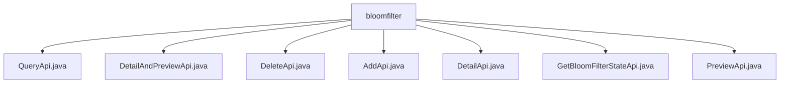

# 基础信息

|      |      |
|------|------|
| 名称 | bloomfilter |
| 编码语言 | .java |
| 代码路径 | WeFe/fusion/fusion-service/src/main/java/com/welab/wefe/data/fusion/service/api/bloomfilter |
| 包名 | docs.fusion.fusion-service.src.main.java.com.welab.wefe.data.fusion.service.api.bloomfilter |
| 概述说明 | QueryApi查询过滤器列表，继承AbstractApi，输入含id和name，输出分页结果。DetailAndPreviewApi获取过滤器详情和预览，输入需id。DeleteApi删除过滤器，需id和登录。AddApi添加过滤器，含多字段校验。DetailApi获取详情，需id和登录。GetBloomFilterStateApi获取状态，含进度信息。PreviewApi预览文件，输入含数据ID等。 |

# 说明

## 概述  
该模块为布隆过滤器管理API组，核心职责是提供过滤器的CRUD操作及状态查询功能，类似资源管理器模式。接口规范统一继承AbstractApi基类，输入参数多包含必填ID字段，输出多为BloomfilterOutputModel或其变体。关键数据结构包括BloomfilterDetailOutputModel（含详情和预览数据）、BloomfilterAddOutput（含数据源ID）等。外部依赖为BloomFilterService系列服务，例如DeleteApi依赖其删除功能。实现案例丰富，例如AddApi包含文件名、SQL脚本等复杂字段校验。

## 主要业务场景  
模块支持完整生命周期管理：AddApi创建过滤器（例如需提供数据集名称和去重标志）、QueryApi分页查询列表、DetailApi获取详情、DeleteApi移除资源。特殊场景如PreviewApi预览文件内容（需数据ID和SQL语句）、GetBloomFilterStateApi监控处理进度。交互模式均为RESTful风格，例如DetailAndPreviewApi合并详情与预览功能。典型应用包括数据清洗前的过滤器配置，通过组合调用实现工作流，如先Add再Query校验。

### 包内部结构视图

该流程图展示了bloomfilter目录下的7个API文件结构，所有Java文件均直接隶属于bloomfilter节点，呈现了布隆过滤器相关接口的平级关系，包括查询、详情预览、删除、添加、详情获取、状态获取和预览等核心功能接口。

# 文件列表

| 名称   | 类型  | 说明 |
|-------|------|-------------|
| [QueryApi.java](QueryApi.md) | file | QueryApi类用于查询过滤器列表，接收分页参数和过滤器名称，返回分页结果和过滤器信息。 |
| [DetailAndPreviewApi.java](DetailAndPreviewApi.md) | file | 这是一个过滤器详情预览API类，通过ID获取布隆过滤器详情，返回详情和预览数据。输入参数为数据ID，调用BloomFilterService处理请求。 |
| [DeleteApi.java](DeleteApi.md) | file | 删除过滤器的API类，需登录，调用BloomFilterService删除指定ID的过滤器。输入参数为必填的ID字段。 |
| [AddApi.java](AddApi.md) | file | 添加过滤器的API接口，需登录，输入包括数据集名称、描述、文件等，输出为数据源ID。名称长度4-30，描述不超过3072字符，主键必填。 |
| [DetailApi.java](DetailApi.md) | file | 这是一个过滤器详情API类，路径为"filter/detail"，需要登录。它继承自AbstractApi，处理输入ID并返回BloomfilterOutputModel结果。使用BloomFilterService获取详情。输入类Input包含必填字段id。 |
| [GetBloomFilterStateApi.java](GetBloomFilterStateApi.md) | file | 获取布隆过滤器状态的API，需登录，输入为过滤器ID，输出包含ID、行数、处理数和进度。 |
| [PreviewApi.java](PreviewApi.md) | file | 预览上传的过滤器源文件API，接收数据ID、文件名、数据源、SQL和行数输入，通过BloomFilterService处理并返回预览结果。 |

