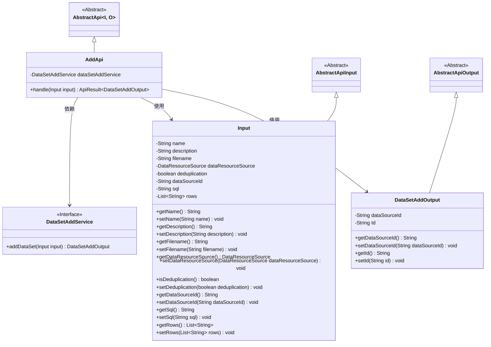

# 基础信息

|      |      |
|------|------|
| 名称 | AddApi |
| 编码语言 | .java |
| 代码路径 | WeFe/fusion/fusion-service/src/main/java/com/welab/wefe/data/fusion/service/api/dataset/AddApi.java |
| 包名 | com.welab.wefe.data.fusion.service.api.dataset |
| 依赖项 | ['com.welab.wefe.common.fieldvalidate.annotation.Check', 'com.welab.wefe.common.web.api.base.AbstractApi', 'com.welab.wefe.common.web.api.base.Api', 'com.welab.wefe.common.web.dto.AbstractApiInput', 'com.welab.wefe.common.web.dto.AbstractApiOutput', 'com.welab.wefe.common.web.dto.ApiResult', 'com.welab.wefe.data.fusion.service.enums.DataResourceSource', 'com.welab.wefe.data.fusion.service.service.dataset.DataSetAddService', 'org.springframework.beans.factory.annotation.Autowired', 'java.util.List'] |
| 概述说明 | 添加数据集的API接口，包含名称、描述、文件等输入参数，返回数据源ID和数据集ID。需登录使用。 |

# 说明

该代码定义了一个名为AddApi的API类，用于添加数据集。API路径为"data_set/add"，需要登录访问。输入参数Input包含数据集名称、描述、文件名、数据源类型、去重标志、数据源ID、SQL脚本和特征列列表，其中名称必填且长度限制为4-30字符，描述最长3072字符。输出参数DataSetAddOutput包含数据源ID和生成的ID。处理逻辑通过dataSetAddService.addDataSet方法实现，返回成功结果。

# 类列表 Class Summary

| 名称   | 类型  | 说明 |
|-------|------|-------------|
| AddApi | class | 添加数据集API，需登录，输入包括名称、描述、文件、数据源等，输出包含数据源ID和ID。名称需4-30字符，描述限3072字符。 |

## 类 AddApi

|      |      |
|------|------|
| 访问范围 | @Api(path = "data_set/add", name = "添加数据集", desc = "添加数据集", login = true);public |
| 类型 | class |
| 名称 | AddApi |
| 说明 | 添加数据集API，需登录，输入包括名称、描述、文件、数据源等，输出包含数据源ID和ID。名称需4-30字符，描述限3072字符。 |

### UML类图

这段代码描述了一个添加数据集的API类`AddApi`，它继承自泛型抽象类`AbstractApi`，使用`Input`类作为输入参数，`DataSetAddOutput`作为输出结果。`Input`类包含多个经过校验的字段，如数据集名称、描述、文件名等；`DataSetAddOutput`包含数据源ID和生成的ID。`AddApi`通过依赖注入的`DataSetAddService`接口实现核心业务逻辑。整个设计采用了分层结构和严格的输入校验机制。

### 内部方法调用关系图

```mermaid
graph TD
    A["类AddApi"]
    B["注解: @Api"]
    C["依赖注入: DataSetAddService"]
    D["方法: handle(Input input)"]
    E["内部类: Input"]
    F["内部类: DataSetAddOutput"]
    G["Input属性: String name"]
    H["Input属性: String description"]
    I["Input属性: String filename"]
    J["Input属性: DataResourceSource dataResourceSource"]
    K["Input属性: boolean deduplication"]
    L["Input属性: String dataSourceId"]
    M["Input属性: String sql"]
    N["Input属性: List<String> rows"]
    O["Input方法: getter/setter"]
    P["DataSetAddOutput属性: String dataSourceId"]
    Q["DataSetAddOutput属性: String Id"]
    R["DataSetAddOutput方法: getter/setter"]

    A --> B
    A --> C
    A --> D
    A --> E
    A --> F
    E --> G
    E --> H
    E --> I
    E --> J
    E --> K
    E --> L
    E --> M
    E --> N
    E --> O
    F --> P
    F --> Q
    F --> R
    D --> C
```

这段代码是一个用于添加数据集的API类，包含输入参数验证和输出结果处理功能。流程图展示了AddApi类的整体结构，包括类注解、服务依赖、核心处理方法以及两个内部类Input和DataSetAddOutput。Input类包含多个带验证注解的属性和对应的getter/setter方法，用于接收前端传入的参数；DataSetAddOutput类则定义了API返回的数据结构。核心handle方法通过调用dataSetAddService完成业务逻辑处理。

### 字段列表 Field List

| 名称  | 类型  | 说明 |
|-------|-------|------|
| dataSetAddService | DataSetAddService | 代码片段使用@Autowired注解自动注入DataSetAddService实例。 |

### 方法列表

| 名称  | 类型  | 说明 |
|-------|-------|------|
| handle | ApiResult<DataSetAddOutput> | 覆盖方法处理输入并返回数据集添加服务的结果。 |

