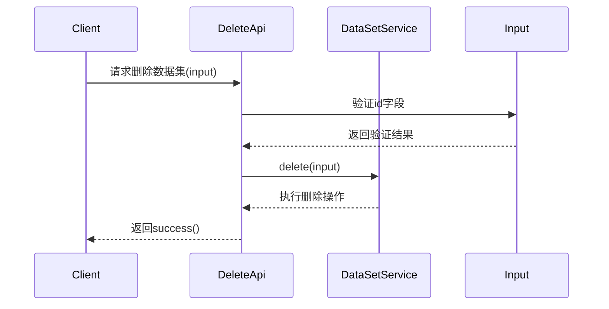

# 基础信息

|      |      |
|------|------|
| 名称 | DeleteApi |
| 编码语言 | .java |
| 代码路径 | WeFe/fusion/fusion-service/src/main/java/com/welab/wefe/data/fusion/service/api/dataset/DeleteApi.java |
| 包名 | com.welab.wefe.data.fusion.service.api.dataset |
| 依赖项 | ['com.welab.wefe.common.fieldvalidate.annotation.Check', 'com.welab.wefe.common.web.api.base.AbstractNoneOutputApi', 'com.welab.wefe.common.web.api.base.Api', 'com.welab.wefe.common.web.dto.AbstractApiInput', 'com.welab.wefe.common.web.dto.ApiResult', 'com.welab.wefe.data.fusion.service.service.dataset.DataSetService', 'org.springframework.beans.factory.annotation.Autowired'] |
| 概述说明 | 删除数据集API，需登录，接收id参数，调用dataSetService删除数据。 |

# 说明

这是一个名为DeleteApi的Java类，用于实现删除数据集的功能。该类继承自AbstractNoneOutputApi，泛型参数为内部类Input。通过@Api注解定义了API路径为"data_set/delete"，名称为"删除数据集"，需要登录验证。类中注入了DataSetService服务，重写了handler方法调用delete操作并返回成功结果。Input内部类继承AbstractApiInput，包含一个必填的String类型id字段及其getter/setter方法，使用@Check注解标记该字段为必填项。

# 类列表 Class Summary

| 名称   | 类型  | 说明 |
|-------|------|-------------|
| DeleteApi | class | 删除数据集的API接口，需登录，接收id参数，调用dataSetService删除数据并返回成功结果。 |


## 类 DeleteApi

|      |      |
|------|------|
| 访问范围 | @Api(path = "data_set/delete", name = "删除数据集", desc = "删除数据集", login = true);public |
| 类型 | class |
| 名称 | DeleteApi |
| 说明 | 删除数据集的API接口，需登录，接收id参数，调用dataSetService删除数据并返回成功结果。 |


### UML类图

```mermaid
classDiagram
    class DeleteApi {
        -DataSetService dataSetService
        +handler(Input input) ApiResult
    }
    class AbstractNoneOutputApi~T~ {
        <<Abstract>>
        +handler(T input) ApiResult
    }
    class DataSetService {
        +delete(DeleteApi$Input input)
    }
    class DeleteApi$Input {
        -String id
        +String getId()
        +void setId(String id)
    }
    class AbstractApiInput {
        <<Abstract>>
    }
    class ApiResult {
    }

    DeleteApi --> AbstractNoneOutputApi~DeleteApi$Input~ : 继承
    DeleteApi --> DataSetService : 依赖
    DeleteApi$Input --> AbstractApiInput : 继承
    DeleteApi ..> DeleteApi$Input : 嵌套类
    AbstractNoneOutputApi ..> ApiResult : 返回类型
```

该代码展示了一个删除数据集的API实现，采用分层架构设计。DeleteApi继承自泛型抽象类AbstractNoneOutputApi，处理包含ID参数的输入对象，通过DataSetService执行删除操作。输入类Input继承自AbstractApiInput并包含数据校验注解，体现了清晰的职责分离和类型安全设计。类间关系包含继承、依赖和组合，形成了标准的API处理流程结构。


### 内部方法调用关系图

```mermaid
graph TD
    A["类DeleteApi"]
    B["注解: @Api"]
    C["继承: AbstractNoneOutputApi<Input>"]
    D["依赖注入: @Autowired DataSetService"]
    E["重写方法: handler(Input input)"]
    F["内部类: Input"]
    G["属性: String id"]
    H["方法: String getId()"]
    I["方法: void setId(String id)"]
    J["调用: dataSetService.delete(input)"]
    K["返回: success()"]

    A --> B
    A --> C
    A --> D
    A --> E
    E --> J
    E --> K
    A --> F
    F --> G
    F --> H
    F --> I
```





这段代码定义了一个删除数据集的API接口，通过继承抽象类实现无输出类型的API。主要流程包括：客户端发起请求后，验证输入参数中的id字段，调用服务层执行删除操作，最后返回成功结果。内部类Input用于封装请求参数并实现字段校验，体现了分层设计和参数校验机制。

### 字段列表 Field List

| 名称  | 类型  | 说明 |
|-------|-------|------|
| dataSetService | DataSetService | 使用@Autowired自动注入DataSetService实例。 |

### 方法列表

| 名称  | 类型  | 说明 |
|-------|-------|------|
| handler | ApiResult | 该方法重写父类handler，调用dataSetService删除输入数据，返回成功结果。 |


