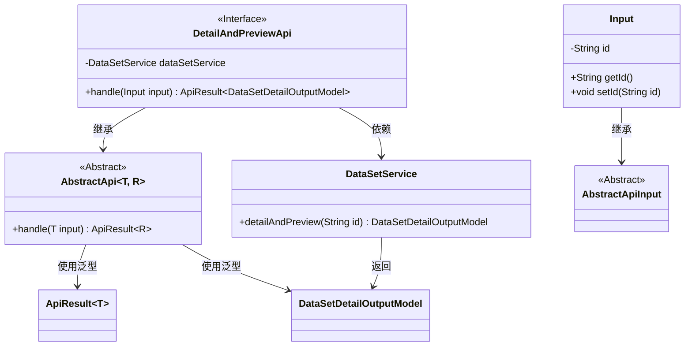

# 基础信息

|      |      |
|------|------|
| 名称 | DetailAndPreviewApi |
| 编码语言 | .java |
| 代码路径 | WeFe/fusion/fusion-service/src/main/java/com/welab/wefe/data/fusion/service/api/dataset/DetailAndPreviewApi.java |
| 包名 | com.welab.wefe.data.fusion.service.api.dataset |
| 依赖项 | ['com.welab.wefe.common.fieldvalidate.annotation.Check', 'com.welab.wefe.common.web.api.base.AbstractApi', 'com.welab.wefe.common.web.api.base.Api', 'com.welab.wefe.common.web.dto.AbstractApiInput', 'com.welab.wefe.common.web.dto.ApiResult', 'com.welab.wefe.data.fusion.service.dto.entity.dataset.DataSetDetailOutputModel', 'com.welab.wefe.data.fusion.service.service.dataset.DataSetService', 'org.springframework.beans.factory.annotation.Autowired'] |
| 概述说明 | 这是一个名为"过滤器详情预览"的API类，路径为"data_set/detail_and_preview"，接收数据ID作为输入，返回数据集详情预览结果。 |

# 说明

该代码定义了一个名为DetailAndPreviewApi的API类，用于处理数据集详情和预览请求。类继承自AbstractApi，指定输入类型为内部类Input，输出类型为DataSetDetailOutputModel。通过Autowired注入DataSetService服务，在handle方法中调用dataSetService的detailAndPreview方法处理请求。Input内部类包含一个经过校验的字符串类型id字段，并提供getter和setter方法。API路径为"data_set/detail_and_preview"，名称为"过滤器详情预览"。

# 类列表 Class Summary

| 名称   | 类型  | 说明 |
|-------|------|-------------|
| DetailAndPreviewApi | class | 这是一个名为"过滤器详情预览"的API类，通过输入数据ID调用数据集服务获取详情和预览数据，返回数据集详情输出模型。 |

## 类 DetailAndPreviewApi

|      |      |
|------|------|
| 访问范围 | @Api(path = "data_set/detail_and_preview", name = "过滤器详情预览", desc = "过滤器详情预览");public |
| 类型 | class |
| 名称 | DetailAndPreviewApi |
| 说明 | 这是一个名为"过滤器详情预览"的API类，通过输入数据ID调用数据集服务获取详情和预览数据，返回数据集详情输出模型。 |

### UML类图

这段代码展示了一个处理数据集详情预览的API类结构。DetailAndPreviewApi继承自泛型抽象类AbstractApi，通过DataSetService获取数据详情。Input作为内部类继承AbstractApiInput，包含数据ID字段及访问方法。类图清晰地呈现了继承关系、依赖关系和泛型参数的使用，体现了Spring框架中典型的API服务层设计模式。

### 内部方法调用关系图

```mermaid
graph TD
    A["类DetailAndPreviewApi"]
    B["注解: @Api"]
    C["继承: AbstractApi<Input, DataSetDetailOutputModel>"]
    D["依赖注入: @Autowired DataSetService"]
    E["重写方法: handle(Input input)"]
    F["内部类: Input"]
    G["属性: String id"]
    H["方法: getId()"]
    I["方法: setId(String id)"]
    J["调用: dataSetService.detailAndPreview(input.getId())"]
    K["返回: success(result)"]

    A --> B
    A --> C
    A --> D
    A --> E
    E --> J
    J --> K
    A --> F
    F --> G
    F --> H
    F --> I
```

该流程图展示了DetailAndPreviewApi类的结构和工作流程。类通过@Api注解定义API路径，继承AbstractApi并注入DataSetService服务。核心方法handle调用dataSetService.detailAndPreview获取数据详情，返回封装结果。内部类Input包含id属性和getter/setter方法，用于参数校验。整个流程清晰展现了从请求处理到数据返回的调用链，体现了Spring Boot API的典型分层设计模式。

### 字段列表 Field List

| 名称  | 类型  | 说明 |
|-------|-------|------|
| dataSetService | DataSetService | 自动注入DataSetService实例。 |

### 方法列表

| 名称  | 类型  | 说明 |
|-------|-------|------|
| handle | ApiResult<DataSetDetailOutputModel> | 该方法重写父类逻辑，调用服务获取数据集详情和预览，返回成功结果。输入为ID，输出为数据集详情模型。 |

