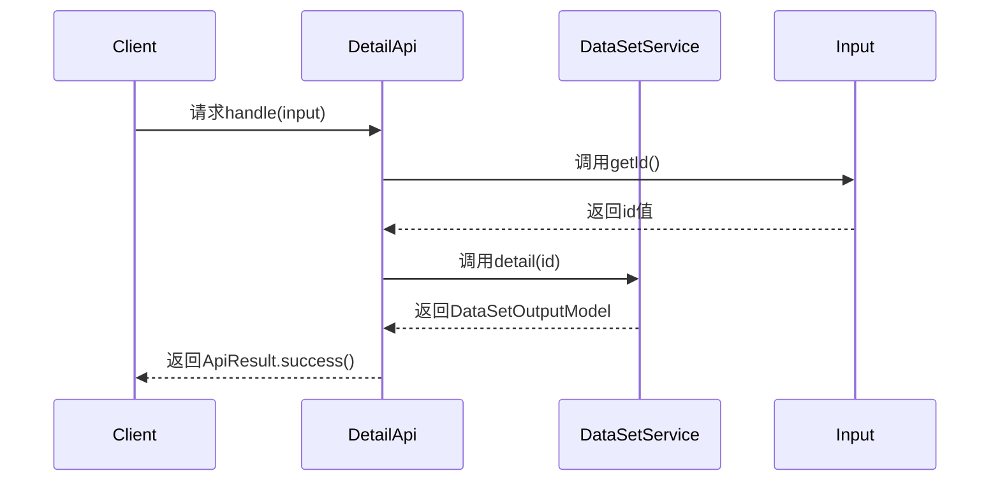

# 基础信息

|      |      |
|------|------|
| 名称 | DetailApi |
| 编码语言 | .java |
| 代码路径 | WeFe/fusion/fusion-service/src/main/java/com/welab/wefe/data/fusion/service/api/dataset/DetailApi.java |
| 包名 | com.welab.wefe.data.fusion.service.api.dataset |
| 依赖项 | ['com.welab.wefe.common.fieldvalidate.annotation.Check', 'com.welab.wefe.common.web.api.base.AbstractApi', 'com.welab.wefe.common.web.api.base.Api', 'com.welab.wefe.common.web.dto.AbstractApiInput', 'com.welab.wefe.common.web.dto.ApiResult', 'com.welab.wefe.data.fusion.service.dto.entity.dataset.DataSetOutputModel', 'com.welab.wefe.data.fusion.service.service.dataset.DataSetService', 'org.springframework.beans.factory.annotation.Autowired'] |
| 概述说明 | 这是一个名为"过滤器详情"的API类，路径为"data_set/detail"，需要登录。它继承自AbstractApi，接收包含必填id参数的Input类，调用dataSetService的detail方法并返回DataSetOutputModel结果。 |

# 说明

该代码定义了一个名为DetailApi的API类，用于处理数据集详情请求。API路径为"data_set/detail"，需要登录访问。类继承自AbstractApi，使用泛型指定输入类型为DetailApi.Input，输出类型为DataSetOutputModel。通过Autowired注入DataSetService服务。核心处理方法handle调用dataSetService.detail获取详情数据。输入类Input继承AbstractApiInput，包含必填字段id及其getter/setter方法。整个API实现了数据集详情查询功能。

# 类列表 Class Summary

| 名称   | 类型  | 说明 |
|-------|------|-------------|
| DetailApi | class | 这是一个名为"过滤器详情"的API类，路径为"data_set/detail"，需要登录。它接收包含必填id参数的输入，调用dataSetService的detail方法并返回数据集详情。 |


## 类 DetailApi

|      |      |
|------|------|
| 访问范围 | @Api(path = "data_set/detail", name = "过滤器详情", desc = "过滤器详情", login = true);public |
| 类型 | class |
| 名称 | DetailApi |
| 说明 | 这是一个名为"过滤器详情"的API类，路径为"data_set/detail"，需要登录。它接收包含必填id参数的输入，调用dataSetService的detail方法并返回数据集详情。 |


### UML类图

```mermaid
classDiagram
    class DetailApi {
        -DataSetService dataSetService
        +handle(Input input) ApiResult~DataSetOutputModel~
    }
    DetailApi --> DataSetService : 依赖
    DetailApi --> AbstractApi~Input,DataSetOutputModel~ : 继承
    DetailApi --> Input : 包含

    class AbstractApi~I~O~ {
        <<Abstract>>
        +handle(I input) ApiResult~O~
    }

    class DataSetService {
        +detail(String id) DataSetOutputModel
    }

    class Input {
        -String id
        +String getId()
        +void setId(String id)
    }
    Input --> AbstractApiInput : 继承

    class AbstractApiInput {
        <<Abstract>>
    }
```

这段代码展示了一个名为DetailApi的API类，它继承自泛型抽象类AbstractApi，处理数据集详情请求。DetailApi包含一个内部类Input用于接收参数，并依赖DataSetService获取数据详情。类图清晰地展示了继承关系(DetailApi→AbstractApi、Input→AbstractApiInput)、组合关系(DetailApi包含Input)和依赖关系(DetailApi使用DataSetService)。整体设计符合分层架构，通过泛型和抽象类实现了良好的扩展性。


### 内部方法调用关系图

```mermaid
graph TD
    A["类DetailApi"]
    B["注解: @Api"]
    C["继承: AbstractApi<Input, DataSetOutputModel>"]
    D["依赖注入: @Autowired DataSetService"]
    E["重写方法: handle(Input input)"]
    F["静态内部类: Input"]
    G["属性: @Check String id"]
    H["方法: getId()"]
    I["方法: setId(String id)"]
    J["调用: dataSetService.detail(input.getId())"]
    K["返回: ApiResult.success()"]

    A --> B
    A --> C
    A --> D
    A --> E
    E --> J
    J --> K
    A --> F
    F --> G
    F --> H
    F --> I
```





这段代码是一个基于Spring框架的API控制器类DetailApi，继承自AbstractApi，用于处理数据集详情查询请求。通过@Api注解定义API路径和元信息，使用@Autowired注入DataSetService服务。核心逻辑在handle方法中，通过输入参数Input的id调用服务层获取详情数据，最后返回封装好的ApiResult结果。Input作为静态内部类，包含带校验注解的id属性和对应的getter/setter方法。流程图展示了类结构和调用关系，时序图描述了请求处理过程。

### 字段列表 Field List

| 名称  | 类型  | 说明 |
|-------|-------|------|
| dataSetService | DataSetService | 自动注入数据集服务实例。 |

### 方法列表

| 名称  | 类型  | 说明 |
|-------|-------|------|
| handle | ApiResult<DataSetOutputModel> | 方法重写，调用dataSetService.detail获取输入ID的数据详情，返回成功结果。 |


