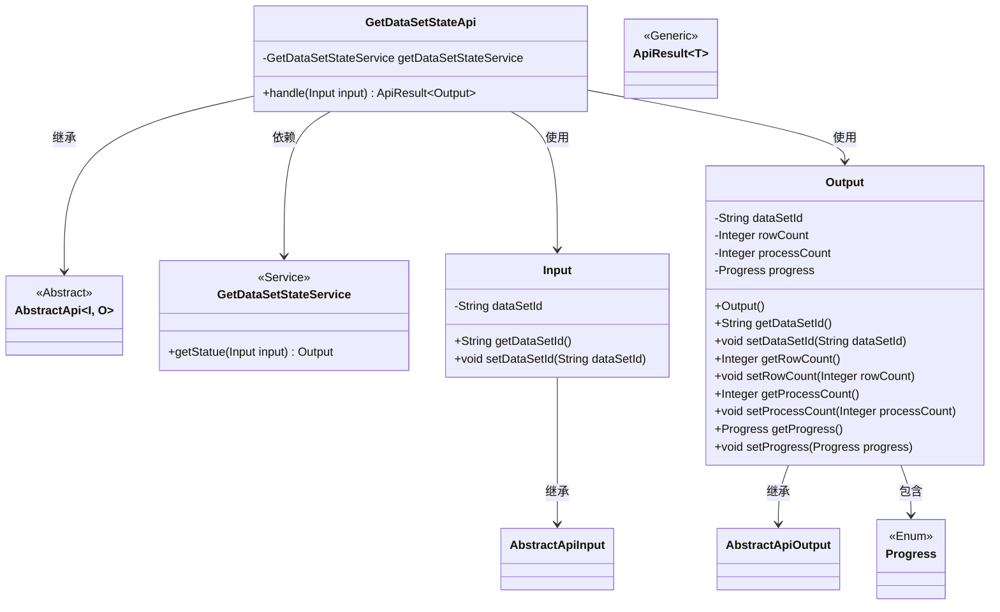
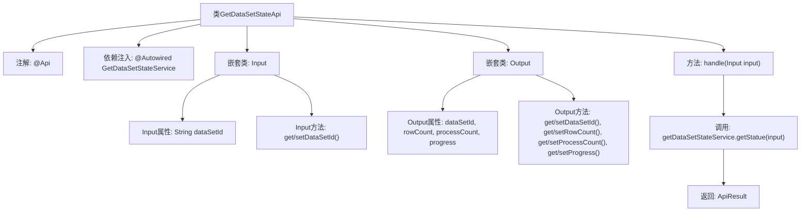

# 基础信息

|      |      |
|------|------|
| 名称 | GetDataSetStateApi |
| 编码语言 | .java |
| 代码路径 | WeFe/fusion/fusion-service/src/main/java/com/welab/wefe/data/fusion/service/api/dataset/GetDataSetStateApi.java |
| 包名 | com.welab.wefe.data.fusion.service.api.dataset |
| 依赖项 | ['com.welab.wefe.common.exception.StatusCodeWithException', 'com.welab.wefe.common.fieldvalidate.annotation.Check', 'com.welab.wefe.common.web.api.base.AbstractApi', 'com.welab.wefe.common.web.api.base.Api', 'com.welab.wefe.common.web.dto.AbstractApiInput', 'com.welab.wefe.common.web.dto.AbstractApiOutput', 'com.welab.wefe.common.web.dto.ApiResult', 'com.welab.wefe.data.fusion.service.enums.Progress', 'com.welab.wefe.data.fusion.service.service.dataset.GetDataSetStateService', 'org.springframework.beans.factory.annotation.Autowired', 'java.io.IOException'] |
| 概述说明 | 获取数据集状态的API接口，需登录，输入数据源ID，返回行数、处理数和进度。 |

# 说明

这是一个名为"获取数据集当前状态"的API接口，路径为"data_set/get_state"，需要登录才能访问。该API接收包含数据集ID的输入参数，通过GetDataSetStateService服务获取数据集状态信息，返回包含数据集ID、行数、处理数和进度等信息的输出结果。输入类Input定义了数据源ID字段及其getter/setter方法，输出类Output定义了数据集ID、行数、处理数和进度字段及其对应的getter/setter方法。

# 类列表 Class Summary

| 名称   | 类型  | 说明 |
|-------|------|-------------|
| GetDataSetStateApi | class | 获取数据集状态的API，需登录，输入数据源ID，返回数据集ID、行数、处理数和进度。 |

## 类 GetDataSetStateApi

|      |      |
|------|------|
| 访问范围 | @Api(path = "data_set/get_state", name = "获取数据集当前状态", desc = "获取数据集当前状态", login = true);public |
| 类型 | class |
| 名称 | GetDataSetStateApi |
| 说明 | 获取数据集状态的API，需登录，输入数据源ID，返回数据集ID、行数、处理数和进度。 |

### UML类图

这段代码描述了一个获取数据集状态的API接口实现。GetDataSetStateApi继承自泛型抽象类AbstractApi，使用Input作为输入参数类型，Output作为输出结果类型。该API通过GetDataSetStateService服务获取数据集状态，其中Input包含数据集ID字段，Output则封装了数据集ID、行数、处理数和进度等状态信息。类图清晰地展示了各组件间的继承、依赖和包含关系，体现了分层架构设计。

### 内部方法调用关系图

该流程图展示了GetDataSetStateApi类的完整结构，包含API注解、服务注入和核心处理方法。类继承自AbstractApi并定义了Input/Output两个嵌套类，Input用于接收数据集ID参数，Output包含数据集状态信息。handle方法通过getDataSetStateService获取状态并返回封装结果，体现了从参数验证到业务处理的完整调用链。

### 字段列表 Field List

| 名称  | 类型  | 说明 |
|-------|-------|------|
| getDataSetStateService | GetDataSetStateService | 使用@Autowired自动注入GetDataSetStateService实例。 |

### 方法列表

| 名称  | 类型  | 说明 |
|-------|-------|------|
| handle | ApiResult<Output> | Java方法重写，调用getDataSetStateService.getStatue处理输入并返回成功结果，可能抛出StatusCodeWithException和IOException。 |

