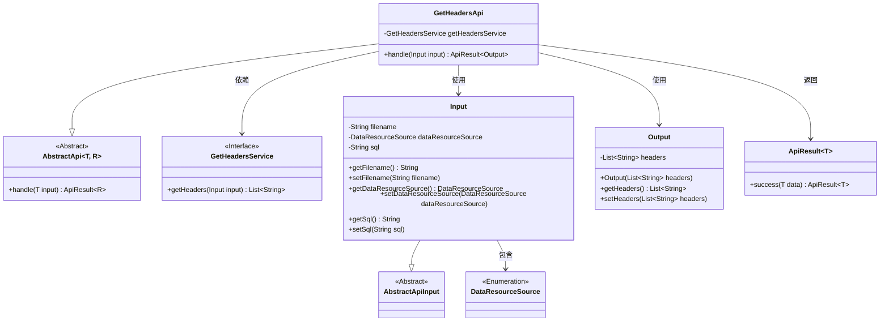
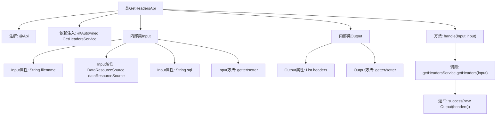

# 基础信息

|      |      |
|------|------|
| 名称 | GetHeadersApi |
| 编码语言 | .java |
| 代码路径 | WeFe/fusion/fusion-service/src/main/java/com/welab/wefe/data/fusion/service/api/dataset/GetHeadersApi.java |
| 包名 | com.welab.wefe.data.fusion.service.api.dataset |
| 依赖项 | ['com.welab.wefe.common.exception.StatusCodeWithException', 'com.welab.wefe.common.fieldvalidate.annotation.Check', 'com.welab.wefe.common.web.api.base.AbstractApi', 'com.welab.wefe.common.web.api.base.Api', 'com.welab.wefe.common.web.dto.AbstractApiInput', 'com.welab.wefe.common.web.dto.ApiResult', 'com.welab.wefe.data.fusion.service.enums.DataResourceSource', 'com.welab.wefe.data.fusion.service.service.GetHeadersService', 'org.springframework.beans.factory.annotation.Autowired', 'java.util.List'] |
| 概述说明 | GetHeadersApi接口用于获取数据集特征字段，输入需包含文件名、数据源和SQL脚本，输出为字段列表。 |

# 说明

该代码定义了一个名为GetHeadersApi的API类，用于获取数据集的特征字段。API路径为data_set/get_headers，功能描述为添加数据集并获取特征字段。类继承自AbstractApi，包含输入Input和输出Output两个内部类。输入类包含必填字段filename、dataResourceSource和可选字段sql，并进行了非空校验。输出类包含headers列表。API通过GetHeadersService处理输入并返回特征字段列表。

# 类列表 Class Summary

| 名称   | 类型  | 说明 |
|-------|------|-------------|
| GetHeadersApi | class | 该API用于获取数据集特征字段，接收文件名、数据源和SQL脚本作为输入，返回字段列表。通过GetHeadersService处理请求并返回结果。 |

## 类 GetHeadersApi

|      |      |
|------|------|
| 访问范围 | @Api(path = "data_set/get_headers", name = "添加数据集", desc = "获取特征字段");public |
| 类型 | class |
| 名称 | GetHeadersApi |
| 说明 | 该API用于获取数据集特征字段，接收文件名、数据源和SQL脚本作为输入，返回字段列表。通过GetHeadersService处理请求并返回结果。 |

### UML类图

这段代码描述了一个获取数据集特征字段的API实现，核心类GetHeadersApi继承自泛型抽象类AbstractApi，使用GetHeadersService服务处理业务逻辑。输入参数Input继承自AbstractApiInput，包含文件名、数据源类型和SQL脚本三个校验字段；输出结果Output封装了返回的字段头列表。通过类图清晰展示了各组件间的继承、依赖和使用关系，体现了典型的API分层设计模式。

### 内部方法调用关系图

这段代码是一个基于Spring框架的API控制器类，用于获取数据集的特征字段。流程图展示了类结构关系：GetHeadersApi通过注解定义API路径，依赖GetHeadersService处理业务逻辑，包含Input和Output两个内部类分别封装请求参数和响应数据。核心流程是handle方法调用服务层获取表头信息，最终返回封装后的结果。输入参数包含文件名、数据源类型和SQL脚本，输出为表头列表，整个过程遵循标准的API设计模式。

### 字段列表 Field List

| 名称  | 类型  | 说明 |
|-------|-------|------|
| getHeadersService | GetHeadersService | 使用@Autowired自动注入GetHeadersService实例。 |

### 方法列表

| 名称  | 类型  | 说明 |
|-------|-------|------|
| handle | ApiResult<Output> | 重写handle方法，调用getHeadersService获取headers并封装为Output返回成功结果。 |

