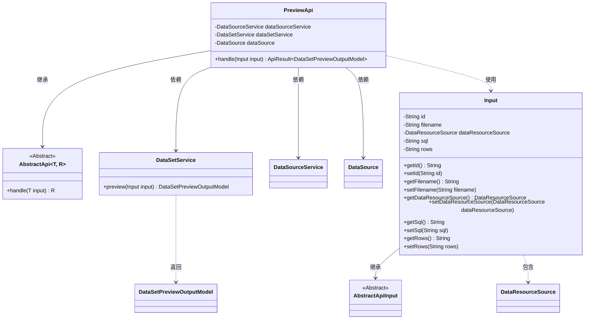

# 基础信息

|      |      |
|------|------|
| 名称 | PreviewApi |
| 编码语言 | .java |
| 代码路径 | WeFe/fusion/fusion-service/src/main/java/com/welab/wefe/data/fusion/service/api/dataset/PreviewApi.java |
| 包名 | com.welab.wefe.data.fusion.service.api.dataset |
| 依赖项 | ['com.welab.wefe.common.fieldvalidate.annotation.Check', 'com.welab.wefe.common.web.api.base.AbstractApi', 'com.welab.wefe.common.web.api.base.Api', 'com.welab.wefe.common.web.dto.AbstractApiInput', 'com.welab.wefe.common.web.dto.ApiResult', 'com.welab.wefe.data.fusion.service.dto.entity.dataset.DataSetPreviewOutputModel', 'com.welab.wefe.data.fusion.service.enums.DataResourceSource', 'com.welab.wefe.data.fusion.service.service.DataSourceService', 'com.welab.wefe.data.fusion.service.service.dataset.DataSetService', 'org.springframework.beans.factory.annotation.Autowired', 'javax.sql.DataSource'] |
| 概述说明 | PreviewApi用于预览数据集文件，接收包含数据ID、文件名、数据源、SQL和行数的输入，调用服务处理后返回预览结果。 |

# 说明

这是一个用于预览数据集文件的API类，路径为"data_set/preview"。它继承自AbstractApi，输入类型为PreviewApi.Input，输出类型为DataSetPreviewOutputModel。类中注入了DataSourceService、DataSetService和DataSource三个服务。核心处理逻辑在handle方法中，调用dataSetService.preview方法处理输入并返回结果。输入类Input包含五个字段：数据id、文件名、数据资源来源、SQL语句和行数，每个字段都有对应的getter和setter方法。

# 类列表 Class Summary

| 名称   | 类型  | 说明 |
|-------|------|-------------|
| PreviewApi | class | PreviewApi类用于预览数据集文件，继承AbstractApi，处理输入参数如数据ID、文件名、数据源等，调用dataSetService.preview方法返回结果。 |

## 类 PreviewApi

|      |      |
|------|------|
| 访问范围 | @Api(path = "data_set/preview", name = "Preview the dataset file");public |
| 类型 | class |
| 名称 | PreviewApi |
| 说明 | PreviewApi类用于预览数据集文件，继承AbstractApi，处理输入参数如数据ID、文件名、数据源等，调用dataSetService.preview方法返回结果。 |

### UML类图

这段代码展示了一个数据集预览API的实现结构。PreviewApi继承自泛型抽象类AbstractApi，处理Input输入并返回DataSetPreviewOutputModel结果。核心功能通过依赖注入的DataSetService完成数据预览，Input类封装了包括数据ID、文件名、资源来源等参数。类图清晰地呈现了继承关系、依赖注入和服务调用链路，体现了Spring框架下典型的分层架构设计模式。

### 内部方法调用关系图

```mermaid
graph TD
    A["类PreviewApi"]
    B["注解: @Api(path='data_set/preview', name='Preview the dataset file')"]
    C["继承: AbstractApi<Input, DataSetPreviewOutputModel>"]
    D["依赖注入: @Autowired DataSourceService"]
    E["依赖注入: @Autowired DataSetService"]
    F["依赖注入: @Autowired DataSource"]
    G["重写方法: handle(Input input)"]
    H["内部类: Input extends AbstractApiInput"]
    I["属性: String id"]
    J["属性: String filename"]
    K["属性: DataResourceSource dataResourceSource"]
    L["属性: String sql"]
    M["属性: String rows"]
    N["Getter/Setter方法"]

    A --> B
    A --> C
    A --> D
    A --> E
    A --> F
    A --> G
    A --> H
    H --> I
    H --> J
    H --> K
    H --> L
    H --> M
    H --> N
    G -->|调用| E["dataSetService.preview(input)"]
    G -->|返回| C["ApiResult<DataSetPreviewOutputModel>"]
```

这段代码定义了一个用于预览数据集文件的API类PreviewApi，它继承自AbstractApi并实现了handle方法。类中包含三个自动注入的服务组件，以及一个静态内部类Input作为输入参数。Input类继承自AbstractApiInput，包含五个属性和对应的getter/setter方法。handle方法调用dataSetService的preview方法处理输入参数，并返回封装后的结果。整个结构清晰地展示了API的请求处理流程和参数结构。

### 字段列表 Field List

| 名称  | 类型  | 说明 |
|-------|-------|------|
| dataSetService | DataSetService | 代码片段使用@Autowired注解自动注入DataSetService实例。 |
| dataSourceService | DataSourceService | 自动注入DataSourceService实例。 |
| dataSource | DataSource | 自动注入受保护的数据源对象。 |

### 方法列表

| 名称  | 类型  | 说明 |
|-------|-------|------|
| handle | ApiResult<DataSetPreviewOutputModel> | Java方法重写，调用dataSetService.preview处理输入并返回成功结果。 |

