# 基础信息

|      |      |
|------|------|
| 名称 | QueryApi |
| 编码语言 | .java |
| 代码路径 | WeFe/fusion/fusion-service/src/main/java/com/welab/wefe/data/fusion/service/api/dataset/QueryApi.java |
| 包名 | com.welab.wefe.data.fusion.service.api.dataset |
| 依赖项 | ['com.welab.wefe.common.fieldvalidate.annotation.Check', 'com.welab.wefe.common.web.api.base.AbstractApi', 'com.welab.wefe.common.web.api.base.Api', 'com.welab.wefe.common.web.dto.ApiResult', 'com.welab.wefe.data.fusion.service.dto.base.PagingInput', 'com.welab.wefe.data.fusion.service.dto.base.PagingOutput', 'com.welab.wefe.data.fusion.service.dto.entity.dataset.DataSetOutputModel', 'com.welab.wefe.data.fusion.service.enums.DataResourceSource', 'com.welab.wefe.data.fusion.service.service.dataset.DataSetService', 'org.springframework.beans.factory.annotation.Autowired'] |
| 概述说明 | 查询数据集列表API，接收分页参数和ID或名称，返回分页数据集结果，包含ID、名称和数据来源。 |

# 说明

这是一个名为QueryApi的Java类，用于查询数据集列表。它继承自AbstractApi，接受Input参数并返回分页的DataSetOutputModel结果。Input类包含id和name两个字段，其中name有校验注解。Output类包含id、name和dataResourceSource字段，name同样有校验注解。通过注入的DataSetService执行查询操作，并返回处理结果。整个API路径为"data_set/query"。

# 类列表 Class Summary

| 名称   | 类型  | 说明 |
|-------|------|-------------|
| QueryApi | class | 查询数据集列表API，接收分页参数和ID、名称作为输入，返回包含ID、名称和数据源的分页结果。 |


## 类 QueryApi

|      |      |
|------|------|
| 访问范围 | @Api(path = "data_set/query", name = "查询数据集列表");public |
| 类型 | class |
| 名称 | QueryApi |
| 说明 | 查询数据集列表API，接收分页参数和ID、名称作为输入，返回包含ID、名称和数据源的分页结果。 |


### UML类图

```mermaid
classDiagram
    class QueryApi {
        -DataSetService dataSetService
        +handle(Input input) ApiResult~PagingOutput~DataSetOutputModel~~
    }
    class Input {
        -String id
        -String name
        +String getId()
        +void setId(String id)
        +String getName()
        +void setName(String name)
    }
    class Output {
        -String id
        -String name
        -DataResourceSource dataResourceSource
        +String getId()
        +void setId(String id)
        +String getName()
        +void setName(String name)
        +DataResourceSource getDataResourceSource()
        +void setDataResourceSource(DataResourceSource dataResourceSource)
    }
    class PagingInput {
        <<Abstract>>
    }
    class AbstractApi~T, R~ {
        <<Abstract>>
    }
    class DataSetService {
        <<Interface>>
        +query(Input input) PagingOutput~DataSetOutputModel~
    }
    class PagingOutput~T~ {
        <<GenericType>>
    }
    class DataSetOutputModel {
        <<Model>>
    }
    class DataResourceSource {
        <<Enum>>
    }

    QueryApi --> DataSetService : 依赖
    QueryApi --|> AbstractApi~Input, PagingOutput~DataSetOutputModel~~
    Input --|> PagingInput
    AbstractApi~T, R~ <|-- QueryApi : 实现
    DataSetService ..|> QueryApi : 实现
```

该代码实现了一个查询数据集列表的API接口，主要包含QueryApi类及其嵌套的Input和Output类。QueryApi继承自泛型抽象类AbstractApi，依赖DataSetService接口进行数据查询。Input类继承自PagingInput用于分页查询参数，Output类包含数据集的基本信息和数据源类型。整体结构体现了分层设计思想，通过泛型和继承实现代码复用。


### 内部方法调用关系图

```mermaid
graph TD
    A["类QueryApi"]
    B["注解: @Api(path='data_set/query', name='查询数据集列表')"]
    C["继承: AbstractApi<Input, PagingOutput<DataSetOutputModel>>"]
    D["依赖注入: @Autowired DataSetService"]
    E["重写方法: handle(Input input)"]
    F["内部类: Input extends PagingInput"]
    G["内部类: Output"]
    H["Input属性: String id"]
    I["Input属性: @Check String name"]
    J["Input方法: getter/setter"]
    K["Output属性: String id"]
    L["Output属性: @Check String name"]
    M["Output属性: DataResourceSource"]
    N["Output方法: getter/setter"]
    O["调用链: handle --> dataSetService.query"]

    A --> B
    A --> C
    A --> D
    A --> E
    A --> F
    A --> G
    F --> H
    F --> I
    F --> J
    G --> K
    G --> L
    G --> M
    G --> N
    E --> O
```



该流程图展示了QueryApi类的完整结构，包含API注解、父类继承、服务注入和两个内部类的详细组成。核心处理流程通过handle方法调用dataSetService.query完成数据集查询，Input类继承分页参数并扩展了ID和名称字段，Output类则定义了返回数据的结构。所有属性均配有标准的getter/setter方法，其中关键字段使用了参数校验注解。

### 字段列表 Field List

| 名称  | 类型  | 说明 |
|-------|-------|------|
| dataSetService | DataSetService | 自动注入DataSetService实例。 |

### 方法列表

| 名称  | 类型  | 说明 |
|-------|-------|------|
| handle | ApiResult<PagingOutput<DataSetOutputModel>> | 处理输入并返回数据集查询结果，成功时调用dataSetService.query方法。 |


