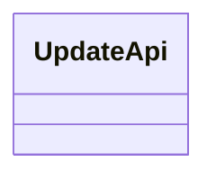
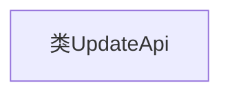

# 基础信息

|      |      |
|------|------|
| 名称 | UpdateApi |
| 编码语言 | .java |
| 代码路径 | WeFe/fusion/fusion-service/src/main/java/com/welab/wefe/data/fusion/service/api/dataset/UpdateApi.java |
| 包名 | com.welab.wefe.data.fusion.service.api.dataset |
| 依赖项 | [] |
| 概述说明 | 类定义：UpdateApi，功能未具体说明。 |

# 说明

这是一个名为UpdateApi的公开类定义，目前为空实现，未包含任何成员变量或方法。该类可能用于构建与API更新相关的功能模块，作为后续扩展的基础结构。根据命名规范推测，其用途可能涉及系统或服务更新操作的接口封装。由于类定义为空，具体功能需通过后续实现的成员来明确。

# 类列表 Class Summary

| 名称   | 类型  | 说明 |
|-------|------|-------------|
| UpdateApi | class | 这是一个名为UpdateApi的公开类，用于定义更新操作的API接口。 |

## 类 UpdateApi

|      |      |
|------|------|
| 访问范围 | public |
| 类型 | class |
| 名称 | UpdateApi |
| 说明 | 这是一个名为UpdateApi的公开类，用于定义更新操作的API接口。 |

### UML类图

这段类图描述了一个名为UpdateApi的空类，目前该类未定义任何成员变量或方法。作为API更新相关功能的潜在入口点，该类未来可能包含版本控制、更新检查或补丁应用等核心方法。当前简洁的结构为后续功能扩展提供了基础框架，符合开闭原则的设计思想。

### 内部方法调用关系图

这段流程图展示了一个名为UpdateApi的空类结构。由于该类未定义任何属性或方法，图中仅包含一个表示类本身的节点。这种基础结构通常作为API更新操作的起点，后续可扩展添加版本控制、请求处理等方法。空类设计可能用于预留接口或作为父类供子类继承实现具体功能。

### 字段列表 Field List

| 名称  | 类型  | 说明 |
|-------|-------|------|

### 方法列表

| 名称  | 类型  | 说明 |
|-------|-------|------|

