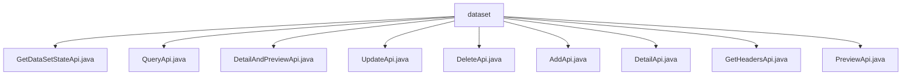

# 基础信息

|      |      |
|------|------|
| 名称 | dataset |
| 编码语言 | .java |
| 代码路径 | WeFe/fusion/fusion-service/src/main/java/com/welab/wefe/data/fusion/service/api/dataset |
| 包名 | docs.fusion.fusion-service.src.main.java.com.welab.wefe.data.fusion.service.api.dataset |
| 概述说明 | 获取数据集状态、查询列表、详情预览、更新、删除、添加、获取详情、特征字段和预览文件的API接口集合，均需登录访问，包含输入输出定义和服务调用逻辑。 |

# 说明

## 概述  
该模块核心职责是提供数据集全生命周期管理API，包括状态查询、增删改查及元数据获取等功能。接口规范遵循RESTful风格，统一继承AbstractApi基类，路径前缀为"data_set/"，均需登录验证。关键数据结构包括Input类（含ID等字段）、OutputModel类（含ID/名称/数据源等）及分页结果集。外部依赖主要为DataSetService等内部服务。例如GetHeadersApi通过GetHeadersService处理特征字段请求，DeleteApi调用DataSetService执行删除操作。

## 主要业务场景  
模块支持数据集CRUD操作与状态监控，类似数据中台模式。典型流程包括：通过AddApi创建数据集（校验名称/描述等）、QueryApi分页查询列表、DetailApi查看详情。交互模式均为请求-响应式，如PreviewApi接收文件参数返回预览数据。API类型覆盖查询类（如GetStateApi）、操作类（如DeleteApi）和复合类（如DetailAndPreviewApi）。例如GetHeadersApi结合SQL脚本解析字段，UpdateApi预留扩展接口。

### 包内部结构视图

该流程图展示了数据集API模块的层级结构，根节点为dataset文件夹，包含9个Java API文件，分别处理数据集的不同操作如查询、更新、删除、预览等。所有文件均直接隶属于dataset目录，无中间子目录层级，形成扁平化结构。

# 文件列表

| 名称   | 类型  | 说明 |
|-------|------|-------------|
| [GetDataSetStateApi.java](GetDataSetStateApi.md) | file | 获取数据集状态的API接口，需登录，输入数据源ID，返回行数、处理数和进度。 |
| [QueryApi.java](QueryApi.md) | file | 查询数据集列表API，接收分页参数和ID或名称，返回分页数据集结果，包含ID、名称和数据来源。 |
| [DetailAndPreviewApi.java](DetailAndPreviewApi.md) | file | 这是一个名为"过滤器详情预览"的API类，路径为"data_set/detail_and_preview"，接收数据ID作为输入，返回数据集详情预览结果。 |
| [UpdateApi.java](UpdateApi.md) | file | 类定义：UpdateApi，功能未具体说明。 |
| [DeleteApi.java](DeleteApi.md) | file | 删除数据集API，需登录，接收id参数，调用dataSetService删除数据。 |
| [AddApi.java](AddApi.md) | file | 添加数据集的API接口，包含名称、描述、文件等输入参数，返回数据源ID和数据集ID。需登录使用。 |
| [DetailApi.java](DetailApi.md) | file | 这是一个名为"过滤器详情"的API类，路径为"data_set/detail"，需要登录。它继承自AbstractApi，接收包含必填id参数的Input类，调用dataSetService的detail方法并返回DataSetOutputModel结果。 |
| [GetHeadersApi.java](GetHeadersApi.md) | file | GetHeadersApi接口用于获取数据集特征字段，输入需包含文件名、数据源和SQL脚本，输出为字段列表。 |
| [PreviewApi.java](PreviewApi.md) | file | PreviewApi用于预览数据集文件，接收包含数据ID、文件名、数据源、SQL和行数的输入，调用服务处理后返回预览结果。 |

