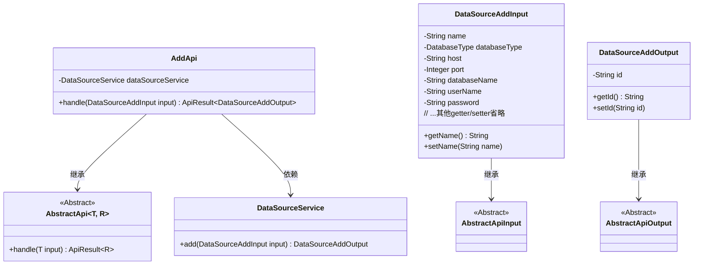
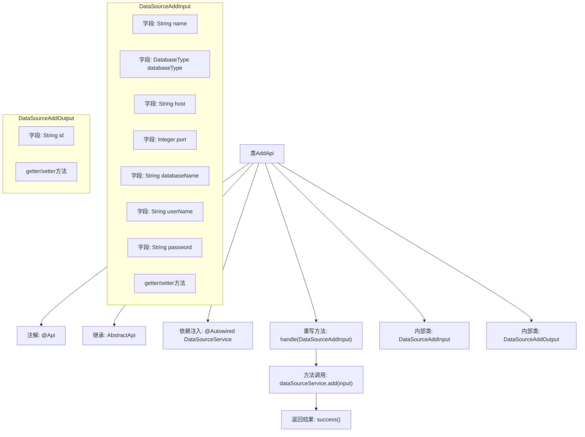

# 基础信息

|      |      |
|------|------|
| 名称 | AddApi |
| 编码语言 | .java |
| 代码路径 | WeFe/fusion/fusion-service/src/main/java/com/welab/wefe/data/fusion/service/api/datasource/AddApi.java |
| 包名 | com.welab.wefe.data.fusion.service.api.datasource |
| 依赖项 | ['com.welab.wefe.common.exception.StatusCodeWithException', 'com.welab.wefe.common.fieldvalidate.annotation.Check', 'com.welab.wefe.common.jdbc.base.DatabaseType', 'com.welab.wefe.common.web.api.base.AbstractApi', 'com.welab.wefe.common.web.api.base.Api', 'com.welab.wefe.common.web.dto.AbstractApiInput', 'com.welab.wefe.common.web.dto.AbstractApiOutput', 'com.welab.wefe.common.web.dto.ApiResult', 'com.welab.wefe.data.fusion.service.service.DataSourceService', 'org.springframework.beans.factory.annotation.Autowired'] |
| 概述说明 | 新增数据源API类，包含输入参数校验和输出结果处理，通过DataSourceService实现数据源添加功能。输入包括名称、类型、地址等必填字段，输出返回数据源ID。 |

# 说明

这是一个名为AddApi的Java类，用于新增数据源。它继承自AbstractApi，定义了DataSourceAddInput和DataSourceAddOutput两个内部类。输入类包含数据源名称、数据库类型、主机地址、端口、数据库名、用户名和密码等必填字段，并对名称长度进行了校验。输出类包含一个id字段。该类通过注入的DataSourceService处理新增请求，并返回操作结果。所有字段都通过注解进行了非空校验。

# 类列表 Class Summary

| 名称   | 类型  | 说明 |
|-------|------|-------------|
| AddApi | class | 新增数据源API类，包含输入参数校验和输出结果处理。输入需提供名称、数据库类型、IP、端口、库名、用户名和密码。输出返回数据源ID。 |

## 类 AddApi

|      |      |
|------|------|
| 访问范围 | @Api(path = "data_source/add", name = "新增数据源");public |
| 类型 | class |
| 名称 | AddApi |
| 说明 | 新增数据源API类，包含输入参数校验和输出结果处理。输入需提供名称、数据库类型、IP、端口、库名、用户名和密码。输出返回数据源ID。 |

### UML类图

该类图展示了数据源添加API的结构。AddApi继承自泛型抽象类AbstractApi，处理DataSourceAddInput输入并返回DataSourceAddOutput输出。输入输出类分别继承自对应的抽象基类，包含数据源相关字段。AddApi通过依赖DataSourceService完成核心业务逻辑，体现了清晰的层级关系和职责划分。

### 内部方法调用关系图

这段代码展示了一个用于新增数据源的API类AddApi，它继承自抽象类AbstractApi并实现了数据处理逻辑。主要包含输入参数校验(DataSourceAddInput)和输出结果(DataSourceAddOutput)两个内部类，通过DataSourceService完成核心业务操作。流程图清晰展示了类结构、依赖关系和主要方法调用链，特别是handle方法如何调用服务层并返回结果的过程。

### 字段列表 Field List

| 名称  | 类型  | 说明 |
|-------|-------|------|
| dataSourceService | DataSourceService | 自动注入DataSourceService实例。 |

### 方法列表

| 名称  | 类型  | 说明 |
|-------|-------|------|
| handle | ApiResult<DataSourceAddOutput> | 该方法重写父类逻辑，调用数据源服务添加输入参数并返回成功结果。 |

