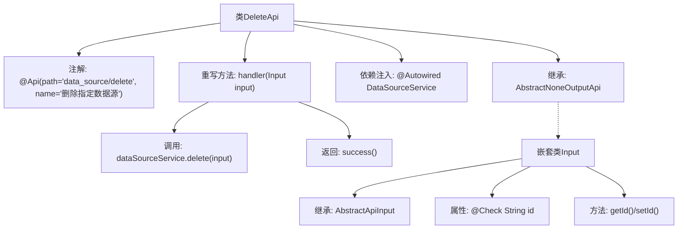

# 基础信息

|      |      |
|------|------|
| 名称 | DeleteApi |
| 编码语言 | .java |
| 代码路径 | WeFe/fusion/fusion-service/src/main/java/com/welab/wefe/data/fusion/service/api/datasource/DeleteApi.java |
| 包名 | com.welab.wefe.data.fusion.service.api.datasource |
| 依赖项 | ['com.welab.wefe.common.exception.StatusCodeWithException', 'com.welab.wefe.common.fieldvalidate.annotation.Check', 'com.welab.wefe.common.web.api.base.AbstractNoneOutputApi', 'com.welab.wefe.common.web.api.base.Api', 'com.welab.wefe.common.web.dto.AbstractApiInput', 'com.welab.wefe.common.web.dto.ApiResult', 'com.welab.wefe.data.fusion.service.service.DataSourceService', 'org.springframework.beans.factory.annotation.Autowired'] |
| 概述说明 | 删除数据源的API类，接收数据源ID参数，调用服务删除并返回成功结果。 |

# 说明

这是一个名为DeleteApi的Java类，用于删除指定数据源。它继承自AbstractNoneOutputApi，泛型参数为内部类Input。类上标注了Api注解，指定路径为"data_source/delete"，名称为"删除指定数据源"。通过Autowired注入了DataSourceService服务。handler方法处理输入参数，调用dataSourceService的delete方法完成删除操作，并返回成功结果。内部类Input继承AbstractApiInput，包含一个必填的字符串类型id字段，用于标识要删除的数据源，字段上标注了Check注解进行校验。

# 类列表 Class Summary

| 名称   | 类型  | 说明 |
|-------|------|-------------|
| DeleteApi | class | 删除数据源的API类，接收数据源ID参数，调用服务层删除操作，返回成功结果。 |


## 类 DeleteApi

|      |      |
|------|------|
| 访问范围 | @Api(path = "data_source/delete", name = "删除指定数据源");public |
| 类型 | class |
| 名称 | DeleteApi |
| 说明 | 删除数据源的API类，接收数据源ID参数，调用服务层删除操作，返回成功结果。 |


### UML类图

```mermaid
classDiagram
    class DeleteApi {
        -DataSourceService dataSourceService
        +handler(Input input) ApiResult~?~
    }
    
    class DataSourceService {
        <<Interface>>
        +delete(DeleteApi$Input input)
    }
    
    class AbstractNoneOutputApi~T~ {
        <<Abstract>>
        +handler(T input) ApiResult~?~
    }
    
    class DeleteApi$Input {
        -String id
        +String getId()
        +void setId(String id)
    }
    
    class AbstractApiInput {
        <<Abstract>>
    }
    
    DeleteApi --> AbstractNoneOutputApi~DeleteApi$Input~ : 继承
    DeleteApi --> DataSourceService : 依赖
    DeleteApi$Input --> AbstractApiInput : 继承
    DeleteApi ..> DeleteApi$Input : 嵌套
```

该代码展示了一个删除数据源的API实现，核心结构包含：1) DeleteApi继承自泛型抽象类AbstractNoneOutputApi，处理删除请求；2) 嵌套类Input继承AbstractApiInput，包含数据源ID校验逻辑；3) 通过DataSourceService接口执行实际删除操作。类图清晰呈现了继承关系（DeleteApi→AbstractNoneOutputApi、Input→AbstractApiInput）、依赖关系（DeleteApi→DataSourceService）和嵌套类关系，体现了Spring风格的API层设计模式，其中输入参数校验与业务逻辑分离，符合分层架构原则。


### 内部方法调用关系图



该流程图展示了DeleteApi类的结构，它是一个带有API注解的Spring组件，继承自泛型抽象类并重写了handler方法。流程包含依赖注入的服务调用和嵌套输入类的属性校验，描述了从请求处理到数据源删除的完整调用链。嵌套类Input负责封装校验参数，主类通过服务层完成核心业务逻辑后返回统一响应。

### 字段列表 Field List

| 名称  | 类型  | 说明 |
|-------|-------|------|
| dataSourceService | DataSourceService | 使用@Autowired自动注入DataSourceService实例。 |

### 方法列表

| 名称  | 类型  | 说明 |
|-------|-------|------|
| handler | ApiResult<?> | 覆盖handler方法，调用dataSourceService删除输入数据，成功返回结果。处理中可能抛出StatusCodeWithException异常。 |


