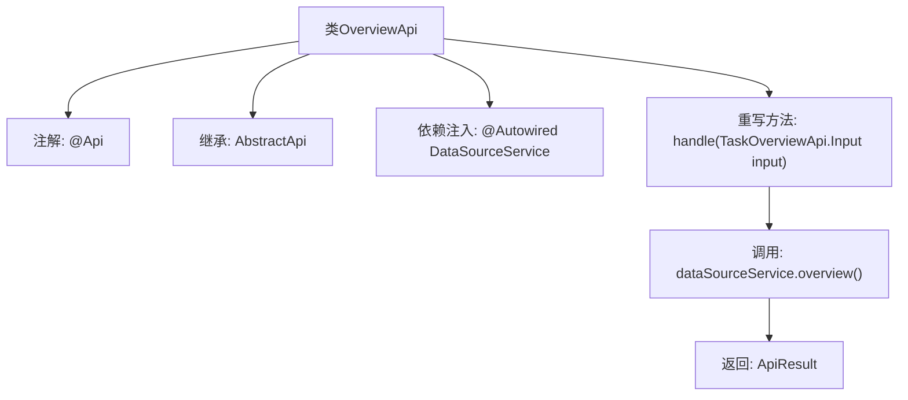

# 基础信息

|      |      |
|------|------|
| 名称 | OverviewApi |
| 编码语言 | .java |
| 代码路径 | WeFe/fusion/fusion-service/src/main/java/com/welab/wefe/data/fusion/service/api/datasource/OverviewApi.java |
| 包名 | com.welab.wefe.data.fusion.service.api.datasource |
| 依赖项 | ['com.welab.wefe.common.exception.StatusCodeWithException', 'com.welab.wefe.common.web.api.base.AbstractApi', 'com.welab.wefe.common.web.api.base.Api', 'com.welab.wefe.common.web.dto.ApiResult', 'com.welab.wefe.data.fusion.service.api.system.TaskOverviewApi', 'com.welab.wefe.data.fusion.service.dto.entity.DataSourceOverviewOutput', 'com.welab.wefe.data.fusion.service.dto.entity.TaskOverviewOutput', 'com.welab.wefe.data.fusion.service.service.DataSourceService', 'org.springframework.beans.factory.annotation.Autowired', 'java.io.IOException'] |
| 概述说明 | 概述API类，路径为"data_source/overview"，处理数据源概览请求，调用DataSourceService返回概览数据。 |

# 说明

这是一个名为OverviewApi的Java类，继承自AbstractApi，用于处理数据源概览的API请求。类注解定义了API路径为"data_source/overview"，名称为"data source overview"，描述为"data source overview"。该类通过自动注入的DataSourceService调用overview方法获取数据源概览信息，并返回封装在ApiResult中的DataSourceOverviewOutput结果。处理过程中可能抛出StatusCodeWithException和IOException异常。

# 类列表 Class Summary

| 名称   | 类型  | 说明 |
|-------|------|-------------|
| OverviewApi | class | 概述API类，路径"data_source/overview"，处理数据源概览请求，调用DataSourceService的overview方法返回结果。 |


## 类 OverviewApi

|      |      |
|------|------|
| 访问范围 | @Api(path = "data_source/overview", name = "data source overview", desc = "data source overview");public |
| 类型 | class |
| 名称 | OverviewApi |
| 说明 | 概述API类，路径"data_source/overview"，处理数据源概览请求，调用DataSourceService的overview方法返回结果。 |


### UML类图

```mermaid
classDiagram
    class AbstractApi~T, R~ {
        <<Abstract>>
        +ApiResult~R~ handle(T input) throws StatusCodeWithException, IOException
    }
    
    class OverviewApi {
        -DataSourceService dataSourceService
        +ApiResult~DataSourceOverviewOutput~ handle(TaskOverviewApi$Input input) throws StatusCodeWithException, IOException
    }
    
    class DataSourceService {
        +DataSourceOverviewOutput overview()
    }
    
    class TaskOverviewApi$Input
    class DataSourceOverviewOutput
    class ApiResult~T~
    class StatusCodeWithException
    class IOException
    
    OverviewApi --|> AbstractApi~TaskOverviewApi$Input, DataSourceOverviewOutput~ : 继承
    OverviewApi --> DataSourceService : 依赖
    OverviewApi ..> TaskOverviewApi$Input : 使用
    OverviewApi ..> DataSourceOverviewOutput : 生成
    AbstractApi ..> ApiResult~R~ : 返回
    AbstractApi ..> StatusCodeWithException : 可能抛出
    AbstractApi ..> IOException : 可能抛出
```

类图描述：该图展示了OverviewApi继承自泛型抽象类AbstractApi，并依赖DataSourceService获取数据。AbstractApi定义了核心处理方法handle()，返回封装结果的ApiResult对象，可能抛出两种异常。OverviewApi通过重写handle()方法调用数据源服务的overview()功能，处理输入参数并返回数据源概览输出结果。各组件间通过清晰的依赖和继承关系协作完成数据源概览功能。


### 内部方法调用关系图



这段代码流程图展示了OverviewApi类的结构和工作流程。该类通过@Api注解定义API路径和描述，继承AbstractApi基类并指定泛型参数。核心是通过@Autowired注入DataSourceService，并在重写的handle方法中调用dataSourceService.overview()获取数据源概览信息，最后返回封装好的ApiResult结果。整个流程体现了Spring框架下API类的典型设计模式，包括注解配置、依赖注入和模板方法实现。

### 字段列表 Field List

| 名称  | 类型  | 说明 |
|-------|-------|------|
| dataSourceService | DataSourceService | 使用@Autowired自动注入DataSourceService实例。 |

### 方法列表

| 名称  | 类型  | 说明 |
|-------|-------|------|
| handle | ApiResult<DataSourceOverviewOutput> | 该方法重写父类逻辑，调用数据源服务获取概览信息并返回成功结果。 |


