# 基础信息

|      |      |
|------|------|
| 名称 | QueryApi |
| 编码语言 | .java |
| 代码路径 | WeFe/fusion/fusion-service/src/main/java/com/welab/wefe/data/fusion/service/api/datasource/QueryApi.java |
| 包名 | com.welab.wefe.data.fusion.service.api.datasource |
| 依赖项 | ['com.welab.wefe.common.exception.StatusCodeWithException', 'com.welab.wefe.common.fieldvalidate.annotation.Check', 'com.welab.wefe.common.jdbc.base.DatabaseType', 'com.welab.wefe.common.web.api.base.AbstractApi', 'com.welab.wefe.common.web.api.base.Api', 'com.welab.wefe.common.web.dto.ApiResult', 'com.welab.wefe.data.fusion.service.dto.base.PagingInput', 'com.welab.wefe.data.fusion.service.dto.base.PagingOutput', 'com.welab.wefe.data.fusion.service.dto.entity.AbstractOutputModel', 'com.welab.wefe.data.fusion.service.service.DataSourceService', 'org.springframework.beans.factory.annotation.Autowired'] |
| 概述说明 | 查询数据源API类，包含分页输入参数id和name，输出数据源名称、类型、主机、端口、数据库名和用户名。 |

# 说明

该代码定义了一个名为QueryApi的API类，用于查询数据源。API路径为data_source/query，继承自AbstractApi，输入为Input类，输出为分页的Output类。Input类包含数据源ID和名称两个可查询字段，继承自PagingInput。Output类包含数据源名称、数据库类型、主机、端口、数据库名和用户名等字段，继承自AbstractOutputModel。API处理逻辑通过DataSourceService的query方法实现查询功能，并返回分页结果。

# 类列表 Class Summary

| 名称   | 类型  | 说明 |
|-------|------|-------------|
| QueryApi | class | 查询数据源的API类，包含分页输入参数和输出结果，输出含名称、类型、主机、端口等数据库信息。 |


## 类 QueryApi

|      |      |
|------|------|
| 访问范围 | @Api(path = "data_source/query", name = "查询数据源");public |
| 类型 | class |
| 名称 | QueryApi |
| 说明 | 查询数据源的API类，包含分页输入参数和输出结果，输出含名称、类型、主机、端口等数据库信息。 |


### UML类图

```mermaid
classDiagram
    class QueryApi {
        -DataSourceService dataSourceService
        +handle(Input input) ApiResult~PagingOutput~Output~~
    }
    
    class PagingInput {
        <<Abstract>>
    }
    
    class Input {
        -String id
        -String name
        +String getId()
        +void setId(String id)
        +String getName()
        +void setName(String name)
    }
    
    class AbstractOutputModel {
        <<Abstract>>
    }
    
    class Output {
        -String name
        -DatabaseType databaseType
        -String host
        -Integer port
        -String databaseName
        -String userName
        +getters/setters...
    }
    
    class PagingOutput~T~ {
        <<Generic>>
    }
    
    class ApiResult~T~ {
        <<Generic>>
    }
    
    class DataSourceService {
        <<Interface>>
        +query(Input input) PagingOutput~Output~
    }
    
    QueryApi --> DataSourceService : 依赖
    Input --|> PagingInput : 继承
    Output --|> AbstractOutputModel : 继承
    QueryApi ..> Input : 使用
    QueryApi ..> Output : 使用
    QueryApi ..> PagingOutput~Output~ : 使用
    QueryApi ..> ApiResult~PagingOutput~Output~~ : 使用
```

这段代码描述了一个查询数据源的API类`QueryApi`，它继承自`AbstractApi`并处理分页查询请求。类图中展示了`QueryApi`与内部类`Input`（继承`PagingInput`）和`Output`（继承`AbstractOutputModel`）的关系，以及通过依赖注入使用`DataSourceService`接口进行数据查询。泛型类`PagingOutput`和`ApiResult`用于包装分页结果和API响应。整体结构体现了清晰的层级关系和类型约束。


### 内部方法调用关系图

```mermaid
graph TD
    A["类QueryApi"]
    B["注解: @Api(path='data_source/query', name='查询数据源')"]
    C["继承: AbstractApi<Input, PagingOutput<Output>>"]
    D["依赖注入: @Autowired DataSourceService"]
    E["重写方法: handle(Input input)"]
    F["内部类: Input extends PagingInput"]
    G["内部类: Output extends AbstractOutputModel"]
    H["Input属性: String id, String name"]
    I["Input方法: getter/setter"]
    J["Output属性: name, databaseType, host, port, databaseName, userName"]
    K["Output方法: getter/setter"]
    L["流程: handle调用dataSourceService.query(input)"]
    M["返回: ApiResult<PagingOutput<Output>>"]

    A --> B
    A --> C
    A --> D
    A --> E
    A --> F
    A --> G
    F --> H
    F --> I
    G --> J
    G --> K
    E --> L
    L --> M
```



这段代码定义了一个查询数据源的API类QueryApi，继承自AbstractApi基类，包含输入参数Input和分页输出PagingOutput<Output>。主要流程是通过handle方法调用dataSourceService.query服务，返回分页查询结果。Input类包含id和name两个查询条件，Output类则定义了数据源的详细属性信息，包括名称、数据库类型、连接信息等。整个类通过注解定义了API路径和名称，采用依赖注入方式获取数据源服务。

### 字段列表 Field List

| 名称  | 类型  | 说明 |
|-------|-------|------|
| dataSourceService | DataSourceService | 自动注入DataSourceService实例。 |

### 方法列表

| 名称  | 类型  | 说明 |
|-------|-------|------|
| handle | ApiResult<PagingOutput<Output>> | Java方法重写，调用数据源服务查询输入并返回分页结果，成功时封装为ApiResult。 |


