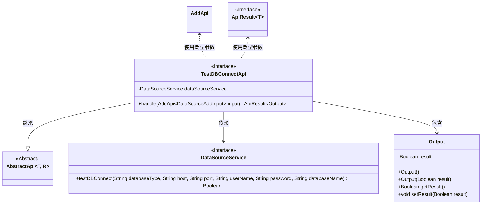
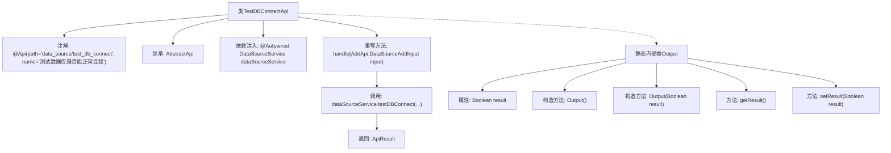

# 基础信息

|      |      |
|------|------|
| 名称 | TestDBConnectApi |
| 编码语言 | .java |
| 代码路径 | WeFe/fusion/fusion-service/src/main/java/com/welab/wefe/data/fusion/service/api/datasource/TestDBConnectApi.java |
| 包名 | com.welab.wefe.data.fusion.service.api.datasource |
| 依赖项 | ['com.welab.wefe.common.exception.StatusCodeWithException', 'com.welab.wefe.common.web.api.base.AbstractApi', 'com.welab.wefe.common.web.api.base.Api', 'com.welab.wefe.common.web.dto.AbstractApiOutput', 'com.welab.wefe.common.web.dto.ApiResult', 'com.welab.wefe.data.fusion.service.service.DataSourceService', 'org.springframework.beans.factory.annotation.Autowired'] |
| 概述说明 | 该API用于测试数据库连接，接收数据库类型、主机、端口、用户名、密码和数据库名作为输入，返回连接测试结果。 |

# 说明

这是一个名为TestDBConnectApi的Java类，用于测试数据库连接。它继承自AbstractApi，接受DataSourceAddInput作为输入，返回包含布尔结果Output。类通过DataSourceService的testDBConnect方法验证连接参数（数据库类型、主机、端口、用户名、密码、数据库名）。Output类封装了测试结果result及其getter和setter方法。整个API路径为data_source/test_db_connect，功能描述为测试数据库是否能正常连接。

# 类列表 Class Summary

| 名称   | 类型  | 说明 |
|-------|------|-------------|
| TestDBConnectApi | class | 这是一个测试数据库连接的API类，接收数据库类型、主机、端口等参数，调用服务测试连接并返回布尔结果。 |

## 类 TestDBConnectApi

|      |      |
|------|------|
| 访问范围 | @Api(path = "data_source/test_db_connect", name = "测试数据库是否能正常连接");public |
| 类型 | class |
| 名称 | TestDBConnectApi |
| 说明 | 这是一个测试数据库连接的API类，接收数据库类型、主机、端口等参数，调用服务测试连接并返回布尔结果。 |

### UML类图

类图描述：
该图展示了TestDBConnectApi类的结构及其关联关系。TestDBConnectApi继承自泛型类AbstractApi，依赖DataSourceService接口进行数据库连接测试，并包含静态嵌套类Output用于封装测试结果。AbstractApi是一个抽象泛型基类，DataSourceService提供数据库连接测试方法，Output类包含布尔类型的结果字段及其访问方法。类之间通过继承、依赖和包含关系组织，体现了清晰的层级结构和职责划分。

### 内部方法调用关系图

这段代码定义了一个测试数据库连接的API类TestDBConnectApi，继承自AbstractApi并指定了输入输出类型。主要功能是通过注入的DataSourceService调用testDBConnect方法测试数据库连接，返回包含布尔结果的ApiResult。内部类Output用于封装测试结果，包含result属性和相关getter/setter方法。流程图展示了类结构、依赖关系和方法调用链，体现了从API入口到数据库测试的完整流程。

### 字段列表 Field List

| 名称  | 类型  | 说明 |
|-------|-------|------|
| dataSourceService | DataSourceService | 自动注入DataSourceService实例。 |

### 方法列表

| 名称  | 类型  | 说明 |
|-------|-------|------|
| handle | ApiResult<Output> | 方法重写，测试数据库连接，返回结果。参数包括数据库类型、主机、端口、用户名、密码和数据库名。 |

