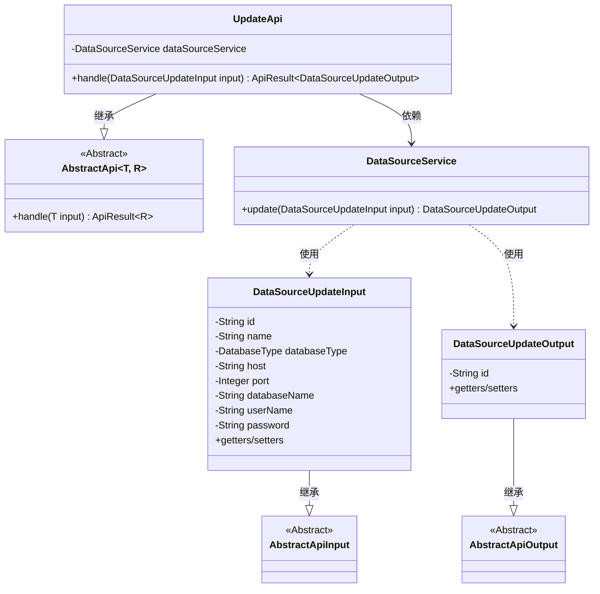
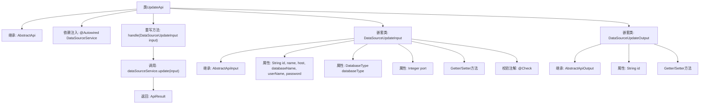

# 基础信息

|      |      |
|------|------|
| 名称 | UpdateApi |
| 编码语言 | .java |
| 代码路径 | WeFe/fusion/fusion-service/src/main/java/com/welab/wefe/data/fusion/service/api/datasource/UpdateApi.java |
| 包名 | com.welab.wefe.data.fusion.service.api.datasource |
| 依赖项 | ['com.welab.wefe.common.exception.StatusCodeWithException', 'com.welab.wefe.common.fieldvalidate.annotation.Check', 'com.welab.wefe.common.jdbc.base.DatabaseType', 'com.welab.wefe.common.web.api.base.AbstractApi', 'com.welab.wefe.common.web.api.base.Api', 'com.welab.wefe.common.web.dto.AbstractApiInput', 'com.welab.wefe.common.web.dto.AbstractApiOutput', 'com.welab.wefe.common.web.dto.ApiResult', 'com.welab.wefe.data.fusion.service.service.DataSourceService', 'org.springframework.beans.factory.annotation.Autowired'] |
| 概述说明 | 更新数据源的API类，包含输入参数校验和输出结果处理。输入需提供数据源ID、名称、类型、主机、端口、数据库名、用户名和密码。输出返回更新后的数据源ID。 |

# 说明

该代码定义了一个名为UpdateApi的API类，用于新增数据源。API路径为data_source/update，继承自AbstractApi，处理DataSourceUpdateInput输入并返回DataSourceUpdateOutput输出。输入类包含数据源ID、名称、数据库类型、主机地址、端口、数据库名、用户名和密码等必填字段，并进行了格式校验。输出类包含数据源ID字段。API通过注入的DataSourceService调用update方法处理请求，返回操作结果。

# 类列表 Class Summary

| 名称   | 类型  | 说明 |
|-------|------|-------------|
| UpdateApi | class | 更新数据源的API类，包含输入参数校验和输出结果处理，输入包括ID、名称、数据库类型、主机、端口、数据库名、用户名和密码，输出为更新后的数据源ID。 |

## 类 UpdateApi

|      |      |
|------|------|
| 访问范围 | @Api(path = "data_source/update", name = "新增数据源");public |
| 类型 | class |
| 名称 | UpdateApi |
| 说明 | 更新数据源的API类，包含输入参数校验和输出结果处理，输入包括ID、名称、数据库类型、主机、端口、数据库名、用户名和密码，输出为更新后的数据源ID。 |

### UML类图

这段代码展示了一个数据源更新API的实现结构。UpdateApi继承自泛型抽象类AbstractApi，处理DataSourceUpdateInput输入并返回DataSourceUpdateOutput输出。核心业务逻辑委托给DataSourceService完成，输入输出类都继承自相应的抽象基类。输入类包含数据源各项参数的校验注解，输出类则简单封装了操作结果ID。整个设计体现了清晰的层次结构和职责分离。

### 内部方法调用关系图

这段代码定义了一个用于更新数据源的API类UpdateApi，它继承自抽象类AbstractApi并实现了数据处理逻辑。类中包含两个嵌套类：DataSourceUpdateInput用于封装输入参数并进行校验，DataSourceUpdateOutput用于封装返回结果。主类通过依赖注入DataSourceService来完成数据源更新操作，整个流程从handle方法开始，最终返回包含操作结果的ApiResult对象。输入参数类包含多个带校验注解的字段，确保数据的完整性和有效性。

### 字段列表 Field List

| 名称  | 类型  | 说明 |
|-------|-------|------|
| dataSourceService | DataSourceService | 代码片段使用@Autowired注解自动注入DataSourceService实例。 |

### 方法列表

| 名称  | 类型  | 说明 |
|-------|-------|------|
| handle | ApiResult<DataSourceUpdateOutput> | Java方法重写，处理数据源更新请求，调用服务层并返回结果。 |

