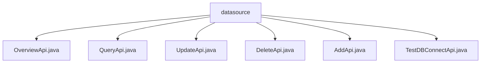

# 基础信息

|      |      |
|------|------|
| 名称 | datasource |
| 编码语言 | .java |
| 代码路径 | WeFe/fusion/fusion-service/src/main/java/com/welab/wefe/data/fusion/service/api/datasource |
| 包名 | docs.fusion.fusion-service.src.main.java.com.welab.wefe.data.fusion.service.api.datasource |
| 概述说明 | OverviewApi处理数据源概览请求，路径data_source/overview。QueryApi查询数据源，路径data_source/query，支持分页。UpdateApi更新数据源，路径data_source/update。DeleteApi删除数据源，路径data_source/delete。AddApi新增数据源。TestDBConnectApi测试数据库连接，路径data_source/test_db_connect。均继承AbstractApi，通过DataSourceService实现功能。 |

# 说明

## 概述  
该模块是数据源管理API集合，核心职责为提供数据源的增删改查、连接测试及概览功能，类似数据库管理系统的CRUD操作。接口规范遵循RESTful风格，路径统一以"data_source/"为前缀，继承AbstractApi基类。关键数据结构包括DataSourceOverviewOutput（概览）、PagingInput（分页查询）及包含数据库连接参数的Input类。外部依赖仅为DataSourceService服务。例如UpdateApi处理数据源更新，TestDBConnectApi验证连接参数有效性。

## 主要业务场景  
模块支持完整的数据源生命周期管理：通过AddApi/DeleteApi实现增删，QueryApi提供分页查询，UpdateApi处理配置变更。典型流程为先使用TestDBConnectApi验证连接，再通过AddApi创建数据源。交互模式均为请求-响应式，例如查询返回分页结果，概览接口返回聚合信息。API类型覆盖基础CRUD和辅助功能，集成案例包括数据源配置界面和自动化测试流程。

### 包内部结构视图

该流程图展示了WeFe数据融合服务中数据源API的层级结构。根节点"datasource"包含6个子节点，分别对应不同的API实现类文件，包括数据概览、查询、更新、删除、添加和数据库连接测试等功能模块。所有Java文件均位于同一目录层级下，没有更深层次的嵌套关系。

# 文件列表

| 名称   | 类型  | 说明 |
|-------|------|-------------|
| [OverviewApi.java](OverviewApi.md) | file | 概述API类，路径为"data_source/overview"，处理数据源概览请求，调用DataSourceService返回概览数据。 |
| [QueryApi.java](QueryApi.md) | file | 查询数据源API类，包含分页输入参数id和name，输出数据源名称、类型、主机、端口、数据库名和用户名。 |
| [UpdateApi.java](UpdateApi.md) | file | 更新数据源的API类，包含输入参数校验和输出结果处理。输入需提供数据源ID、名称、类型、主机、端口、数据库名、用户名和密码。输出返回更新后的数据源ID。 |
| [DeleteApi.java](DeleteApi.md) | file | 删除数据源的API类，接收数据源ID参数，调用服务删除并返回成功结果。 |
| [AddApi.java](AddApi.md) | file | 新增数据源API类，包含输入参数校验和输出结果处理，通过DataSourceService实现数据源添加功能。输入包括名称、类型、地址等必填字段，输出返回数据源ID。 |
| [TestDBConnectApi.java](TestDBConnectApi.md) | file | 该API用于测试数据库连接，接收数据库类型、主机、端口、用户名、密码和数据库名作为输入，返回连接测试结果。 |

