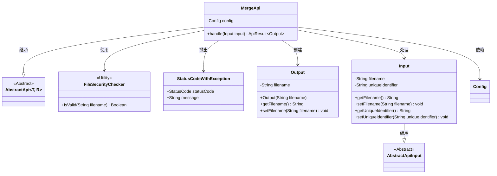
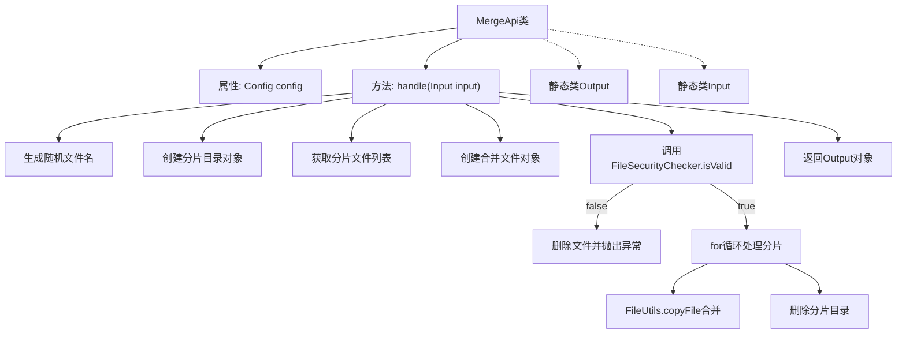
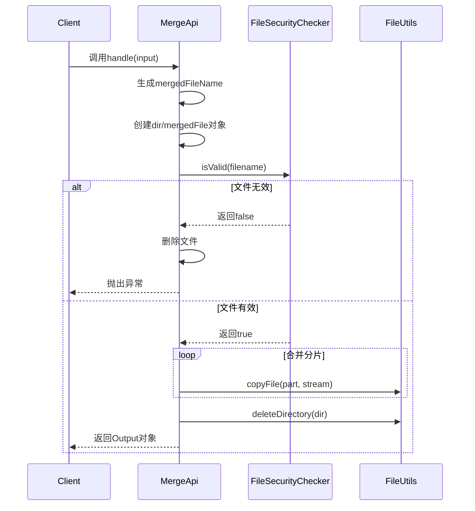

# 基础信息

|      |      |
|------|------|
| 名称 | MergeApi |
| 编码语言 | .java |
| 代码路径 | WeFe/fusion/fusion-service/src/main/java/com/welab/wefe/data/fusion/service/api/file/MergeApi.java |
| 包名 | com.welab.wefe.data.fusion.service.api.file |
| 依赖项 | ['com.welab.wefe.common.StatusCode', 'com.welab.wefe.common.exception.StatusCodeWithException', 'com.welab.wefe.common.web.api.base.AbstractApi', 'com.welab.wefe.common.web.api.base.Api', 'com.welab.wefe.common.web.dto.AbstractApiInput', 'com.welab.wefe.common.web.dto.ApiResult', 'com.welab.wefe.data.fusion.service.config.Config', 'com.welab.wefe.data.fusion.service.utils.FileSecurityChecker', 'org.apache.commons.io.FileUtils', 'org.springframework.beans.factory.annotation.Autowired', 'java.io.File', 'java.io.FileOutputStream', 'java.io.IOException', 'java.util.UUID'] |
| 概述说明 | 该API用于合并上传的文件分片，生成唯一文件名，仅支持.csv,.xls,.xlsx格式，合并后删除分片目录，返回合并后的文件名。 |

# 说明

该代码定义了一个名为MergeApi的类，用于处理文件上传后的分片合并操作。它接收包含文件名和唯一标识符的输入，生成随机合并后的文件名。首先检查文件类型是否为允许的格式（.csv,.xls,.xlsx），若非法则删除相关文件并抛出异常。通过遍历分片文件，将其按顺序合并到目标文件中，完成后删除分片目录。若合并过程出错则抛出系统错误。成功时返回包含合并后文件名的输出对象。

# 类列表 Class Summary

| 名称   | 类型  | 说明 |
|-------|------|-------------|
| MergeApi | class | MergeApi类处理文件分片合并，验证文件类型后合并分片并返回新文件名，失败时删除文件并报错。 |

## 类 MergeApi

|      |      |
|------|------|
| 访问范围 | @Api(path = "file/merge", name = "文件上传完毕后合并分片");public |
| 类型 | class |
| 名称 | MergeApi |
| 说明 | MergeApi类处理文件分片合并，验证文件类型后合并分片并返回新文件名，失败时删除文件并报错。 |

### UML类图

这段代码展示了一个文件分片合并的API实现。MergeApi继承自泛型抽象类AbstractApi，处理Input参数并返回包含合并后文件名的Output结果。核心流程包括：验证文件类型安全性、合并分片文件、清理临时目录。类图中清晰地反映了继承关系（MergeApi→AbstractApi、Input→AbstractApiInput）、工具类调用（FileSecurityChecker）和异常处理（StatusCodeWithException），体现了模块化的设计思想。文件操作涉及分片读取、流合并和目录清理，需注意IO异常处理和线程安全问题。

### 内部方法调用关系图

这段代码实现了一个文件分片合并的API，主要功能包括：1)生成合并后的文件名；2)检查文件类型安全性；3)合并分片文件；4)清理临时文件。流程图展示了类结构和主要处理逻辑，时序图详细描述了客户端调用到最终返回的完整过程。代码通过UUID保证文件名唯一性，使用FileUtils工具类高效处理文件操作，并对非法文件类型进行了严格拦截。

### 字段列表 Field List

| 名称  | 类型  | 说明 |
|-------|-------|------|
| config | Config | 使用@Autowired自动注入Config配置对象。 |

### 方法列表

| 名称  | 类型  | 说明 |
|-------|-------|------|
| handle | ApiResult<Output> | 处理文件分片合并：检查文件类型有效性，合并分片文件，清理临时文件，返回合并后文件名。无效文件类型则报错并删除临时文件。 |

