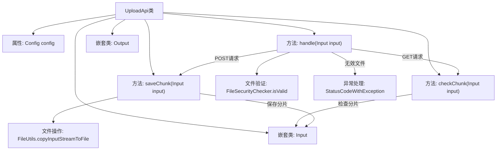
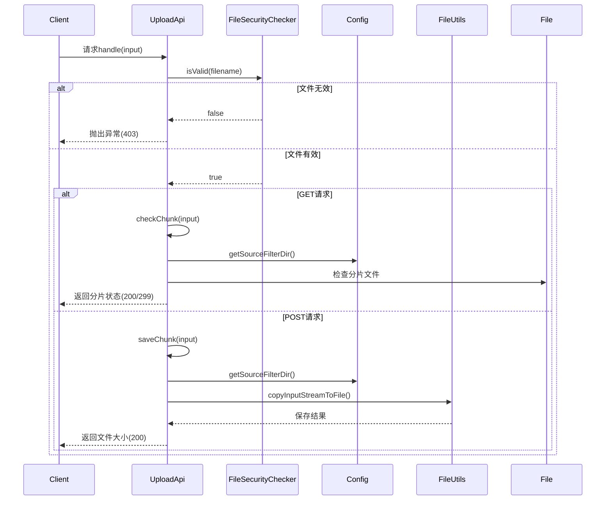

# 基础信息

|      |      |
|------|------|
| 名称 | UploadApi |
| 编码语言 | .java |
| 代码路径 | WeFe/fusion/fusion-service/src/main/java/com/welab/wefe/data/fusion/service/api/file/UploadApi.java |
| 包名 | com.welab.wefe.data.fusion.service.api.file |
| 依赖项 | ['com.welab.wefe.common.StatusCode', 'com.welab.wefe.common.exception.StatusCodeWithException', 'com.welab.wefe.common.web.api.base.AbstractApi', 'com.welab.wefe.common.web.api.base.Api', 'com.welab.wefe.common.web.dto.AbstractWithFilesApiInput', 'com.welab.wefe.common.web.dto.ApiResult', 'com.welab.wefe.data.fusion.service.config.Config', 'com.welab.wefe.data.fusion.service.utils.FileSecurityChecker', 'org.apache.commons.io.FileUtils', 'org.springframework.beans.factory.annotation.Autowired', 'org.springframework.web.multipart.MultipartFile', 'java.io.File', 'java.io.IOException', 'java.io.InputStream'] |
| 概述说明 | 文件上传API，支持分片检查与保存，仅允许.csv,.xls,.xlsx文件，包含输入输出参数及异常处理。 |

# 说明

这是一个文件上传API类，名为UploadApi，继承自AbstractApi。它处理文件上传请求，支持POST和GET方法。POST方法用于保存文件分片，GET方法用于检查分片是否存在。文件类型限制为.csv、.xls或.xlsx，否则抛出异常。输入参数包括文件标识符、分片编号、大小、总大小等信息。输出包含文件长度。文件分片保存在配置指定的目录中，以分片编号和.part后缀命名。处理过程中会进行文件类型验证和分片存在性检查。

# 类列表 Class Summary

| 名称   | 类型  | 说明 |
|-------|------|-------------|
| UploadApi | class | 文件上传API，支持分片检查与保存，仅允许.csv,.xls,.xlsx文件。POST保存分片，GET检查分片是否存在，返回分片状态或文件大小。 |


## 类 UploadApi

|      |      |
|------|------|
| 访问范围 | @Api(path = "file/upload", name = "Upload a file");public |
| 类型 | class |
| 名称 | UploadApi |
| 说明 | 文件上传API，支持分片检查与保存，仅允许.csv,.xls,.xlsx文件。POST保存分片，GET检查分片是否存在，返回分片状态或文件大小。 |


### UML类图

```mermaid
classDiagram
    class UploadApi {
        -Config config
        +handle(Input input) ApiResult~Output~
        -checkChunk(Input input) ApiResult~Output~
        -saveChunk(Input input) ApiResult~Output~
    }
    <<Interface>> UploadApi {
        <<AbstractApi~Input, Output~>>
    }

    class Output {
        -long length
        +Output(long length)
        +getLength() long
        +setLength(long length) void
    }

    class Input {
        -Long id
        -Integer chunkNumber
        -Long chunkSize
        -Long currentChunkSize
        -Long totalSize
        -String identifier
        -String filename
        -String relativePath
        -Integer totalChunks
        -String type
        // 省略getter/setter方法
    }
    <<Interface>> Input {
        <<AbstractWithFilesApiInput>>
    }

    class Config {
        // 配置类
    }

    class FileSecurityChecker {
        <<static>>
        +isValid(String filename) Boolean
    }

    class StatusCodeWithException {
        +StatusCodeWithException(StatusCode code, String message)
    }

    class ApiResult~T~ {
        +setMessage(String message) ApiResult~T~
        +setHttpCode(Integer code) ApiResult~T~
    }

    UploadApi --> Config : 依赖
    UploadApi --> FileSecurityChecker : 使用
    UploadApi --> StatusCodeWithException : 抛出
    UploadApi --> ApiResult~Output~ : 返回
    Input --|> AbstractWithFilesApiInput : 继承
    UploadApi --|> AbstractApi~Input, Output~ : 继承
```

类图描述：该图展示了文件上传API的核心结构。UploadApi继承自AbstractApi泛型类，处理Input和Output类型。包含文件安全检查、分块检查和保存功能。Input类继承自AbstractWithFilesApiInput，包含文件分块上传的各种参数。Output类记录文件长度。UploadApi依赖Config配置类和FileSecurityChecker安全检查类，可能抛出StatusCodeWithException异常，并返回ApiResult封装结果。


### 内部方法调用关系图





这段代码实现了一个文件分片上传API，主要包含文件类型验证、分片检查和分片保存三个核心功能。流程图展示了类结构和方法调用关系，时序图详细描述了从客户端请求到最终响应的完整处理流程。当收到请求时，系统首先验证文件类型，然后根据GET/POST方法分别处理分片检查或保存操作，过程中会动态读取配置路径并进行文件系统操作，最后返回相应状态码和消息。

### 字段列表 Field List

| 名称  | 类型  | 说明 |
|-------|-------|------|
| config | Config | 使用@Autowired自动注入Config配置对象。 |

### 方法列表

| 名称  | 类型  | 说明 |
|-------|-------|------|
| handle | ApiResult<Output> | 代码处理文件上传请求，检查文件类型是否为CSV或Excel，支持POST保存分块和GET检查分块，无效类型或方法抛出异常。 |
| checkChunk | ApiResult<Output> | 检查文件分片是否存在。若分片号为空则设为0，检查对应分片文件是否存在。存在返回成功消息，不存在返回299状态码及提示。 |
| saveChunk | ApiResult<Output> | 方法saveChunk接收Input参数，处理分块文件保存。检查分块号，为空则设为0。创建目标文件路径，将输入流写入文件。异常时抛出StatusCodeWithException。成功返回包含文件大小的Output结果。 |


