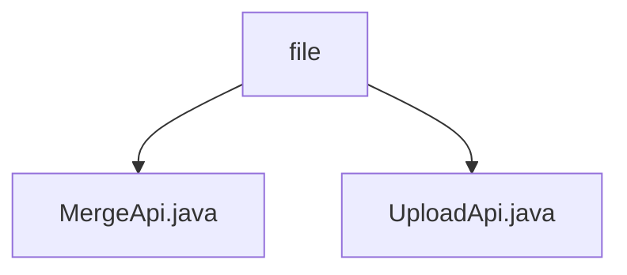

# 基础信息

|      |      |
|------|------|
| 名称 | file |
| 编码语言 | .java |
| 代码路径 | WeFe/fusion/fusion-service/src/main/java/com/welab/wefe/data/fusion/service/api/file |
| 包名 | docs.fusion.fusion-service.src.main.java.com.welab.wefe.data.fusion.service.api.file |
| 概述说明 | MergeApi类处理文件分片合并，验证文件类型后合并分片并删除临时文件。UploadApi类处理文件上传，支持分片保存和检查，限制文件类型为csv/xls/xlsx。 |

# 说明

## 概述  
该模块核心职责是处理文件分片上传与合并，支持CSV/Excel格式。提供统一接口规范：MergeApi负责分片合并，生成随机文件名并校验格式；UploadApi处理分片上传与存在性检查，继承AbstractApi支持GET/POST方法。关键数据结构包括文件标识符、分片编号和合并后文件名。依赖文件系统存储分片（例如.part后缀文件）和格式校验逻辑。例如非法格式触发异常并清理文件，合并过程采用顺序追加模式。

## 主要业务场景  
典型流程为用户上传分片后触发合并，类似分治处理模式。完整交互链包含：1)UploadApi接收分片并存储；2)MergeApi验证格式后按编号合并。功能完整性体现在分片检查、类型过滤和异常处理（例如删除非法文件）。API类型涵盖状态查询（GET）和数据提交（POST），集成案例包括Excel数据合并场景。系统采用目录级事务，合并成功后自动清理临时文件。

### 包内部结构视图

该流程图展示了文件API模块的层级结构，根节点为"file"目录，包含两个Java接口文件：MergeApi.java和UploadApi.java。这两个文件分别处理文件合并和上传功能，属于同一层级下的平行模块，共同构成文件服务API的实现部分。

# 文件列表

| 名称   | 类型  | 说明 |
|-------|------|-------------|
| [MergeApi.java](MergeApi.md) | file | 该API用于合并上传的文件分片，生成唯一文件名，仅支持.csv,.xls,.xlsx格式，合并后删除分片目录，返回合并后的文件名。 |
| [UploadApi.java](UploadApi.md) | file | 文件上传API，支持分片检查与保存，仅允许.csv,.xls,.xlsx文件，包含输入输出参数及异常处理。 |

