# 基础信息

|      |      |
|------|------|
| 名称 | LogQueryApi |
| 编码语言 | .java |
| 代码路径 | WeFe/fusion/fusion-service/src/main/java/com/welab/wefe/data/fusion/service/api/operation/LogQueryApi.java |
| 包名 | com.welab.wefe.data.fusion.service.api.operation |
| 依赖项 | ['com.welab.wefe.common.exception.StatusCodeWithException', 'com.welab.wefe.common.fieldvalidate.annotation.Check', 'com.welab.wefe.common.web.api.base.AbstractApi', 'com.welab.wefe.common.web.api.base.Api', 'com.welab.wefe.common.web.dto.ApiResult', 'com.welab.wefe.data.fusion.service.dto.base.PagingInput', 'com.welab.wefe.data.fusion.service.dto.base.PagingOutput', 'com.welab.wefe.data.fusion.service.dto.entity.OperationLogOutputModel', 'com.welab.wefe.data.fusion.service.service.OperationLogService', 'org.springframework.beans.factory.annotation.Autowired'] |
| 概述说明 | 日志查询API类，继承抽象API，输入含接口名、调用者、时间范围，输出分页操作日志，调用OperationLogService处理查询。 |

# 说明

LogQueryApi是一个用于查询操作日志的API类，继承自AbstractApi，处理输入类型为Input，输出为分页的OperationLogOutputModel。通过OperationLogService执行查询操作。Input类包含分页参数及四个可筛选字段：apiName、callerName、startTime和endTime，每个字段都有对应的getter和setter方法。API路径为"log/query"，名称为"query log"。

# 类列表 Class Summary

| 名称   | 类型  | 说明 |
|-------|------|-------------|
| LogQueryApi | class | 日志查询API类，继承抽象类处理分页输入，返回操作日志分页结果。输入含接口名、调用者名、时间范围等字段，通过服务类查询数据。 |


## 类 LogQueryApi

|      |      |
|------|------|
| 访问范围 | @Api(path = "log/query", name = "query log");public |
| 类型 | class |
| 名称 | LogQueryApi |
| 说明 | 日志查询API类，继承抽象类处理分页输入，返回操作日志分页结果。输入含接口名、调用者名、时间范围等字段，通过服务类查询数据。 |


### UML类图

```mermaid
classDiagram
    class AbstractApi~T, R~ {
        <<Abstract>>
        +handle(T input) ApiResult~R~
    }

    class LogQueryApi {
        -OperationLogService service
        +handle(Input input) ApiResult~PagingOutput~OperationLogOutputModel~~
    }

    class PagingInput {
        <<Abstract>>
    }

    class Input {
        -String apiName
        -String callerName
        -Long startTime
        -Long endTime
        +getApiName() String
        +setApiName(String apiName) void
        +getCallerName() String
        +setCallerName(String callerName) void
        +getStartTime() Long
        +setStartTime(Long startTime) void
        +getEndTime() Long
        +setEndTime(Long endTime) void
    }

    class OperationLogService {
        <<Interface>>
        +query(Input input) PagingOutput~OperationLogOutputModel~
    }

    class PagingOutput~T~ {
        +List~T~ items
        +Integer total
    }

    class OperationLogOutputModel {
        // 日志输出模型字段未显示
    }

    class ApiResult~T~ {
        +T data
        +Integer code
        +String message
    }

    LogQueryApi --> AbstractApi~Input, PagingOutput~OperationLogOutputModel~~ : 继承
    LogQueryApi --> OperationLogService : 依赖
    Input --|> PagingInput : 继承
    OperationLogService ..> PagingOutput~OperationLogOutputModel~ : 创建
    OperationLogService ..> Input : 使用
    PagingOutput~OperationLogOutputModel~ --> OperationLogOutputModel : 包含
```

这段代码展示了一个日志查询API的实现架构。LogQueryApi继承自泛型抽象类AbstractApi，通过OperationLogService服务处理分页查询请求。输入参数Input继承自PagingInput，包含API名称、调用者名称和时间范围等查询条件。系统使用PagingOutput包装分页结果，其中包含OperationLogOutputModel列表和总数。整个设计体现了清晰的层级关系和职责分离。


### 内部方法调用关系图

```mermaid
graph TD
    A["类LogQueryApi"]
    B["注解: @Api(path='log/query', name='query log')"]
    C["继承: AbstractApi<Input, PagingOutput<OperationLogOutputModel>>"]
    D["依赖注入: @Autowired OperationLogService service"]
    E["重写方法: handle(Input input)"]
    F["内部类: Input"]
    G["属性: String apiName @Check"]
    H["属性: String callerName @Check"]
    I["属性: Long startTime @Check"]
    J["属性: Long endTime @Check"]
    K["getter/setter方法组"]
    L["方法调用: service.query(input)"]
    M["返回: success(查询结果)"]

    A --> B
    A --> C
    A --> D
    A --> E
    A --> F
    F --> G
    F --> H
    F --> I
    F --> J
    F --> K
    E --> L
    L --> M
```



这段代码描述了一个日志查询API的实现类LogQueryApi，它继承自抽象基类AbstractApi并实现了核心的handle方法。流程图展示了类结构的关键组成部分：类级别的API注解、依赖注入的服务实例、处理请求的handle方法实现，以及作为内部类的输入参数Input的定义。Input类包含四个带校验注解的查询条件和对应的getter/setter方法。核心处理流程是通过OperationLogService执行查询并返回分页结果，体现了典型的API层实现模式。

### 字段列表 Field List

| 名称  | 类型  | 说明 |
|-------|-------|------|
| service | OperationLogService | 使用@Autowired自动注入OperationLogService实例。 |

### 方法列表

| 名称  | 类型  | 说明 |
|-------|-------|------|
| handle | ApiResult<PagingOutput<OperationLogOutputModel>> | 重写方法处理输入并返回分页查询结果。 |


