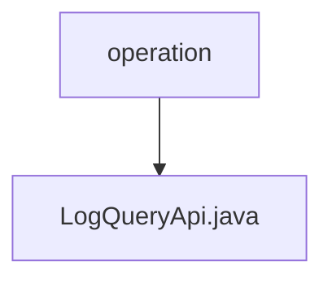

# 基础信息

|      |      |
|------|------|
| 名称 | operation |
| 编码语言 | .java |
| 代码路径 | WeFe/fusion/fusion-service/src/main/java/com/welab/wefe/data/fusion/service/api/operation |
| 包名 | docs.fusion.fusion-service.src.main.java.com.welab.wefe.data.fusion.service.api.operation |
| 概述说明 | 日志查询API类，继承抽象API，输入含接口名、调用者、时间范围，输出分页操作日志，调用OperationLogService处理查询。 |

# 说明

LogQueryApi是一个用于查询操作日志的API类，继承自AbstractApi，处理输入类型为Input，输出为分页的OperationLogOutputModel。通过OperationLogService执行查询操作。Input类包含分页参数及四个可筛选字段：apiName、callerName、startTime和endTime，每个字段都有对应的getter和setter方法。API路径为"log/query"，名称为"query log"。

### 包内部结构视图

该流程图展示了WeFe项目中fusion-service模块的API操作路径结构。operation作为父级目录，包含一个具体的API实现文件LogQueryApi.java。这种结构体现了典型的Java项目分层设计，其中operation目录用于组织各类操作相关的API接口，而具体的接口实现则以单独文件形式存在。

# 文件列表

| 名称   | 类型  | 说明 |
|-------|------|-------------|
| [LogQueryApi.java](LogQueryApi.md) | file | 日志查询API类，继承抽象API，输入含接口名、调用者、时间范围，输出分页操作日志，调用OperationLogService处理查询。 |

