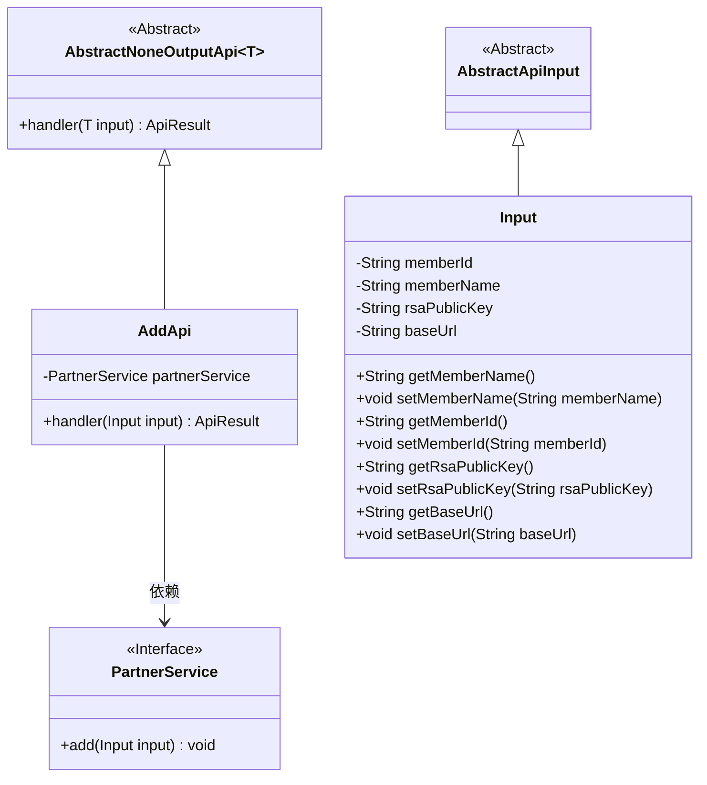

# 基础信息

|      |      |
|------|------|
| 名称 | AddApi |
| 编码语言 | .java |
| 代码路径 | WeFe/fusion/fusion-service/src/main/java/com/welab/wefe/data/fusion/service/api/partner/AddApi.java |
| 包名 | com.welab.wefe.data.fusion.service.api.partner |
| 依赖项 | ['com.welab.wefe.common.exception.StatusCodeWithException', 'com.welab.wefe.common.fieldvalidate.annotation.Check', 'com.welab.wefe.common.web.api.base.AbstractNoneOutputApi', 'com.welab.wefe.common.web.api.base.Api', 'com.welab.wefe.common.web.dto.AbstractApiInput', 'com.welab.wefe.common.web.dto.ApiResult', 'com.welab.wefe.data.fusion.service.service.PartnerService', 'org.springframework.beans.factory.annotation.Autowired'] |
| 概述说明 | 添加合作伙伴API，需输入成员ID、名称、公钥和请求路径，调用PartnerService完成添加操作。 |

# 说明

该代码定义了一个名为AddApi的API类，用于添加合作伙伴。API路径为"partner/add"，名称为"添加合作伙伴"。该类继承自AbstractNoneOutputApi，输入参数为内部类Input。Input包含四个必填字段：联邦成员ID、名称、RSA公钥和请求路径。处理逻辑通过PartnerService的add方法实现，成功时返回空结果。所有输入字段均通过@Check注解进行非空校验，并提供了对应的getter和setter方法。

# 类列表 Class Summary

| 名称   | 类型  | 说明 |
|-------|------|-------------|
| AddApi | class | 添加合作伙伴API，需提供成员ID、名称、公钥和请求路径，调用PartnerService完成添加操作。 |

## 类 AddApi

|      |      |
|------|------|
| 访问范围 | @Api(path = "partner/add", name = "添加合作伙伴", desc = "添加合作伙伴");public |
| 类型 | class |
| 名称 | AddApi |
| 说明 | 添加合作伙伴API，需提供成员ID、名称、公钥和请求路径，调用PartnerService完成添加操作。 |

### UML类图

这段代码描述了一个添加合作伙伴的API实现。AddApi继承自AbstractNoneOutputApi泛型类，指定Input作为输入类型，并依赖PartnerService接口完成业务逻辑。Input类继承自AbstractApiInput，包含四个必填字段（memberId、memberName、rsaPublicKey、baseUrl）及其getter/setter方法。整个结构体现了清晰的层次关系：抽象基类定义框架，具体实现类处理业务，输入类封装参数，服务接口提供业务能力。

### 内部方法调用关系图

```mermaid
graph TD
    A["类AddApi"]
    B["注解: @Api"]
    C["继承: AbstractNoneOutputApi<Input>"]
    D["依赖注入: @Autowired PartnerService"]
    E["重写方法: handler(Input input)"]
    F["内部类: Input"]
    G["父类: AbstractApiInput"]
    H["校验注解: @Check"]
    I["字段: memberId/memberName/rsaPublicKey/baseUrl"]
    J["Getter/Setter方法"]

    A --> B
    A --> C
    A --> D
    A --> E
    A --> F
    F --> G
    F --> H
    F --> I
    F --> J
    E --> D["调用partnerService.add"]
    E --> K["返回success()"]
```

这段代码描述了一个添加合作伙伴的API实现类AddApi，它继承自抽象类AbstractNoneOutputApi并指定了输入参数类型Input。流程图展示了类结构关系，包括注解、继承关系、依赖注入的服务、核心处理方法handler()以及内部输入参数类Input的定义。Input类包含多个带有校验注解的字段和对应的访问方法。handler方法通过partnerService执行添加操作后返回成功结果。整个设计体现了清晰的层级结构和参数校验机制。

### 字段列表 Field List

| 名称  | 类型  | 说明 |
|-------|-------|------|
| partnerService | PartnerService | 自动注入PartnerService服务实例。 |

### 方法列表

| 名称  | 类型  | 说明 |
|-------|-------|------|
| handler | ApiResult | 该方法重写父类handler，接收Input参数，调用partnerService.add处理输入，成功则返回ApiResult成功结果，异常时抛出StatusCodeWithException。 |

