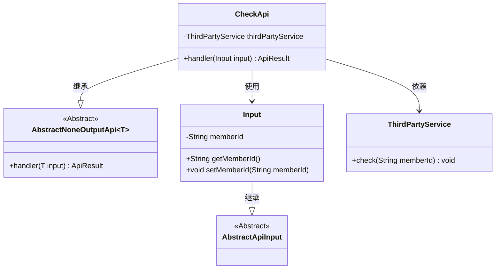
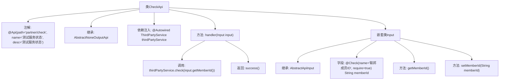

# 基础信息

|      |      |
|------|------|
| 名称 | CheckApi |
| 编码语言 | .java |
| 代码路径 | WeFe/fusion/fusion-service/src/main/java/com/welab/wefe/data/fusion/service/api/partner/CheckApi.java |
| 包名 | com.welab.wefe.data.fusion.service.api.partner |
| 依赖项 | ['com.welab.wefe.common.exception.StatusCodeWithException', 'com.welab.wefe.common.fieldvalidate.annotation.Check', 'com.welab.wefe.common.web.api.base.AbstractNoneOutputApi', 'com.welab.wefe.common.web.api.base.Api', 'com.welab.wefe.common.web.dto.AbstractApiInput', 'com.welab.wefe.common.web.dto.ApiResult', 'com.welab.wefe.data.fusion.service.service.ThirdPartyService', 'org.springframework.beans.factory.annotation.Autowired'] |
| 概述说明 | 这是一个测试服务状态的API类，路径为partner/check，依赖第三方服务检查成员ID，输入需包含必填的联邦成员ID字段。 |

# 说明

该代码定义了一个名为CheckApi的API类，用于测试服务状态。它继承自AbstractNoneOutputApi，泛型参数为内部类Input。API路径为"partner/check"，名称为"测试服务状态"。类中注入了ThirdPartyService，并通过handler方法调用其check方法，传入Input中的memberId参数。Input类继承自AbstractApiInput，包含一个必填的字符串类型memberId字段，带有"联邦成员ID"的校验注解，并提供了getter和setter方法。handler方法成功执行后返回success结果。

# 类列表 Class Summary

| 名称   | 类型  | 说明 |
|-------|------|-------------|
| CheckApi | class | CheckApi类用于测试服务状态，通过第三方服务验证成员ID，输入需包含成员ID字段，验证成功返回成功结果。 |

## 类 CheckApi

|      |      |
|------|------|
| 访问范围 | @Api(path = "partner/check", name = "测试服务状态", desc = "测试服务状态");public |
| 类型 | class |
| 名称 | CheckApi |
| 说明 | CheckApi类用于测试服务状态，通过第三方服务验证成员ID，输入需包含成员ID字段，验证成功返回成功结果。 |

### UML类图

该代码展示了一个检查服务状态的API实现，包含核心类CheckApi及其嵌套输入类Input。CheckApi继承自泛型抽象类AbstractNoneOutputApi，依赖第三方服务ThirdPartyService进行成员ID验证。Input类继承自AbstractApiInput，包含成员ID字段及访问方法。整体结构体现了清晰的层次关系和职责分离，通过注解标注API元信息，输入验证通过Check注解实现。

### 内部方法调用关系图

这段代码展示了一个名为CheckApi的API类，用于测试服务状态。它继承自AbstractNoneOutputApi并处理Input类型的输入参数。类中包含一个通过@Autowired注入的ThirdPartyService实例，handler方法会调用该服务的check方法验证成员ID，并返回成功结果。Input是一个嵌套静态类，包含带有校验注解的memberId字段及其getter/setter方法。整个结构清晰地体现了API的请求处理流程和输入验证机制。

### 字段列表 Field List

| 名称  | 类型  | 说明 |
|-------|-------|------|
| thirdPartyService | ThirdPartyService | 自动注入第三方服务实例。 |

### 方法列表

| 名称  | 类型  | 说明 |
|-------|-------|------|
| handler | ApiResult | 重写方法处理输入，调用第三方服务检查会员ID，成功返回结果。 |

