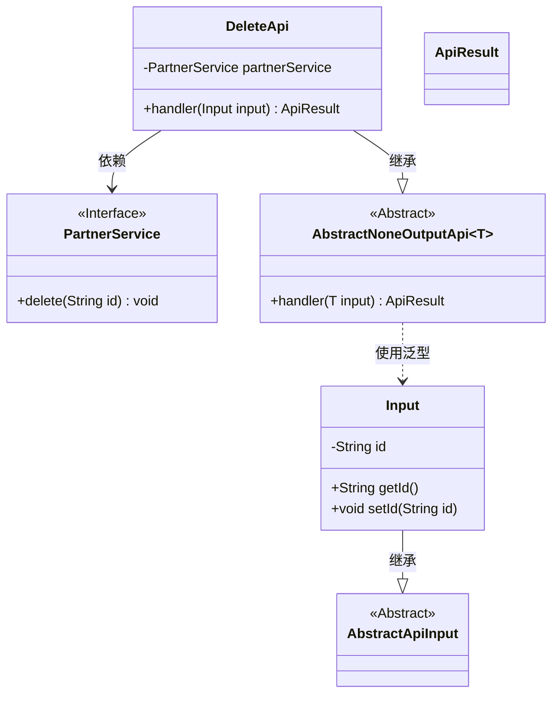
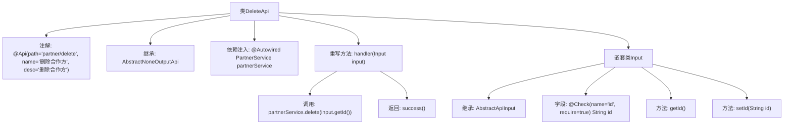

# 基础信息

|      |      |
|------|------|
| 名称 | DeleteApi |
| 编码语言 | .java |
| 代码路径 | WeFe/fusion/fusion-service/src/main/java/com/welab/wefe/data/fusion/service/api/partner/DeleteApi.java |
| 包名 | com.welab.wefe.data.fusion.service.api.partner |
| 依赖项 | ['com.welab.wefe.common.exception.StatusCodeWithException', 'com.welab.wefe.common.fieldvalidate.annotation.Check', 'com.welab.wefe.common.web.api.base.AbstractNoneOutputApi', 'com.welab.wefe.common.web.api.base.Api', 'com.welab.wefe.common.web.dto.AbstractApiInput', 'com.welab.wefe.common.web.dto.ApiResult', 'com.welab.wefe.data.fusion.service.service.PartnerService', 'org.springframework.beans.factory.annotation.Autowired'] |
| 概述说明 | 删除合作方的API类，继承无输出抽象类，通过PartnerService删除指定ID的合作方，输入参数为必填的ID字段。 |

# 说明

该代码定义了一个名为DeleteApi的API类，用于删除合作方。API路径为"partner/delete"，功能描述为"删除合作方"。该类继承自AbstractNoneOutputApi，使用泛型指定输入参数类型为内部类Input。通过@Autowired注入PartnerService服务，在handler方法中调用partnerService.delete方法执行删除操作，输入参数id通过Input类传递，并使用@Check注解标记为必填字段。操作成功后返回ApiResult。

# 类列表 Class Summary

| 名称   | 类型  | 说明 |
|-------|------|-------------|
| DeleteApi | class | 删除合作方的API接口，通过ID调用PartnerService执行删除操作，输入需包含必填ID字段。 |

## 类 DeleteApi

|      |      |
|------|------|
| 访问范围 | @Api(path = "partner/delete", name = "删除合作方", desc = "删除合作方");public |
| 类型 | class |
| 名称 | DeleteApi |
| 说明 | 删除合作方的API接口，通过ID调用PartnerService执行删除操作，输入需包含必填ID字段。 |

### UML类图

类图描述：该图展示了DeleteApi类继承自AbstractNoneOutputApi<Input>，并依赖PartnerService接口。Input类继承自AbstractApiInput，包含id属性和getter/setter方法。AbstractNoneOutputApi是泛型抽象类，处理输入类型T并返回ApiResult。PartnerService接口定义了delete方法。整体结构体现了API处理请求的典型分层设计。

### 内部方法调用关系图

这段代码流程图展示了DeleteApi类的结构及其关键组件。DeleteApi是一个带有API注解的类，继承自AbstractNoneOutputApi并处理删除合作方的请求。它通过Autowired注入PartnerService，并重写handler方法来执行删除操作。嵌套类Input继承自AbstractApiInput，包含一个必填的id字段及其getter/setter方法。整个流程从API入口开始，经过参数校验后调用服务层完成删除操作。

### 字段列表 Field List

| 名称  | 类型  | 说明 |
|-------|-------|------|
| partnerService | PartnerService | 自动注入PartnerService实例。 |

### 方法列表

| 名称  | 类型  | 说明 |
|-------|-------|------|
| handler | ApiResult | 删除指定ID的合作伙伴并返回成功结果。 |

