# 基础信息

|      |      |
|------|------|
| 名称 | PagingApi |
| 编码语言 | .java |
| 代码路径 | WeFe/fusion/fusion-service/src/main/java/com/welab/wefe/data/fusion/service/api/partner/PagingApi.java |
| 包名 | com.welab.wefe.data.fusion.service.api.partner |
| 依赖项 | ['com.welab.wefe.common.exception.StatusCodeWithException', 'com.welab.wefe.common.fieldvalidate.annotation.Check', 'com.welab.wefe.common.web.api.base.AbstractApi', 'com.welab.wefe.common.web.api.base.Api', 'com.welab.wefe.common.web.dto.ApiResult', 'com.welab.wefe.data.fusion.service.database.entity.PartnerMySqlModel', 'com.welab.wefe.data.fusion.service.dto.base.PagingInput', 'com.welab.wefe.data.fusion.service.dto.base.PagingOutput', 'com.welab.wefe.data.fusion.service.service.PartnerService', 'org.springframework.beans.factory.annotation.Autowired'] |
| 概述说明 | 这是一个名为"合作伙伴"的API类，用于分页查询合作伙伴数据。它接收包含合作伙伴ID和名称的输入参数，调用PartnerService进行分页处理，并返回分页结果。输入类包含成员ID和名称的getter和setter方法。 |

# 说明

这是一个名为PagingApi的Java类，用于处理合作伙伴分页查询。它继承自AbstractApi，接收Input类作为输入参数，返回包含PartnerMySqlModel的分页结果PagingOutput。Input类包含两个可校验字段：memberId（合作伙伴ID）和memberName（合作方名称）。该类通过注入的PartnerService调用paging方法处理分页请求，并返回成功结果。整个API路径为"partner/paging"，名称为"合作伙伴"，描述为"任务列表"。

# 类列表 Class Summary

| 名称   | 类型  | 说明 |
|-------|------|-------------|
| PagingApi | class | 合作伙伴分页查询API，输入含ID和名称，输出分页结果，调用PartnerService处理。 |


## 类 PagingApi

|      |      |
|------|------|
| 访问范围 | @Api(path = "partner/paging", name = "合作伙伴", desc = "任务列表");public |
| 类型 | class |
| 名称 | PagingApi |
| 说明 | 合作伙伴分页查询API，输入含ID和名称，输出分页结果，调用PartnerService处理。 |


### UML类图

```mermaid
classDiagram
    class AbstractApi~T, R~ {
        <<Abstract>>
        +handle(T input) R
    }
    
    class PagingApi {
        -PartnerService partnerService
        +handle(Input input) ApiResult~PagingOutput~PartnerMySqlModel~~
    }
    
    class PagingInput {
        <<Abstract>>
    }
    
    class Input {
        -String memberId
        -String memberName
        +String getMemberId()
        +void setMemberId(String memberId)
        +String getMemberName()
        +void setMemberName(String memberName)
    }
    
    class PartnerService {
        <<Interface>>
        +paging(Input input) PagingOutput~PartnerMySqlModel~
    }
    
    class PagingOutput~T~ {
        +List~T~ items
        +long total
    }
    
    class PartnerMySqlModel {
        // 合作伙伴模型
    }
    
    class ApiResult~T~ {
        +T data
        +boolean success
    }
    
    AbstractApi~T, R~ <|-- PagingApi
    PagingInput <|-- Input
    PagingApi --> PartnerService : 依赖
    PagingApi --> Input : 使用
    PartnerService --> PagingOutput~PartnerMySqlModel~ : 返回
    PagingApi --> ApiResult~PagingOutput~PartnerMySqlModel~~ : 返回
    PagingOutput~T~ --> PartnerMySqlModel : 包含
```

该类图展示了分页查询合作伙伴的API结构。PagingApi继承自泛型抽象类AbstractApi，通过PartnerService接口实现分页查询功能。Input类继承PagingInput并包含查询条件字段，PartnerService返回包含PartnerMySqlModel的分页结果PagingOutput，最终由ApiResult包装返回。整体采用分层设计，职责清晰，通过泛型实现类型安全。


### 内部方法调用关系图

```mermaid
graph TD
    A["类PagingApi"]
    B["注解: @Api"]
    C["继承: AbstractApi<Input, PagingOutput<PartnerMySqlModel>>"]
    D["依赖注入: @Autowired PartnerService"]
    E["重写方法: handle(Input input)"]
    F["内部类: Input"]
    G["继承: PagingInput"]
    H["属性: @Check String memberId"]
    I["属性: @Check String memberName"]
    J["方法: getter/setter"]

    A --> B
    A --> C
    A --> D
    A --> E
    A --> F
    F --> G
    F --> H
    F --> I
    F --> J
    E --> D
    E --> F
```



该流程图展示了PagingApi类的结构，它是一个带有@Api注解的REST接口类，继承自AbstractApi泛型基类。核心逻辑是通过handle方法调用PartnerService的分页查询功能，其中输入参数使用嵌套的Input类定义，包含两个带校验注解的字段memberId和memberName。流程清晰呈现了类继承关系、依赖注入、方法调用链以及内部类的属性结构。

### 字段列表 Field List

| 名称  | 类型  | 说明 |
|-------|-------|------|
| partnerService | PartnerService | 自动注入PartnerService服务实例。 |

### 方法列表

| 名称  | 类型  | 说明 |
|-------|-------|------|
| handle | ApiResult<PagingOutput<PartnerMySqlModel>> | 处理分页请求，返回合作伙伴数据的分页结果。 |


