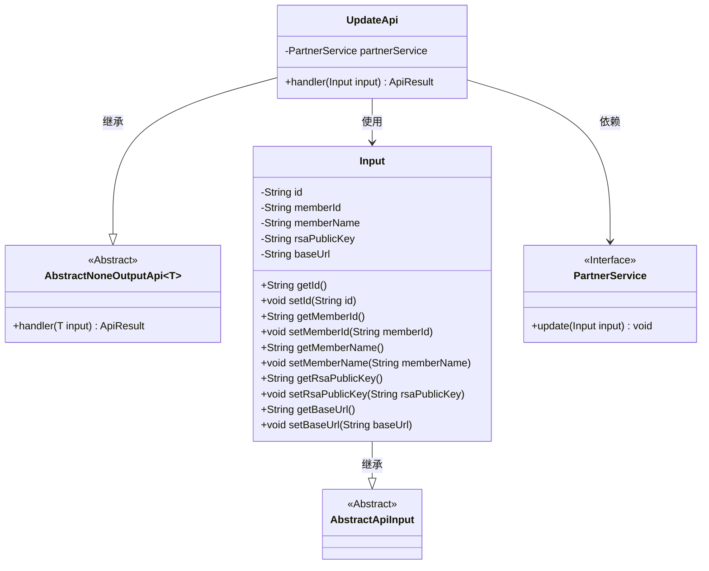

# 基础信息

|      |      |
|------|------|
| 名称 | UpdateApi |
| 编码语言 | .java |
| 代码路径 | WeFe/fusion/fusion-service/src/main/java/com/welab/wefe/data/fusion/service/api/partner/UpdateApi.java |
| 包名 | com.welab.wefe.data.fusion.service.api.partner |
| 依赖项 | ['com.welab.wefe.common.exception.StatusCodeWithException', 'com.welab.wefe.common.fieldvalidate.annotation.Check', 'com.welab.wefe.common.web.api.base.AbstractNoneOutputApi', 'com.welab.wefe.common.web.api.base.Api', 'com.welab.wefe.common.web.dto.AbstractApiInput', 'com.welab.wefe.common.web.dto.ApiResult', 'com.welab.wefe.data.fusion.service.service.PartnerService', 'org.springframework.beans.factory.annotation.Autowired'] |
| 概述说明 | 更新合作伙伴API，路径为partner/update，输入需包含ID、成员ID、名称、公钥和请求路径，调用PartnerService更新数据。 |

# 说明

这是一个名为UpdateApi的Java类，用于添加合作伙伴。它继承自AbstractNoneOutputApi，使用Input类作为输入参数。Input类包含五个必填字段：id、联邦成员ID、联邦成员名称、联帮成员fusion系统公钥和请求路径。类中注入了PartnerService，通过handler方法调用partnerService.update处理输入数据。所有字段都有对应的getter和setter方法。

# 类列表 Class Summary

| 名称   | 类型  | 说明 |
|-------|------|-------------|
| UpdateApi | class | 更新合作伙伴信息的API接口，包含必填字段：ID、成员ID、名称、公钥和请求路径。调用PartnerService处理输入并返回成功结果。 |

## 类 UpdateApi

|      |      |
|------|------|
| 访问范围 | @Api(path = "partner/update", name = "添加合作伙伴", desc = "添加合作伙伴");public |
| 类型 | class |
| 名称 | UpdateApi |
| 说明 | 更新合作伙伴信息的API接口，包含必填字段：ID、成员ID、名称、公钥和请求路径。调用PartnerService处理输入并返回成功结果。 |

### UML类图

这段代码描述了一个用于更新合作伙伴信息的API接口UpdateApi，它继承自泛型抽象类AbstractNoneOutputApi，并使用了嵌套类Input作为输入参数。Input类包含合作伙伴的ID、成员ID、名称、公钥和请求路径等字段，并继承自AbstractApiInput。UpdateApi通过依赖注入PartnerService接口来实现业务逻辑，主要功能是处理合作伙伴信息的更新请求。整个设计体现了清晰的层次结构和职责分离，Input类负责数据校验和传输，PartnerService负责业务操作，UpdateApi负责协调处理流程。

### 内部方法调用关系图

```mermaid
graph TD
    A["类UpdateApi"]
    B["注解: @Api(path='partner/update', name='添加合作伙伴', desc='添加合作伙伴')"]
    C["继承: AbstractNoneOutputApi<Input>"]
    D["依赖注入: @Autowired PartnerService partnerService"]
    E["重写方法: handler(Input input)"]
    F["内部类: Input"]
    G["属性: String id (带@Check校验)"]
    H["属性: String memberId (带@Check校验)"]
    I["属性: String memberName (带@Check校验)"]
    J["属性: String rsaPublicKey (带@Check校验)"]
    K["属性: String baseUrl (带@Check校验)"]
    L["getter/setter方法组"]
    M["调用: partnerService.update(input)"]
    N["返回: success()"]

    A --> B
    A --> C
    A --> D
    A --> E
    E --> M
    E --> N
    A --> F
    F --> G
    F --> H
    F --> I
    F --> J
    F --> K
    F --> L
```

这段代码描述了一个用于更新合作伙伴信息的API类UpdateApi，继承自抽象基类并实现了核心处理器方法。流程图展示了类结构关系，包括注解声明、服务注入、输入参数校验和业务处理流程。内部类Input封装了5个必填字段及其校验规则，handler方法通过partnerService执行更新操作后返回成功结果。整个设计体现了清晰的层次结构和参数校验机制。

### 字段列表 Field List

| 名称  | 类型  | 说明 |
|-------|-------|------|
| partnerService | PartnerService | 自动注入PartnerService实例。 |

### 方法列表

| 名称  | 类型  | 说明 |
|-------|-------|------|
| handler | ApiResult | 代码重写handler方法，调用partnerService更新输入数据，成功后返回ApiResult。异常时抛出StatusCodeWithException。 |

