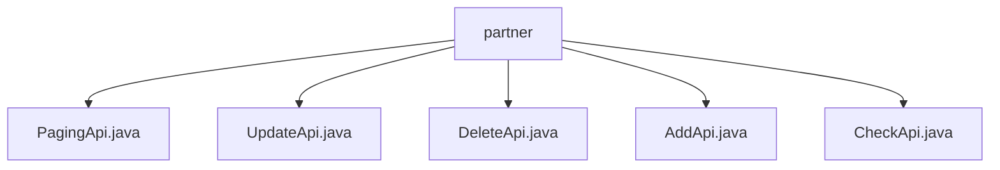

# 基础信息

|      |      |
|------|------|
| 名称 | partner |
| 编码语言 | .java |
| 代码路径 | WeFe/fusion/fusion-service/src/main/java/com/welab/wefe/data/fusion/service/api/partner |
| 包名 | docs.fusion.fusion-service.src.main.java.com.welab.wefe.data.fusion.service.api.partner |
| 概述说明 | PagingApi处理合作伙伴分页查询，输入含memberId和memberName，返回分页结果。UpdateApi更新合作伙伴，输入含五个必填字段。DeleteApi删除合作方，输入需id。AddApi添加合作伙伴，输入含四个必填字段。CheckApi测试服务状态，输入需memberId。 |

# 说明

## 概述  
该模块是合作伙伴管理API集合，核心职责为提供合作伙伴的增删改查及状态检查功能，类似CRUD操作中心。接口规范统一继承AbstractApi基类，输入输出使用特定结构，例如PagingApi返回分页结果，其他操作返回空结果。关键数据结构包括PartnerMySqlModel、Input类（含成员ID/名称等字段）和PagingOutput。外部依赖为PartnerService和ThirdPartyService。例如AddApi需RSA公钥，DeleteApi需ID校验。

## 主要业务场景  
模块支持完整的合作伙伴生命周期管理：分页查询（PagingApi）、添加（AddApi）、更新（UpdateApi）、删除（DeleteApi）及服务状态检查（CheckApi）。交互模式均为HTTP请求触发Service调用，例如UpdateApi通过PartnerService更新数据。典型应用包括联邦成员管理，如添加新成员需提供公钥和路径。API类型涵盖数据操作（如POST添加）和状态查询（如GET检查），集成案例包括合作伙伴列表分页展示和成员信息维护。

### 包内部结构视图

该流程图展示了WeFe项目中fusion-service模块下partner目录的API文件结构。根节点为partner文件夹，包含5个Java接口文件：PagingApi、UpdateApi、DeleteApi、AddApi和CheckApi，这些文件直接位于partner目录下，没有更深层级的子目录结构。

# 文件列表

| 名称   | 类型  | 说明 |
|-------|------|-------------|
| [PagingApi.java](PagingApi.md) | file | 这是一个名为"合作伙伴"的API类，用于分页查询合作伙伴数据。它接收包含合作伙伴ID和名称的输入参数，调用PartnerService进行分页处理，并返回分页结果。输入类包含成员ID和名称的getter和setter方法。 |
| [UpdateApi.java](UpdateApi.md) | file | 更新合作伙伴API，路径为partner/update，输入需包含ID、成员ID、名称、公钥和请求路径，调用PartnerService更新数据。 |
| [DeleteApi.java](DeleteApi.md) | file | 删除合作方的API类，继承无输出抽象类，通过PartnerService删除指定ID的合作方，输入参数为必填的ID字段。 |
| [AddApi.java](AddApi.md) | file | 添加合作伙伴API，需输入成员ID、名称、公钥和请求路径，调用PartnerService完成添加操作。 |
| [CheckApi.java](CheckApi.md) | file | 这是一个测试服务状态的API类，路径为partner/check，依赖第三方服务检查成员ID，输入需包含必填的联邦成员ID字段。 |

