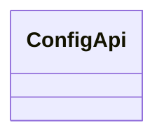
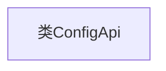

# 基础信息

|      |      |
|------|------|
| 名称 | ConfigApi |
| 编码语言 | .java |
| 代码路径 | WeFe/fusion/fusion-service/src/main/java/com/welab/wefe/data/fusion/service/api/system/ConfigApi.java |
| 包名 | com.welab.wefe.data.fusion.service.api.system |
| 依赖项 | [] |
| 概述说明 | 配置API类，用于管理配置相关操作。 |

# 说明

这是一个名为ConfigApi的公开Java类，目前为空实现，未包含任何成员变量或方法。作为配置相关的API类，它可能用于集中管理应用程序的配置信息，但具体功能需根据后续实现的业务逻辑确定。类名遵循大驼峰命名规范，public修饰符表明允许外部访问。

# 类列表 Class Summary

| 名称   | 类型  | 说明 |
|-------|------|-------------|
| ConfigApi | class | ConfigApi是一个公开的配置API类。 |

## 类 ConfigApi

|      |      |
|------|------|
| 访问范围 | public |
| 类型 | class |
| 名称 | ConfigApi |
| 说明 | ConfigApi是一个公开的配置API类。 |

### UML类图

这段类图描述了一个简单的ConfigApi类，目前该类为空，没有定义任何属性或方法。ConfigApi可能作为配置管理的基础类，后续可扩展用于存储或处理应用程序的配置数据。当前结构为后续功能扩展提供了基础框架，但需要进一步实现具体配置管理逻辑。

### 内部方法调用关系图

这段流程图描述了一个名为ConfigApi的空类结构。图中仅包含一个节点表示类定义，没有任何属性或方法声明。由于该类未实现任何功能，流程图仅展示了最基本的类声明框架，为后续扩展预留了空间。这种结构常见于设计初期的占位类或接口定义阶段。

### 字段列表 Field List

| 名称  | 类型  | 说明 |
|-------|-------|------|

### 方法列表

| 名称  | 类型  | 说明 |
|-------|-------|------|

