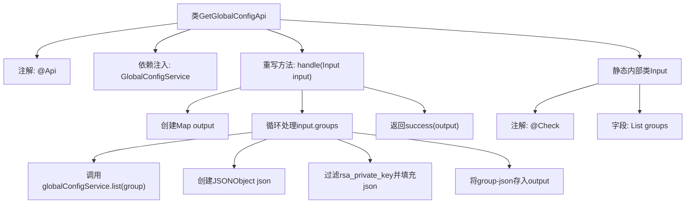

# 基础信息

|      |      |
|------|------|
| 名称 | GetGlobalConfigApi |
| 编码语言 | .java |
| 代码路径 | WeFe/fusion/fusion-service/src/main/java/com/welab/wefe/data/fusion/service/api/system/GetGlobalConfigApi.java |
| 包名 | com.welab.wefe.data.fusion.service.api.system |
| 依赖项 | ['com.alibaba.fastjson.JSONObject', 'com.welab.wefe.common.exception.StatusCodeWithException', 'com.welab.wefe.common.fieldvalidate.annotation.Check', 'com.welab.wefe.common.web.api.base.AbstractApi', 'com.welab.wefe.common.web.api.base.Api', 'com.welab.wefe.common.web.dto.AbstractApiInput', 'com.welab.wefe.common.web.dto.ApiResult', 'com.welab.wefe.data.fusion.service.database.entity.GlobalConfigMysqlModel', 'com.welab.wefe.data.fusion.service.service.globalconfig.GlobalConfigService', 'org.springframework.beans.factory.annotation.Autowired', 'java.util.HashMap', 'java.util.List', 'java.util.Map'] |
| 概述说明 | 获取系统全局配置的API类，通过输入组名列表返回对应配置项的键值对，过滤私钥字段。依赖GlobalConfigService查询数据，输出为分组后的JSON对象。 |

# 说明

该代码定义了一个名为GetGlobalConfigApi的API类，用于获取系统全局配置。API路径为system/global_config/detail，接收包含配置组名的列表作为输入参数。通过GlobalConfigService服务查询指定组的配置项，过滤掉名为rsa_private_key的敏感信息，将结果以组名为键、配置项为值的JSON对象形式返回。输入参数groups经过非空校验，最终返回包含所有请求组配置的Map结构。

# 类列表 Class Summary

| 名称   | 类型  | 说明 |
|-------|------|-------------|
| GetGlobalConfigApi | class | 获取系统全局配置的API类，通过输入组名列表返回对应配置项的键值对，过滤掉rsa_private_key字段。 |


## 类 GetGlobalConfigApi

|      |      |
|------|------|
| 访问范围 | @Api(path = "system/global_config/detail", name = "get system global configs");public |
| 类型 | class |
| 名称 | GetGlobalConfigApi |
| 说明 | 获取系统全局配置的API类，通过输入组名列表返回对应配置项的键值对，过滤掉rsa_private_key字段。 |


### UML类图

```mermaid
classDiagram
    class GetGlobalConfigApi {
        -GlobalConfigService globalConfigService
        +handle(Input input) ApiResult~Map~String,JSONObject~~
    }

    class AbstractApi~I~Input, R~ {
        <<Abstract>>
        +handle(I input) ApiResult~R~
    }

    class GlobalConfigService {
        +list(String group) List~GlobalConfigMysqlModel~
    }

    class GlobalConfigMysqlModel {
        -String name
        -String value
        +String getName()
        +String getValue()
    }

    class Input {
        -List~String~ groups
    }

    class AbstractApiInput {
        <<Abstract>>
    }

    class JSONObject {
        +put(String key, Object value) JSONObject
    }

    class ApiResult~T~ {
        +success(T data) ApiResult~T~
    }

    GetGlobalConfigApi --> AbstractApi~Input, Map~String,JSONObject~~ : 继承
    GetGlobalConfigApi --> GlobalConfigService : 依赖
    GetGlobalConfigApi --> Input : 使用
    Input --> AbstractApiInput : 继承
    GlobalConfigService --> GlobalConfigMysqlModel : 返回
    GetGlobalConfigApi --> JSONObject : 创建
    GetGlobalConfigApi --> ApiResult~Map~String,JSONObject~~ : 返回
```

这段代码描述了一个获取系统全局配置的API类`GetGlobalConfigApi`，它继承自泛型抽象类`AbstractApi`，通过`GlobalConfigService`服务获取配置数据。主要功能是根据输入的组名列表查询配置项，过滤敏感字段后返回JSON格式的配置数据。类图中清晰地展示了类之间的继承、依赖和关联关系，包括核心业务逻辑处理、数据模型和服务调用等组件。


### 内部方法调用关系图



该流程图展示了GetGlobalConfigApi类的核心处理逻辑，从接收输入参数开始，通过循环处理配置组，调用服务层获取数据，过滤敏感字段后构建响应结构，最终返回处理结果。静态内部类Input定义了必需的校验参数，整体流程清晰展现了API从请求到响应的完整数据处理路径。

### 字段列表 Field List

| 名称  | 类型  | 说明 |
|-------|-------|------|
| globalConfigService | GlobalConfigService | 使用@Autowired自动注入GlobalConfigService实例。 |

### 方法列表

| 名称  | 类型  | 说明 |
|-------|-------|------|
| handle | ApiResult<Map<String, JSONObject>> | 该方法处理输入数据，遍历输入组别，从服务获取配置列表，过滤掉私钥项后构建JSON对象，最终返回各组配置的映射结果。 |


