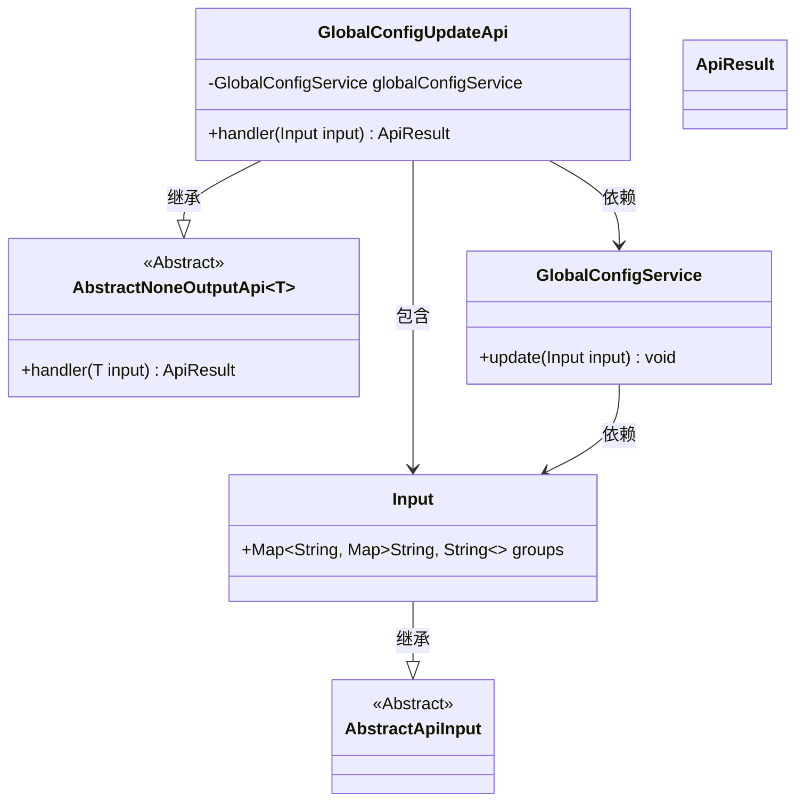

# 基础信息

|      |      |
|------|------|
| 名称 | GlobalConfigUpdateApi |
| 编码语言 | .java |
| 代码路径 | WeFe/fusion/fusion-service/src/main/java/com/welab/wefe/data/fusion/service/api/system/GlobalConfigUpdateApi.java |
| 包名 | com.welab.wefe.data.fusion.service.api.system |
| 依赖项 | ['com.welab.wefe.common.exception.StatusCodeWithException', 'com.welab.wefe.common.web.api.base.AbstractNoneOutputApi', 'com.welab.wefe.common.web.api.base.Api', 'com.welab.wefe.common.web.dto.AbstractApiInput', 'com.welab.wefe.common.web.dto.ApiResult', 'com.welab.wefe.data.fusion.service.service.globalconfig.GlobalConfigService', 'org.springframework.beans.factory.annotation.Autowired', 'java.util.Map'] |
| 概述说明 | 这是一个用于更新全局配置的API类，路径为"global_config/update"，通过GlobalConfigService处理输入参数groups并返回成功结果。输入参数为包含分组信息的Map。 |

# 说明

这是一个名为GlobalConfigUpdateApi的Java类，用于更新全局配置信息。该类继承自AbstractNoneOutputApi，泛型参数为内部类Input。通过@Api注解定义了API路径为"global_config/update"和名称"更新配置信息"。类中注入了GlobalConfigService服务，并重写了handler方法，调用服务的update方法处理输入参数后返回成功结果。Input内部类继承自AbstractApiInput，包含一个groups字段，类型为嵌套的Map结构，用于存储分组配置数据。整个类实现了配置更新的核心逻辑。

# 类列表 Class Summary

| 名称   | 类型  | 说明 |
|-------|------|-------------|
| GlobalConfigUpdateApi | class | 这是一个用于更新全局配置的API类，通过GlobalConfigService处理输入参数并返回成功结果。输入参数为分组的配置信息。 |

## 类 GlobalConfigUpdateApi

|      |      |
|------|------|
| 访问范围 | @Api(path = "global_config/update", name = "更新配置信息");public |
| 类型 | class |
| 名称 | GlobalConfigUpdateApi |
| 说明 | 这是一个用于更新全局配置的API类，通过GlobalConfigService处理输入参数并返回成功结果。输入参数为分组的配置信息。 |

### UML类图

类图描述：该图展示了GlobalConfigUpdateApi的类结构，它继承自泛型类AbstractNoneOutputApi<Input>，包含一个GlobalConfigService依赖和静态嵌套类Input。Input继承自AbstractApiInput，包含一个嵌套的Map结构。GlobalConfigService提供update方法处理Input参数。整体结构体现了配置更新API的输入处理和服务调用关系。

### 内部方法调用关系图

```mermaid
graph TD
    A["类GlobalConfigUpdateApi"]
    B["注解: @Api(path='global_config/update', name='更新配置信息')"]
    C["继承: AbstractNoneOutputApi<Input>"]
    D["依赖注入: @Autowired GlobalConfigService"]
    E["重写方法: handler(Input input)"]
    F["内部类: Input extends AbstractApiInput"]
    G["属性: Map<String, Map<String, String>> groups"]
    H["调用: globalConfigService.update(input)"]
    I["返回: ApiResult.success()"]

    A --> B
    A --> C
    A --> D
    A --> E
    E --> H
    H --> I
    A --> F
    F --> G
```

该流程图展示了GlobalConfigUpdateApi类的结构和工作流程。类通过@Api注解定义API路径，继承抽象父类并注入GlobalConfigService服务。核心handler方法处理输入参数时调用服务层的update方法，最终返回成功结果。内部类Input定义了嵌套Map结构的配置组数据字段，用于接收前端传入的层级式配置数据。整体流程清晰展现了从请求处理到服务调用的完整链路。

### 字段列表 Field List

| 名称  | 类型  | 说明 |
|-------|-------|------|
| globalConfigService | GlobalConfigService | 使用@Autowired自动注入GlobalConfigService实例。 |

### 方法列表

| 名称  | 类型  | 说明 |
|-------|-------|------|
| handler | ApiResult | Java方法重写，调用全局配置服务更新输入参数，成功后返回结果。 |

