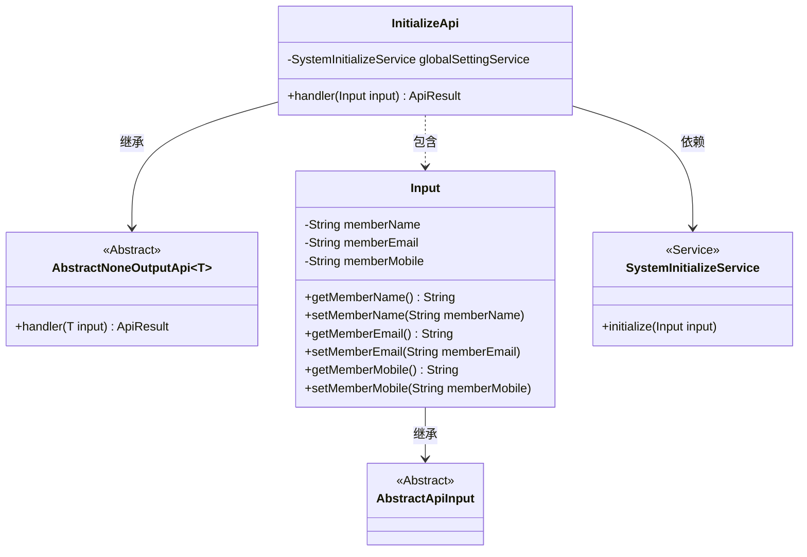

# 基础信息

|      |      |
|------|------|
| 名称 | InitializeApi |
| 编码语言 | .java |
| 代码路径 | WeFe/fusion/fusion-service/src/main/java/com/welab/wefe/data/fusion/service/api/system/InitializeApi.java |
| 包名 | com.welab.wefe.data.fusion.service.api.system |
| 依赖项 | ['com.welab.wefe.common.exception.StatusCodeWithException', 'com.welab.wefe.common.fieldvalidate.StandardFieldType', 'com.welab.wefe.common.fieldvalidate.annotation.Check', 'com.welab.wefe.common.web.api.base.AbstractNoneOutputApi', 'com.welab.wefe.common.web.api.base.Api', 'com.welab.wefe.common.web.dto.AbstractApiInput', 'com.welab.wefe.common.web.dto.ApiResult', 'com.welab.wefe.data.fusion.service.service.SystemInitializeService', 'org.springframework.beans.factory.annotation.Autowired'] |
| 概述说明 | InitializeApi类用于系统初始化，包含成员名称、邮箱和电话的输入验证，名称必填且长度3-12，邮箱需符合格式，电话需6-18位数字或符号。 |

# 说明

这是一个名为InitializeApi的Java类，用于系统初始化。它继承自AbstractNoneOutputApi，路径为system/initialize。类中注入了SystemInitializeService服务，并通过handler方法处理输入参数。输入参数Input类包含三个字段：memberName（必填，支持中文、英文、数字，长度3-12）、memberEmail（邮箱格式）、memberMobile（电话格式，6-18位数字或符号）。每个字段都有相应的校验规则和错误提示。类中还提供了这些字段的getter和setter方法。

# 类列表 Class Summary

| 名称   | 类型  | 说明 |
|-------|------|-------------|
| InitializeApi | class | 这是一个系统初始化API类，包含成员名称、邮箱和电话的输入验证，通过SystemInitializeService执行初始化操作。 |

## 类 InitializeApi

|      |      |
|------|------|
| 访问范围 | @Api(path = "system/initialize", name = "initialize system");public |
| 类型 | class |
| 名称 | InitializeApi |
| 说明 | 这是一个系统初始化API类，包含成员名称、邮箱和电话的输入验证，通过SystemInitializeService执行初始化操作。 |

### UML类图

这段代码展示了一个系统初始化API的结构。InitializeApi继承自AbstractNoneOutputApi，处理Input类型的参数，并通过SystemInitializeService执行初始化操作。Input类包含成员名称、邮箱和电话等字段，带有数据校验注解。类图清晰地展示了继承关系（InitializeApi→AbstractNoneOutputApi、Input→AbstractApiInput）、依赖关系（InitializeApi→SystemInitializeService）和组合关系（InitializeApi包含Input内部类）。

### 内部方法调用关系图

```mermaid
graph TD
    A["类InitializeApi"]
    B["注解: @Api(path='system/initialize', name='initialize system')"]
    C["继承: AbstractNoneOutputApi<Input>"]
    D["依赖注入: @Autowired SystemInitializeService"]
    E["重写方法: handler(Input input)"]
    F["嵌套类Input"]
    G["属性: String memberName @Check"]
    H["属性: String memberEmail @Check"]
    I["属性: String memberMobile @Check"]
    J["方法: getter/setter"]

    A --> B
    A --> C
    A --> D
    A --> E
    A --> F
    F --> G
    F --> H
    F --> I
    F --> J
    E --> D
    E -->|调用| F
```

流程图描述了InitializeApi类的结构，它是一个带有系统初始化功能的API类，继承自抽象父类并包含输入参数校验逻辑。类中通过Autowired注入服务，重写了handler方法处理初始化请求，嵌套的Input类定义了三个带校验规则的字段及对应的getter/setter方法，整体构成一个完整的参数校验和初始化流程。

### 字段列表 Field List

| 名称  | 类型  | 说明 |
|-------|-------|------|
| globalSettingService | SystemInitializeService | 自动注入系统初始化服务实例到全局设置服务变量。 |

### 方法列表

| 名称  | 类型  | 说明 |
|-------|-------|------|
| handler | ApiResult<?> | 该方法重写父类handler，调用globalSettingService初始化输入参数，成功时返回ApiResult。异常时抛出StatusCodeWithException。 |

