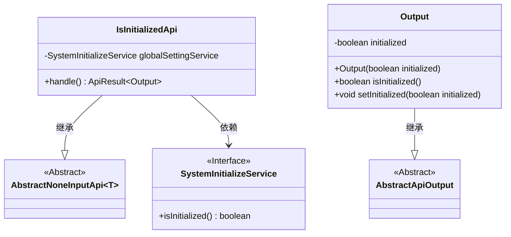
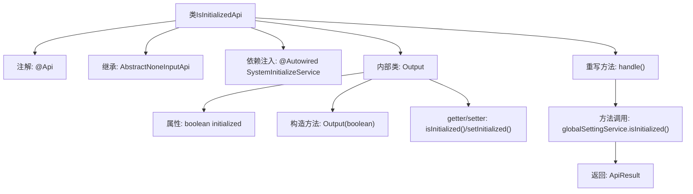

# 基础信息

|      |      |
|------|------|
| 名称 | IsInitializedApi |
| 编码语言 | .java |
| 代码路径 | WeFe/fusion/fusion-service/src/main/java/com/welab/wefe/data/fusion/service/api/system/IsInitializedApi.java |
| 包名 | com.welab.wefe.data.fusion.service.api.system |
| 依赖项 | ['com.welab.wefe.common.exception.StatusCodeWithException', 'com.welab.wefe.common.web.api.base.AbstractNoneInputApi', 'com.welab.wefe.common.web.api.base.Api', 'com.welab.wefe.common.web.dto.AbstractApiOutput', 'com.welab.wefe.common.web.dto.ApiResult', 'com.welab.wefe.data.fusion.service.service.SystemInitializeService', 'org.springframework.beans.factory.annotation.Autowired'] |
| 概述说明 | 这是一个检查系统是否初始化的API接口，调用后返回布尔值表示初始化状态。未初始化时系统无法使用功能模块。 |

# 说明

该代码定义了一个名为IsInitializedApi的API类，用于检查系统是否已完成初始化。API路径为"system/is_initialized"，功能描述指出系统在初始化前无法访问任何功能模块。该类继承自AbstractNoneInputApi，返回包含初始化状态的Output对象。通过SystemInitializeService的isInitialized方法获取初始化状态，并封装在Output类中，该类提供initialized属性的getter和setter方法。整个API处理逻辑简洁，仅返回系统初始化状态。

# 类列表 Class Summary

| 名称   | 类型  | 说明 |
|-------|------|-------------|
| IsInitializedApi | class | 这是一个检查系统是否初始化的API类，路径为"system/is_initialized"，未初始化时无法访问功能模块。通过SystemInitializeService获取初始化状态并返回布尔值结果。 |

## 类 IsInitializedApi

|      |      |
|------|------|
| 访问范围 | @Api(;        path = "system/is_initialized",;        name = "is the system initialized",;        desc = "The system cannot access any functional modules before initialization";);public |
| 类型 | class |
| 名称 | IsInitializedApi |
| 说明 | 这是一个检查系统是否初始化的API类，路径为"system/is_initialized"，未初始化时无法访问功能模块。通过SystemInitializeService获取初始化状态并返回布尔值结果。 |

### UML类图

该类图展示了IsInitializedApi及其相关类的结构。IsInitializedApi继承自泛型类AbstractNoneInputApi<Output>，并依赖SystemInitializeService接口。Output类继承自AbstractApiOutput，包含初始化状态的布尔值及其访问方法。SystemInitializeService作为接口提供isInitialized()方法。整体结构体现了API处理系统初始化状态检查的职责划分。

### 内部方法调用关系图

流程图描述了IsInitializedApi类的结构和执行流程。该类通过@Api注解定义接口元信息，继承AbstractNoneInputApi并重写handle()方法。处理时调用SystemInitializeService检查初始化状态，返回包含Output结果的ApiResult。Output作为内部类封装boolean类型的initialized状态，提供标准的getter/setter方法。整体流程展示了从请求处理到结果返回的完整调用链。

### 字段列表 Field List

| 名称  | 类型  | 说明 |
|-------|-------|------|
| globalSettingService | SystemInitializeService | 自动注入系统初始化服务实例。 |

### 方法列表

| 名称  | 类型  | 说明 |
|-------|-------|------|
| handle | ApiResult<Output> | 处理请求并返回全局设置初始化状态的API结果。 |

