# 基础信息

|      |      |
|------|------|
| 名称 | OptionsApi |
| 编码语言 | .java |
| 代码路径 | WeFe/fusion/fusion-service/src/main/java/com/welab/wefe/data/fusion/service/api/system/OptionsApi.java |
| 包名 | com.welab.wefe.data.fusion.service.api.system |
| 依赖项 | ['com.welab.wefe.common.exception.StatusCodeWithException', 'com.welab.wefe.common.web.api.base.AbstractApi', 'com.welab.wefe.common.web.api.base.Api', 'com.welab.wefe.common.web.dto.AbstractApiInput', 'com.welab.wefe.common.web.dto.ApiResult', 'com.welab.wefe.data.fusion.service.enums.Options', 'java.util.EnumSet'] |
| 概述说明 | 定义了一个名为OptionsApi的API类，路径为system/options，用于处理操作类型请求。该类继承AbstractApi，输入为Input类，返回枚举集合Options。handle方法返回所有Options枚举值。Input类为空，继承AbstractApiInput。 |

# 说明

该代码定义了一个名为OptionsApi的API类，继承自AbstractApi，处理输入类型为Input、输出类型为EnumSet<Options>的请求。API路径为"system/options"，名称为"操作类型"。类中包含一个handle方法，返回所有Options枚举值的集合，并使用success方法包装结果。Input类继承自AbstractApiInput，当前为空实现。整个API用于获取操作类型选项列表。

# 类列表 Class Summary

| 名称   | 类型  | 说明 |
|-------|------|-------------|
| OptionsApi | class | Java类OptionsApi定义了一个系统操作类型API，路径为system/options，返回所有枚举选项集合。继承AbstractApi，输入为空，处理逻辑简单直接。 |


## 类 OptionsApi

|      |      |
|------|------|
| 访问范围 | @Api(path = "system/options", name = "操作类型", desc = "操作类型");public |
| 类型 | class |
| 名称 | OptionsApi |
| 说明 | Java类OptionsApi定义了一个系统操作类型API，路径为system/options，返回所有枚举选项集合。继承AbstractApi，输入为空，处理逻辑简单直接。 |


### UML类图

```mermaid
classDiagram
    class OptionsApi {
        +handle(Input input) ApiResult~EnumSet~Options~~
    }
    class AbstractApi~T, R~ {
        <<Abstract>>
        #handle(T input) ApiResult~R~
    }
    class ApiResult~T~ {
        <<GenericType>>
    }
    class Input {
        <<NestedClass>>
    }
    class AbstractApiInput {
        <<Abstract>>
    }
    class "EnumSet~Options~" {
        <<EnumSet>>
    }

    OptionsApi --|> AbstractApi~Input, EnumSet~Options~~ : 继承
    Input --|> AbstractApiInput : 继承
    OptionsApi --> Input : 使用
    AbstractApi~T, R~ --> ApiResult~R~ : 返回
    OptionsApi --> "EnumSet~Options~" : 返回
```

类图描述：该图展示了一个基于泛型的API类结构，OptionsApi继承自抽象类AbstractApi，并实现了处理输入返回枚举集合的功能。Input作为嵌套类继承自AbstractApiInput，用于封装请求参数。AbstractApi定义了核心的handle抽象方法，返回ApiResult泛型结果。整个结构展示了典型的模板方法模式实现，通过泛型参数确保类型安全。


### 内部方法调用关系图

```mermaid
graph TD
    A["类OptionsApi"]
    B["注解: @Api(path='system/options', name='操作类型', desc='操作类型')"]
    C["父类: AbstractApi<Input, EnumSet<Options>>"]
    D["方法: handle(Input input)"]
    E["内部类: Input extends AbstractApiInput"]
    F["步骤: EnumSet.allOf(Options.class)"]
    G["步骤: return success(options)"]

    A --> B
    A --> C
    A --> D
    A --> E
    D --> F
    F --> G
```



这段代码定义了一个名为`OptionsApi`的类，继承自`AbstractApi`，并带有`@Api`注解。类中包含一个处理输入的方法`handle`，该方法返回一个包含所有`Options`枚举值的`EnumSet`。内部类`Input`继承自`AbstractApiInput`，用于定义输入参数的结构。流程图清晰地展示了类的结构和方法的调用流程。

### 字段列表 Field List

| 名称  | 类型  | 说明 |
|-------|-------|------|

### 方法列表

| 名称  | 类型  | 说明 |
|-------|-------|------|
| handle | ApiResult<EnumSet<Options>> | 方法重写，处理输入并返回包含所有Options枚举值的成功结果。 |


