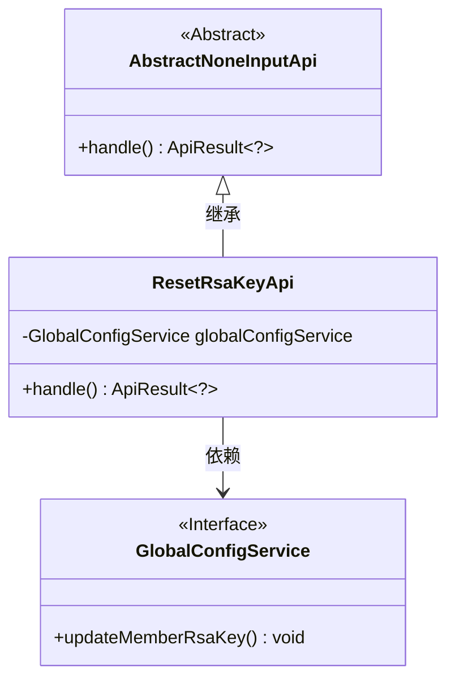
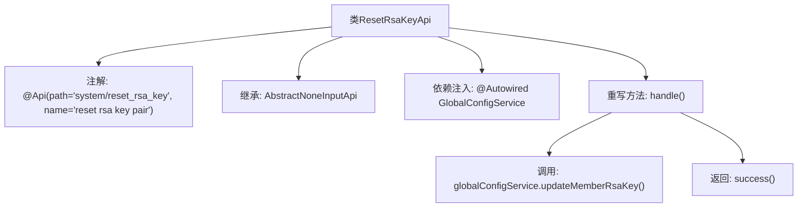

# 基础信息

|      |      |
|------|------|
| 名称 | ResetRsaKeyApi |
| 编码语言 | .java |
| 代码路径 | WeFe/fusion/fusion-service/src/main/java/com/welab/wefe/data/fusion/service/api/system/ResetRsaKeyApi.java |
| 包名 | com.welab.wefe.data.fusion.service.api.system |
| 依赖项 | ['com.welab.wefe.common.exception.StatusCodeWithException', 'com.welab.wefe.common.web.api.base.AbstractNoneInputApi', 'com.welab.wefe.common.web.api.base.Api', 'com.welab.wefe.common.web.dto.ApiResult', 'com.welab.wefe.data.fusion.service.service.globalconfig.GlobalConfigService', 'org.springframework.beans.factory.annotation.Autowired'] |
| 概述说明 | 重置RSA密钥对的API类，调用全局配置服务更新密钥，无输入参数，返回成功结果。 |

# 说明

这是一个名为ResetRsaKeyApi的API类，用于重置RSA密钥对。它继承自AbstractNoneInputApi基类，表明该接口不需要输入参数。类上标注了Api注解，指定路径为system/reset_rsa_key。通过自动注入的GlobalConfigService服务调用updateMemberRsaKey方法执行密钥更新操作。处理成功后返回空结果。整个类简洁明了，专注于完成RSA密钥重置功能。

# 类列表 Class Summary

| 名称   | 类型  | 说明 |
|-------|------|-------------|
| ResetRsaKeyApi | class | 重置RSA密钥对的API类，通过GlobalConfigService更新成员RSA密钥，无输入参数，返回成功结果。 |

## 类 ResetRsaKeyApi

|      |      |
|------|------|
| 访问范围 | @Api(path = "system/reset_rsa_key", name = "reset rsa key pair");public |
| 类型 | class |
| 名称 | ResetRsaKeyApi |
| 说明 | 重置RSA密钥对的API类，通过GlobalConfigService更新成员RSA密钥，无输入参数，返回成功结果。 |

### UML类图

类图描述：ResetRsaKeyApi继承自抽象类AbstractNoneInputApi，实现了无输入参数的API处理逻辑。该类通过依赖注入GlobalConfigService接口来更新成员RSA密钥对，体现了Spring框架的依赖注入特性。AbstractNoneInputApi定义了核心的handle抽象方法，ResetRsaKeyApi通过具体实现完成密钥重置操作，整体结构清晰展示了控制反转和模板方法模式的应用。

### 内部方法调用关系图

该流程图展示了ResetRsaKeyApi类的结构和执行流程。该类通过@Api注解定义API路径和名称，继承AbstractNoneInputApi基类，并注入GlobalConfigService服务。核心逻辑在handle()方法中实现，先调用updateMemberRsaKey()更新RSA密钥对，最后返回成功结果。整个过程体现了Spring Boot的依赖注入和API处理机制。

### 字段列表 Field List

| 名称  | 类型  | 说明 |
|-------|-------|------|
| globalConfigService | GlobalConfigService | 使用@Autowired自动注入GlobalConfigService实例。 |

### 方法列表

| 名称  | 类型  | 说明 |
|-------|-------|------|
| handle | ApiResult<?> | 方法重写，调用更新成员RSA密钥服务，成功后返回结果。 |

