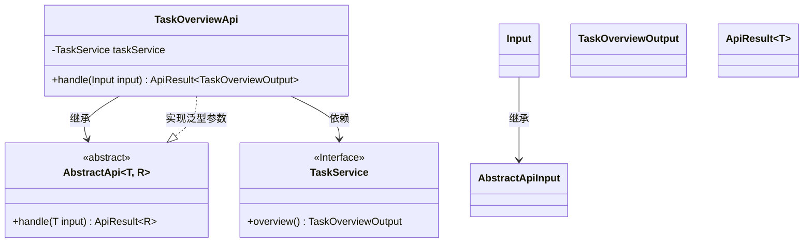

# 基础信息

|      |      |
|------|------|
| 名称 | TaskOverviewApi |
| 编码语言 | .java |
| 代码路径 | WeFe/fusion/fusion-service/src/main/java/com/welab/wefe/data/fusion/service/api/system/TaskOverviewApi.java |
| 包名 | com.welab.wefe.data.fusion.service.api.system |
| 依赖项 | ['com.welab.wefe.common.exception.StatusCodeWithException', 'com.welab.wefe.common.fieldvalidate.annotation.Check', 'com.welab.wefe.common.web.api.base.AbstractApi', 'com.welab.wefe.common.web.api.base.AbstractNoneOutputApi', 'com.welab.wefe.common.web.api.base.Api', 'com.welab.wefe.common.web.dto.AbstractApiInput', 'com.welab.wefe.common.web.dto.ApiResult', 'com.welab.wefe.data.fusion.service.dto.entity.TaskOverviewOutput', 'com.welab.wefe.data.fusion.service.service.TaskService', 'org.springframework.beans.factory.annotation.Autowired', 'java.io.IOException'] |
| 概述说明 | 这是一个任务概览API类，继承自抽象API类，使用TaskService处理请求并返回任务概览结果。输入为空，输出为TaskOverviewOutput。 |

# 说明

该代码定义了一个名为TaskOverviewApi的API类，继承自AbstractApi，用于处理任务概览相关请求。类注解标明路径为"task/overview"，名称为"task overview"，描述为"task overview"。该类注入了TaskService服务，并通过handle方法调用taskService.overview()获取任务概览数据，返回成功结果。输入参数使用静态内部类Input，继承自AbstractApiInput，当前未定义额外字段。整个API设计简洁，专注于任务概览功能的实现。

# 类列表 Class Summary

| 名称   | 类型  | 说明 |
|-------|------|-------------|
| TaskOverviewApi | class | TaskOverviewApi类是一个处理任务概览的API，继承自AbstractApi，使用TaskService获取概览数据并返回TaskOverviewOutput结果。输入类Input为空。 |

## 类 TaskOverviewApi

|      |      |
|------|------|
| 访问范围 | @Api(path = "task/overview", name = "task overview", desc = "task overview");public |
| 类型 | class |
| 名称 | TaskOverviewApi |
| 说明 | TaskOverviewApi类是一个处理任务概览的API，继承自AbstractApi，使用TaskService获取概览数据并返回TaskOverviewOutput结果。输入类Input为空。 |

### UML类图

类图描述：该图展示了TaskOverviewApi类继承自泛型类AbstractApi<Input, TaskOverviewOutput>，并实现了handle方法。TaskOverviewApi通过@Autowired注入TaskService接口，其内部类Input继承自AbstractApiInput。整体结构体现了Spring风格的API控制器设计模式，其中TaskService负责业务逻辑，AbstractApi提供基础框架支持。

### 内部方法调用关系图

```mermaid
graph TD
    A["类TaskOverviewApi"]
    B["注解: @Api"]
    C["继承: AbstractApi<Input, TaskOverviewOutput>"]
    D["依赖注入: @Autowired TaskService"]
    E["重写方法: handle(Input input)"]
    F["内部类: Input extends AbstractApiInput"]
    G["调用: taskService.overview()"]
    H["返回: ApiResult<TaskOverviewOutput>"]

    A --> B
    A --> C
    A --> D
    A --> E
    E --> G
    G --> H
    A --> F
```

该流程图描述了TaskOverviewApi类的结构及其关键行为。类通过@Api注解定义API元信息，继承AbstractApi模板类并指定输入输出类型。核心处理逻辑在重写的handle方法中，通过注入的TaskService获取任务概览数据并封装返回。内部类Input作为API入参的基类扩展。整体展现了从请求处理到结果返回的完整调用链，体现了Spring Boot API层的典型设计模式。

### 字段列表 Field List

| 名称  | 类型  | 说明 |
|-------|-------|------|
| taskService | TaskService | 自动注入TaskService实例。 |

### 方法列表

| 名称  | 类型  | 说明 |
|-------|-------|------|
| handle | ApiResult<TaskOverviewOutput> | 这是一个Java方法，重写父类方法，处理输入并返回任务概览结果。方法调用taskService.overview()获取数据，成功时返回封装结果，可能抛出异常或IO错误。 |

