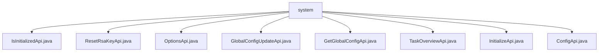

# 基础信息

|      |      |
|------|------|
| 名称 | system |
| 编码语言 | .java |
| 代码路径 | WeFe/fusion/fusion-service/src/main/java/com/welab/wefe/data/fusion/service/api/system |
| 包名 | docs.fusion.fusion-service.src.main.java.com.welab.wefe.data.fusion.service.api.system |
| 概述说明 | IsInitializedApi检查系统初始化状态。ResetRsaKeyApi重置RSA密钥。OptionsApi获取操作类型选项。GlobalConfigUpdateApi更新全局配置。GetGlobalConfigApi获取全局配置。TaskOverviewApi获取任务概览。InitializeApi处理系统初始化。ConfigApi为空配置类。 |

# 说明

## 概述  
该模块核心职责是管理系统初始化状态、全局配置及安全密钥，类似控制中枢模式。接口规范遵循统一设计：继承AbstractApi基类，使用@Api注解定义路径，例如"system/is_initialized"检查初始化状态，"system/reset_rsa_key"重置密钥。关键数据结构包括包含initialized属性的Output类、存储分组配置的Map结构，以及包含成员信息的Input类。外部依赖包括SystemInitializeService（处理初始化）、GlobalConfigService（管理配置）和TaskService（任务概览）。例如InitializeApi通过校验memberName等字段完成系统初始化。

## 主要业务场景  
模块支持系统全生命周期管理：初始化前通过IsInitializedApi检查状态，InitializeApi完成初始化；运行中通过GlobalConfigUpdateApi/GetGlobalConfigApi维护配置，例如过滤rsa_private_key敏感字段；安全方面提供ResetRsaKeyApi密钥重置。交互模式均为RESTful风格，如OptionsApi返回EnumSet<Options>枚举集合。典型应用包括：1) 系统启动时检查/执行初始化 2) 管理员更新全局配置 3) 定期轮换RSA密钥。API类型涵盖状态查询（无输入）、数据处理（Map结构）和枚举获取，例如TaskOverviewApi返回任务统计视图。

### 包内部结构视图

该流程图展示了WeFe数据融合服务中system模块下的API文件结构。所有API文件（如IsInitializedApi.java、ResetRsaKeyApi.java等）都直接隶属于system目录，没有更深层级的子目录。这些API文件主要涉及系统初始化、RSA密钥重置、全局配置管理等功能，构成了数据融合服务的核心系统配置接口。

# 文件列表

| 名称   | 类型  | 说明 |
|-------|------|-------------|
| [IsInitializedApi.java](IsInitializedApi.md) | file | 这是一个检查系统是否初始化的API接口，调用后返回布尔值表示初始化状态。未初始化时系统无法使用功能模块。 |
| [ResetRsaKeyApi.java](ResetRsaKeyApi.md) | file | 重置RSA密钥对的API类，调用全局配置服务更新密钥，无输入参数，返回成功结果。 |
| [OptionsApi.java](OptionsApi.md) | file | 定义了一个名为OptionsApi的API类，路径为system/options，用于处理操作类型请求。该类继承AbstractApi，输入为Input类，返回枚举集合Options。handle方法返回所有Options枚举值。Input类为空，继承AbstractApiInput。 |
| [GlobalConfigUpdateApi.java](GlobalConfigUpdateApi.md) | file | 这是一个用于更新全局配置的API类，路径为"global_config/update"，通过GlobalConfigService处理输入参数groups并返回成功结果。输入参数为包含分组信息的Map。 |
| [GetGlobalConfigApi.java](GetGlobalConfigApi.md) | file | 获取系统全局配置的API类，通过输入组名列表返回对应配置项的键值对，过滤私钥字段。依赖GlobalConfigService查询数据，输出为分组后的JSON对象。 |
| [TaskOverviewApi.java](TaskOverviewApi.md) | file | 这是一个任务概览API类，继承自抽象API类，使用TaskService处理请求并返回任务概览结果。输入为空，输出为TaskOverviewOutput。 |
| [InitializeApi.java](InitializeApi.md) | file | InitializeApi类用于系统初始化，包含成员名称、邮箱和电话的输入验证，名称必填且长度3-12，邮箱需符合格式，电话需6-18位数字或符号。 |
| [ConfigApi.java](ConfigApi.md) | file | 配置API类，用于管理配置相关操作。 |

